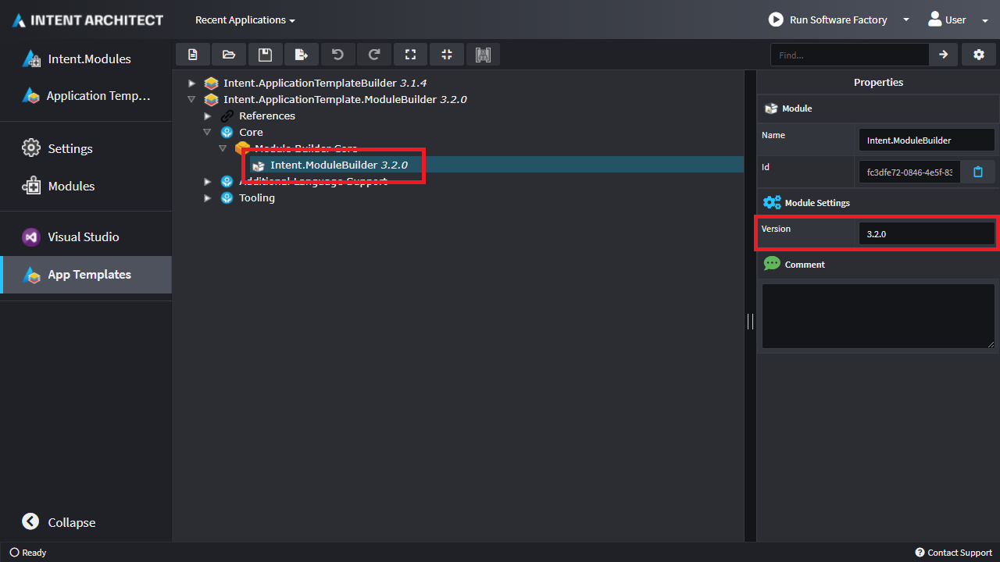

# How to set Module Versions

To set or update the version of a Module that is installed by an Application Template, specify it in `Version` property of the `Module Settings` Stereotype in the `Application Templates` Designer:

