# Metadata installation

## Overview

Intent Architect can automatically install metadata for Designers as an Intent Architect Application is created from an [Application Template](xref:module-building.application-templates.about-application-templates) or alternatively as a Module is installed/reinstalled.

During packaging of both Application Templates and Modules, the Intent Architect packager will look for any `.installation.config` files present in the `content` sub-folder. We recommend following a convention of naming `.installation.config` files after the designer for which they have metadata, for example `visual-studio.installation.config` for the Visual Studio designer or `domain.installation.config` for the Domain Designer.

These files are expected to contain an XML representation of the metadata to install as well as specifying which designer it should be installed into. The easiest way to create this XML in a valid format is to use the "Export" button on the toolbar when a designer is open:

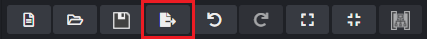

Pressing this button will copy an XML representation of all (even unsaved) content within the designer onto your clipboard which you can then paste into the `.installation.config` file of the Module or Application Template.

## Template strings

If an element's name contains template strings, then these are substituted during installation of the metadata. At this time the following template strings are supported:

|Template String|Description|
|-|-|
|`${solution.name}`|The Intent Architect Solution name.|
|`${application.name}`|The Intent Architect Application name.|

These template strings are commonly used for the Visual Studio designer metadata where the root element has a name of `${solution.name}` and projects have names like `${application.name}.Data.Entities`.

## Metadata merging

To avoid duplicate elements from being created each time a Module is re-installed, Intent Architect merges the metadata to install with any metadata already existing in the designer. For each element it needs to install, it searches in all folders by its `id` in the `.installation.config` file with the `externalReference` value in the Designer's existing metadata. If no match is found by `id` and `externalReference` it will then try match by name and folder path within the metadata.

When there is a match it will merge child elements recursively following the same logic.

Because Intent Architect fundamentally requires that all elements have a unique `id`, during metadata installation it will always create new unique `id`s for them, but it will also store the source element's original `id` value in the `externalReference` attribute so that the above correlation is possible.

## Avoid exporting metadata from "production" Applications for installation

We recommend that in your Intent Architect "Modules" Solution, you create a new Application with a name such as `<module-name>.Metadata`. In this Application install any designers which you want to export metadata from and then model the desired metadata in them as you normally would.

This allows you to put [template string](#template-strings) values in element names so that the exported metadata requires no "correction" after export.

Exporting from working Applications also has other disadvantages in that you may export additional data that you didn't intend to (for example since your original export other data was captured as necessary for the Application), or that shouldn't ideally be installed (for example it's better NOT to export and install `Template Output` elements of the Visual Studio designer as these should be managed as per [output targetting](xref:module-building.templates.how-to-auto-assign-template-outputs)).

## Tutorial

### Tutorial overview

This tutorial will guide you through setting up metadata to be installed for an Application Template and then walk you through setting up metadata to be installed for a Module.

### Assumptions

This tutorial assumes we already have an existing Intent Architect solution called `MyOrganisation.Modules` with the following Applications:

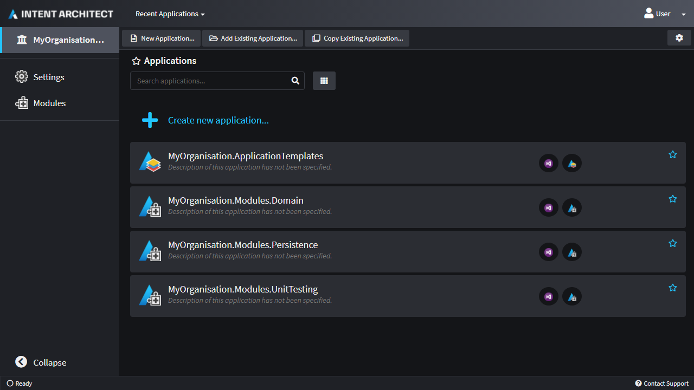

By default the Application Template will install the `Domain` and `Persistence` Modules with the `UnitTesting` Module being optional.

The software factory has been executed before for these Applications with a working Visual Studio solution with projects having been generated.

### Create the metadata Application for the Application Template

- Click `Create new application`.
- Click the icon so we can change it:

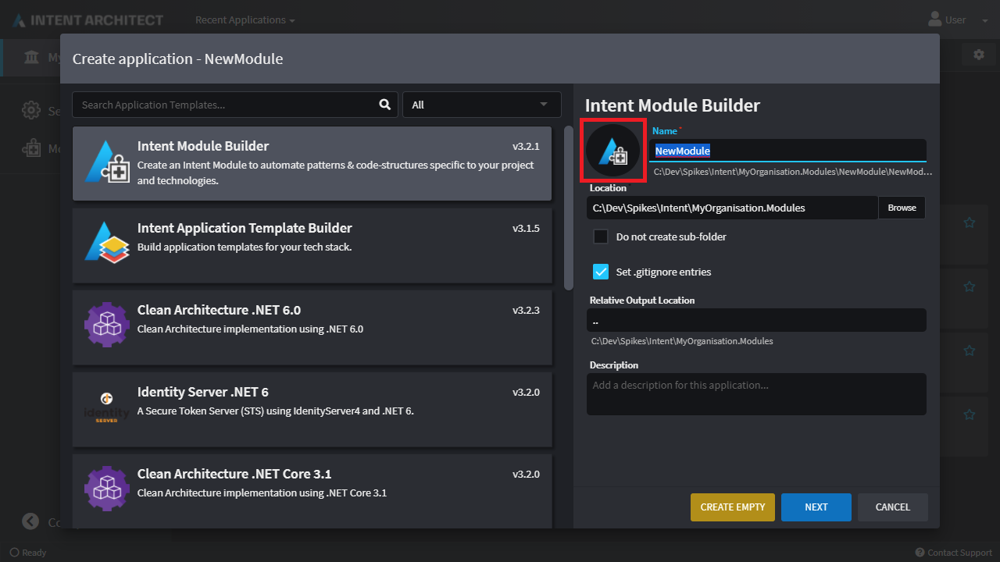

- Click the `Font Awesome` tab, then enter `export` in the filter box, select the `File Export` item and finally click `SELECT`:

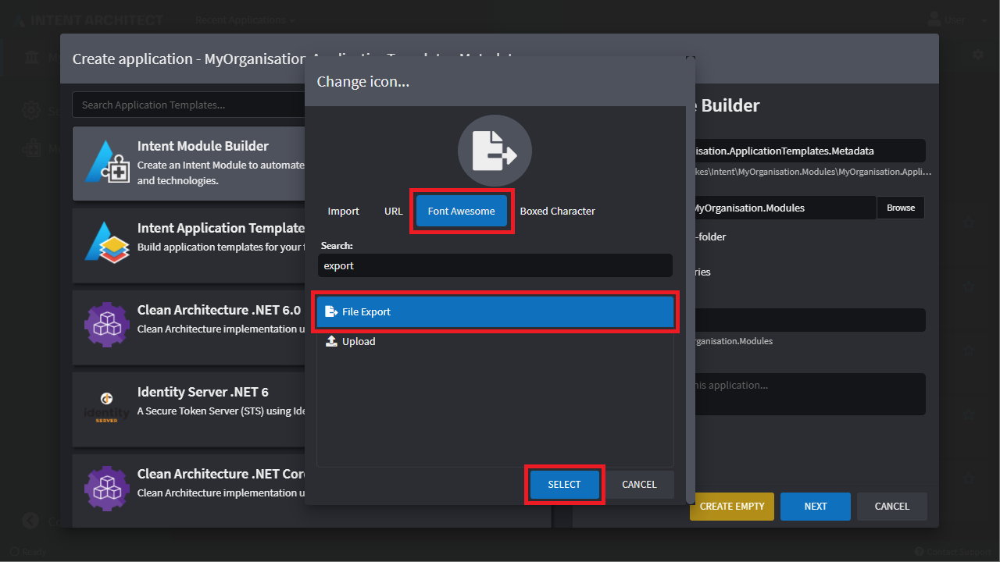

- Change the Name to `MyOrganisation.ApplicationTemplates.Metadata`.
- Press `CREATE EMPTY` at the bottom of the dialogue.

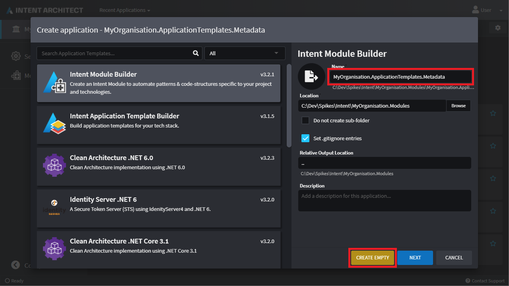

- Press `YES` when asked to confirm that you want to continue creating an empty Application.
- Once the application is created, click on `Modules` in the left pane, search for `Visual Studio`, select the `Intent.VisualStudio.Projects` Module and finally click the install button on the right:

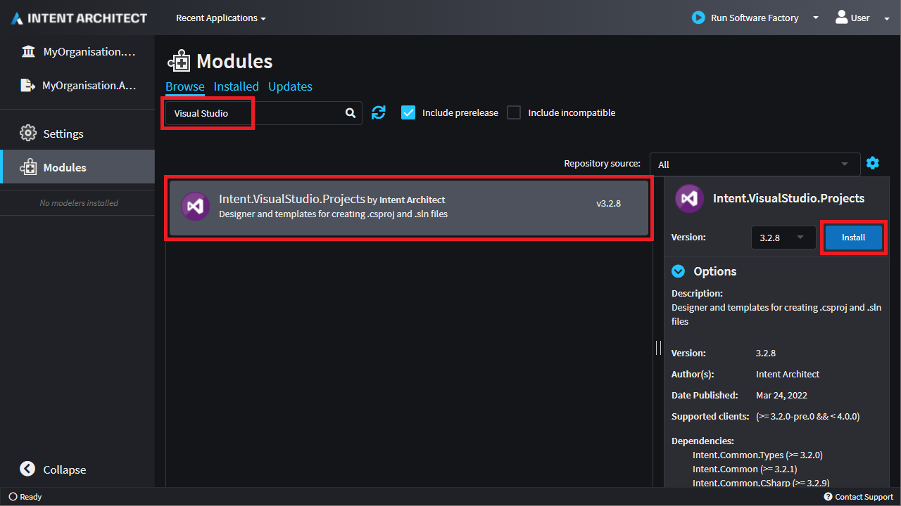

- Select the `Visual Studio` designer on the left.
- Press the `CREATE NEW PACKAGE` button.
- Use `${application.name}` for the "Name" of the package and press `DONE`:

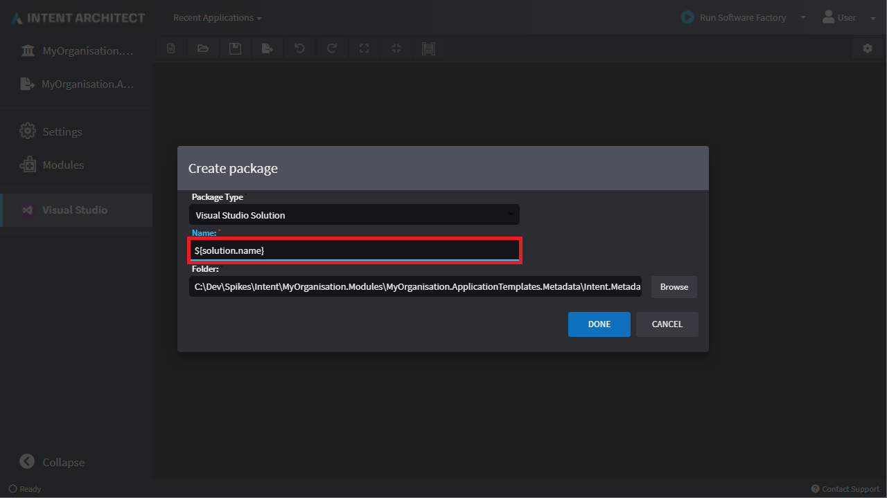

- Right-click on the `${application.name}` element and select `Class Library (.NET Core)`.
- Set its name to `${application.name}.Domain`.
- Right-click the `${application.name}.Domain` element and select `Add Role`.
- Set its name to `Domain`.
- Right-click on the `${application.name}` element and select `Class Library (.NET Core)`.
- Set its name to `${application.name}.Persistence`.
- Right-click the `${application.name}.Persistence` element and select `Add Role`.
- Set its name to `Persistence`.
- Press the `Export` button in the toolbar and `Copied to clipboard...` will appear at the bottom right of the window.

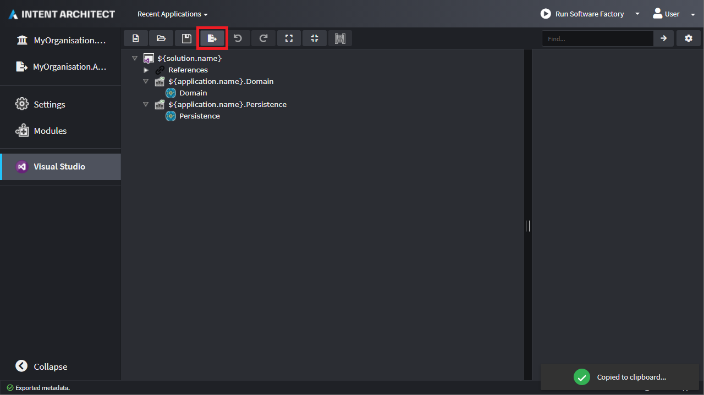

### Add the exported metadata to the Application Template

- Open the `.sln` file for your Modules solution.

> [!TIP]
> To quickly locate the `.sln` file, click `Settings` on the left and then on the link below `Relative Output Location` which will open the folder which contains your `.sln` file.
>
> [!NOTE]
> This tutorial assumes you have already run the software factory for the other Modules and that the `.sln` file and its projects would already have been generated.

- Inside the `MyOrganisation.ApplicationTemplates` project, expand the folder containing your Application Template's `metadata.iatspec` file (for example `MyOrganisation.ApplicationTemplate`) and inside it create a `content` folder.
- Inside the `content` folder create a file called `visual-studio.installation.config`.
- Paste the contents from your clipboard into the file.
- Build the project.
- Note the line with `1>Added content/visual-studio.installation.config.` in the build log which confirms that the file was included in the packaged `.iat` file.

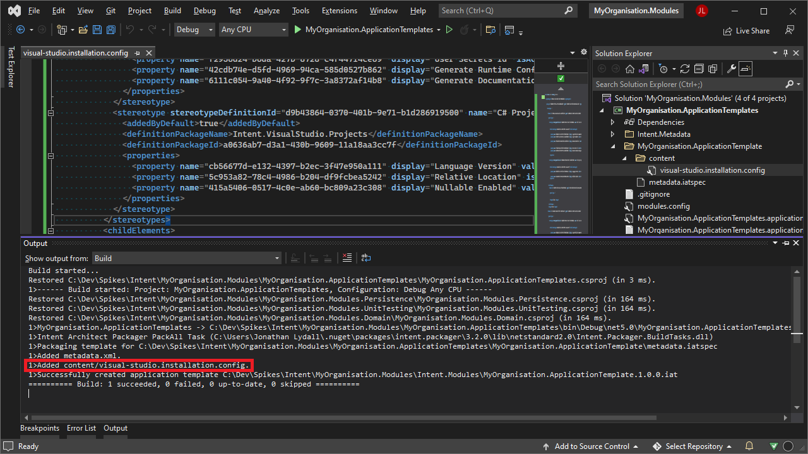

### Application Template metadata summary

If you create a new Application with the Application Template, you will see it now installs the metadata into the Visual Studio designer.

### Create the metadata Application for the Module

> [!NOTE]
> Creating the metadata Application for the Module is almost the same as [creating the metadata Application for the Application Template](#create-the-metadata-application-for-the-application-template), so for brevity, nearly identical screenshots have not been included below.

- Click `Create new application`.
- Change the icon for the new Application to the `Font Awesome` `File Export` icon.
- Change the Name to `MyOrganisation.Modules.UnitTesting.Metadata`.
- Press `CREATE EMPTY` at the bottom of the dialogue.
- Press `YES` when asked to confirm that you want to continue creating an empty Application.
- Once the Application is created, click on `Modules` in the left pane, search for `Visual Studio`, select the `Intent.VisualStudio.Projects` Module and finally click the install button on the right:
- Select the `Visual Studio` designer on the left.
- Press the `CREATE NEW PACKAGE` button.
- Use `${application.name}` for the "Name" of the package and press `DONE`.

> [!NOTE]
> By having given the Solution element the same name as for the Application Template, when this Module is installed the [metadata merging](#metadata-merging) logic prevents a duplicate being created.

- Right-click on the `${application.name}` element and select `Class Library (.NET Core)`.
- Set its name to `${application.name}.UnitTesting`.
- Right-click the `${application.name}.UnitTesting` element and select `Add Role`.
- Set its name to `UnitTesting`.
- Press the `Export` button in the toolbar and `Copied to clipboard...` will appear at the bottom right of the window.

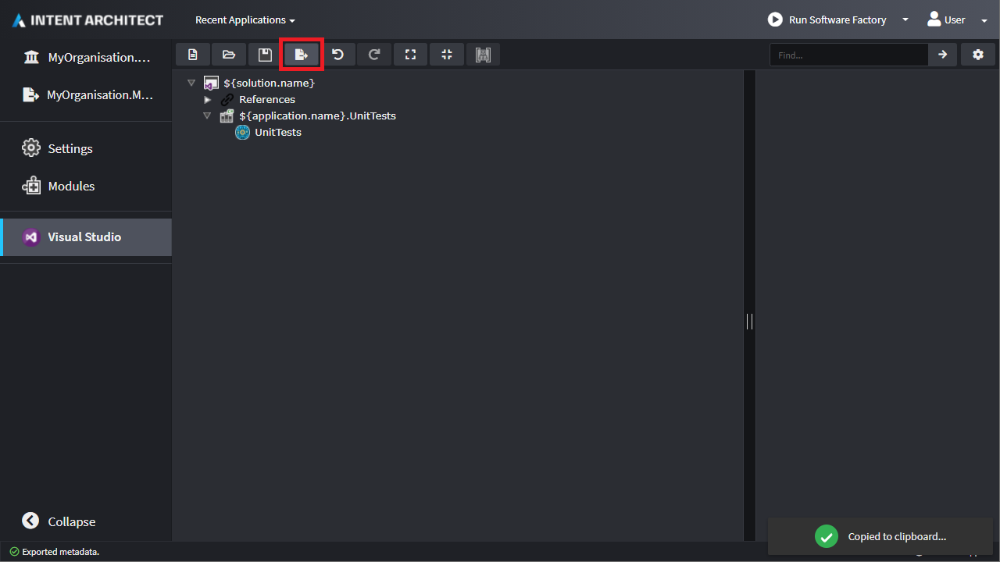

### Add the exported metadata to the Module

- Open the `.sln` file for your Modules solution.
- Inside the `MyOrganisation.Modules.UnitTesting` project create a `content` folder.
- Inside the `content` folder create a file called `visual-studio.installation.config`.
- Paste the contents from your clipboard into the file.
- Build the project.
- Note the line with `1>Added content/visual-studio.installation.config.` in the build log which confirms that the file was included in the packaged `.imod` file.

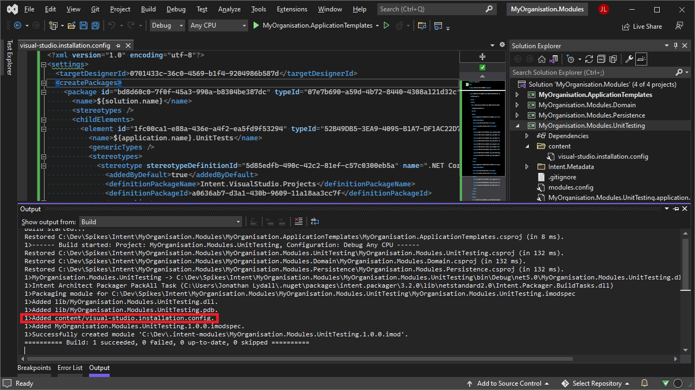

### Module metadata summary

If you install (or re-install) the Module, you will see it now adds a project called `${application.name}.UnitTesting` to the `Visual Studio` designer.
