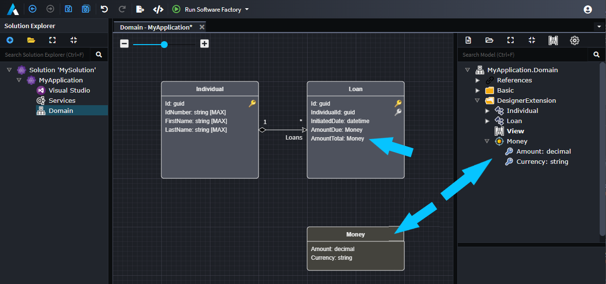
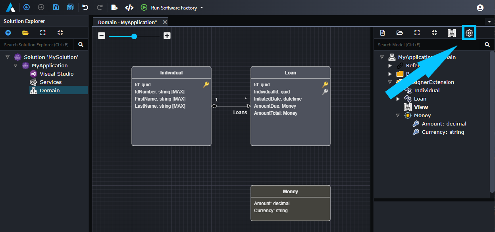

# About Designer Extensions

Designer Extensions extend an existing [Designer](xref:application-development.modelling.about-designers). This is useful for situations where you want add something to an existing Designer without having to make a full copy of it. The other benefit of Designer Extensions is that if the Designer being extended is updated, then the Designer Extension gets that update too, without necessarily requiring you to integrate or re-copy the changes.

_Example of a Designer Extension where a new Element (Value Object) is introduced in an existing designer `Domain`._

## How to see which Designer Extensions are currently applied

You can use the settings icon in a designer to see what extensions are currently applied:

