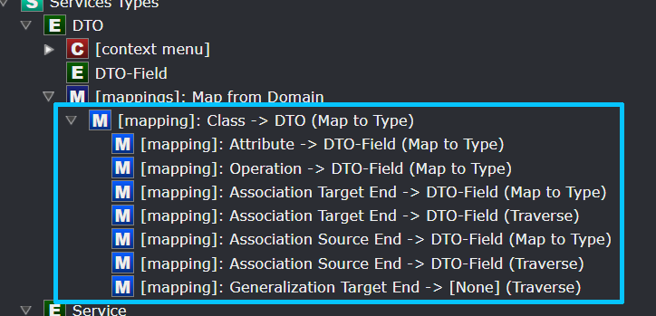

# Designer Modelling

The [Module Builder](xref:module-building.about-the-module-builder) is a designer for authoring [Designers](xref:application-development.modelling.about-designers) and [Designer Extensions](xref:module-building.designer-extensions.about-designer-extensions).

## Structure

### The `Designers Folder` element type

All Designer and Designer Extensions must be modelled inside this folder, as the folder is not created by default you may need to create it first. Only a single `Designers Folder` element can exist and its name, `designers`, cannot be changed.

### The `Designer` element

This Designer is seen as a component by Intent Architect, instructing it when the module is installed that a new Designer tab needs to be setup (located on the left hand side of the screen) which will contain your custom made designer interface.

| Property Name | Description                                                                                                                                            |
|---------------|--------------------------------------------------------------------------------------------------------------------------------------------------------|
| Display Order | Capture an integer number that will be used to determine the order in which your designer gets displayed along with all the other installed designers. [featherlight images/designer-display-order.png]|

### The `Designer Settings` element

Designer Settings contain various elements that will describe how a given Designer is to be extended.

| Property Name    | Description                                                                                                                                   |
|------------------|-----------------------------------------------------------------------------------------------------------------------------------------------|
| Is Reference     | This option is used internally by the Module Builder system.                                                                                  |
| Extend Designers | Optional. If you are not intending to create your own designer but extend an existing one, select that specific designer (or designers) here. |

### The `Element Settings` element

Element Settings contains metadata that will introduce a new designer Element into your new or, an existing designer. They are composite in nature so that Elements are made up of other Elements. So conceptually an Element can have a Parent Element and nested (or child) Elements. Element Settings can only be created inside `Designer Settings`.

In this example a `Workflow Step` is the parent Element that contains two nested Elements: `StepAttribute` and `Interaction`. `Interaction` also contains a nested Element: `Interaction Parameter`. This configuration will produce the following for the end-user (example):

_The example contains the StepAttribute visible in the top highlighted area and the Interaction (with the parameter) in the bottom highlighted area._

| Property Name         | Description                                                                                                                                                                                                                                                                                                                                                                          |
|-----------------------|-|
| Save Mode             | How the Element's metadata gets saved to disk is controlled by this dropdown. [See here](#save-options) for information on the available options. |
| Icon                  | The default icon used to represent the Element in a tree view in the designer. This is also the collapsed icon. [featherlight images/expanded-collapsed-icons-example.png] |
| Expanded Icon         | Inside a tree view designer, specify a distinct icon for when the Element is expanded. [featherlight images/expanded-collapsed-icons-example. |
| Display Text Function | By default the Element's name gets displayed on the visual designer [featherlight images/element-settings-display-function-default.png]. This can be overridden by coding a display function in JavaScript that will return a string that gets treated as the visual display text. [featherlight images/element-settings-display-function-override.png] |
| Validate Function     | Optional. A JavaScript function to validate the state of this Element. Return `null` (or leave the validation function blank) to say that validation is successful. Return a string (with an error message) to say that validation failed and display the string as the error message why it failed. [featherlight images/element-settings-validation-function-example.png] |
| Allow Rename          | If checked, the Element's name can be modified by the user. This will add the option in the context menu to rename. |
| Allow Abstract        | If checked, allows the end-user to set the `Is Abstract` checkbox on an Element. |
| Allow Set Value       | If checked, a text field will be provided for the Element to have a specific value captured by the user. |
| Allow Generic Types   | If checked, the Element will allow Generic type parameters to be specified on itself which can be overridden with specific Types by other Elements that reference them. [featherlight images/element-settings-generic-types.png] |
| Allow Sorting         | If checked, nested Elements can be sorted according to a certain criteria. |
| Sort Children         | Select which criteria should be used when sorting nested Elements if `Allow Sorting` is checked. [See here](#sort-children-options) for information on the available options. |
| Allow Find in View    | If checked, adds a `Find in View` context menu to the element which when used will center the visual diagram on the element and select it. |

#### Save Options

| Save Option | Description                                                                                                                           |
|-------------|---------------------------------------------------------------------------------------------------------------------------------------|
| Default     | Intent Architect automatically chooses the most appropriate save option depending on the Element's position in the Element-hierarchy. |
| Own File    | The Element will have its own `.xml` file stored to disk.                                                                             |
| As Child    | Nested Elements will be stored inside their parent Element's `.xml` file.                                                             |

#### Sort Children Options

| Sort Children Option  | Description                                                                           |
|-----------------------|---------------------------------------------------------------------------------------|
| By type then manually | Elements are ordered by Type yet allows the user to manually order them within.       |
| By type then name     | Elements are ordered by Type, then Name. The user cannot manually order the Elements. |
| By name               | Elements are only ordered by Name. The user cannot manually order the Elements.       |

#### Type Reference Settings

Enabling Type Reference Settings to your Element gives the end-user the capability to select and assign a given Type to your Element. You can filter which Types you are allowed to select and what the relationship between the Element and the Type looks like. This is not the same as an [Association](#association-types).

| Property Name    | Description |
|------------------|-|
| Mode             | Disabled - No Type Reference. Optional - Select a Type Reference or keep it unassigned (void). Required - Mandatory to select a Type Reference. |
| Display Name     | The Property Name for selecting a `Type` is by default called "Type" [featherlight images/element-settings-type-reference-display-default.png]. This can be renamed if "Type" is not appropriate for your use case. [featherlight images/element-settings-type-reference-display-custom.png] |
| Target Types     | Select one or more Elements that become selectable types ([featherlight images/element-settings-type-reference-target-types.png]) when your Element is used in the designer. [featherlight images/element-settings-type-reference-target-types-result.png] |
| Represents       | The default value of `Reference` is sufficient for general use. The other option of `Inheritance` is mostly used internally by the Module Building system. |
| Default Type Id  | If there is an existing instance of an Element created somewhere and you would like that one to become a default selectable Type, copy that Id into this field. [featherlight images/element-settings-type-reference-default-type-id.png] |
| Allow Nullable   | Controls whether or not the `Is Nullable` checkbox is visible for the Element in the designer. [featherlight images/element-settings-type-reference-allow-nullable.png] |
| Allow Collection | Controls whether or not the `Is Collection` checkbox is visible for the Element in the designer. [featherlight images/element-settings-type-reference-allow-collection.png] |

#### Context Menu

Each Element has their own Context Menu (when you right click on the Element) which can be defined in these sections. This is needed to allow the creation of other nested Elements.

#### Diagram Settings

This will instruct Intent Architect to identify this Element to have a Diagram (eg: [Domain designer](xref:application-development.modelling.about-designers)). When you double click on that Element it will open up the Diagram for that Element. It is possible to have other Element instances have their own Diagrams. Diagrams also have their own [Context Menus](#context-menu).

#### Mapping Settings

This setting will enable end-users to map the Element to another Element (potentially from a different Designer). It is possible to map Elements recursively, in other words you can map a high-level Element with another high-level Element, then proceed to map their nested Elements one-by-one. Each level can be configured in the designer to allow or limit the end-user over how deep they may map Elements [featherlight images/element-settings-mapping-settings-example.png].

The following table documents what the overall mapping looks like but won't describe how to map the granular elements with each other.

| Property Name             | Description |
|---------------------------|-------------|
| Default Designer          | Upon creating a mapping, the mapping dialog will be presented with a dropdown featuring all the available Designers. Set the default designer here. [featherlight images/element-settings-mapping-settings-default-designer.png] |
| Option Source             | Determine what the list of Elements are going to be when presented on the mapping dialog. Option `Elements of Type` will present the `Lookup Types` field, while `Lookup Element` will present the `Lookup Element Function` field. |
| Lookup Types              | Select the Elements that can be selectable on the mapping dialog. |
| Lookup Element Function   | Write a JavaScript function that will populate what kind of Elements can be selectable on the mapping dialog. |
| Map From                  | Selecting `Root Element` will present the mapping dialog in a tree-view style where the top-level Element and its nested Elements can be selected [featherlight images/element-settings-mapping-settings-map-from-root-element.png]. Selecting `Child Elements` will only present the nested Elements on the mapping dialog and allow you to choose only one option [featherlight images/element-settings-mapping-settings-map-from-child-element.png]. |
| Auto-sync Type References | Each time the designer is loaded, Elements with mappings and with this setting checked auto-synchronize their types with the mapping source in case they have been changed. |
| Symbol                    | On the tree-view display the symbol that denotes the mapping is by default a left pointing arrow. This symbol can be changed by selecting a different symbol from the font-awesome icons [featherlight images/left-arrow-fontawesome.png]. |

##### Element Mapping

This mapping can only be created once there is a `Mapping Setting`. This table documents how each granular element mapping will look like in a hierarchy form.

| Property Name        | Description |
|----------------------|-------------|
| From Type            | Select the Element type to map from. This is the type from the external designer. |
| Has Type-Reference   | Yes: Mapped Element must have a Type-Reference. No: Mapped Element must not have a Type-Reference. Not Applicable: Ignore this criteria. |
| Has Children         | Yes: Mapped Element must have nested Elements. No: Mapped Element must not have nested Elements. Not Applicable: Ignore this criteria. |
| Is Collection        | Yes: Mapped Element must be a Collection. No: Mapped Element must not be a Collection. Not Applicable: Ignore this criteria. |
| Auto-select Children | When checked, then when selecting a parent Element, all its nested Elements will be selected by default. |
| Child Mapping Mode   | `Map To Type`: Mapping to this Element can only be done on a Type level and cannot drill down into its nested Elements. `Traverse`: Mapping to this Element will allow to drill down into its nested Elements. |
| To Type              | Select the Element type to map to. This is the type from your current designer. |
| Use Mapping Settings | If `Child Mapping Mode` is `Traverse`, set the Mapping Setting to inherit during the traversal. |

### Element Extensions

With the Type set to an instance of an Element outside of the current designer (ensuring that the relevant package is referenced), this Element allows you to extend it by adding nested Elements, mappings, diagrams, etc. [See Element Settings](#the-element-settings-element) for more info.

### Association Types

Associations bring a relationship aspect to Elements which can be used by end-users to model how Elements are related or bound to one another. Examples would be having an [aggregate relationship between two Class Elements](xref:application-development.modelling.domain-designer.modeling-the-domain#modeling-entity-associations).

Each Association have a Source end and a Target end. The Source end is where the end-user started creating the association and the Target end is where the end-user finished creating the association.

#### Association End Settings

The properties are the same for Source and Target association ends and is denoted as "Association End".

| Property Name         | Description |
|-----------------------|-------------|
| Target Types          | Select the Element types where the Association End can be connected to. |
| Display Text Function | By default the Associations's name gets displayed on the visual designer [featherlight images/association-type-display-text-default.png]. This can be overridden by coding a display function in JavaScript that will return a string that gets treated as the visual display text. [featherlight images/association-type-display-text-override.png] |
| Api Property Name     | The Module Builder will generate API code for this Element and you can set what the Association End's name can be here. [featherlight images/association-type-apiname.png] |
| Is Navigable Enabled  | If checked, the end-user may set whether an association end can be navigated to. |
| Is Nullable Enabled   | If checked, the end-user may set whether an association end can be set to a nullable type or not. |
| Is Collection Enabled | If checked, the end-user may set whether an association end can be set to expect zero or more instances of the Element its associated with. |
| Is Navigable Default  | Set the default state of Navigable. |
| Is Nullable Default   | Set the default state of Nullable. |
| Is Collection Default | Set the default state of Collection. |
| Allow Multiple        | If checked, this Association can be created multiple times, otherwise it can only be created once. |

### Association Extensions

With the Type set to an instance of an Association outside of the current designer (ensuring that the relevant package is referenced), this association allows you to extend it by adding association end settings, visuals, etc. See [Association Types](#association-types) for more info.

### Package Types

Every designer needs packages to store Elements and associations in and this type allows you to create a unique package for your designer. It is required to set the `Context Menu` in order for your designer to enable the end-user to create Elements within your designer.

| Property Name | Description |
|---------------|-------------|
| Default Name  | When your designer is installed and the end-user opens it up for the first time, a package creation prompt is presented. Set the default name for your package here or leave it blank for the end-user to be obliged to complete. |
| Sorting       | With a package presented in a tree-view, set the mode how the Elements inside it is ordered. |

| Package Sorting Option | Description                                                                           |
|------------------------|---------------------------------------------------------------------------------------|
| Manually               | Elements are not ordered automatically, the user determines the order.                |
| By type then manually  | Elements are ordered by Type yet allows the user to manually order them within.       |
| By type then name      | Elements are ordered by Type, then Name. The user cannot manually order the Elements. |
| By name                | Elements are only ordered by Name. The user cannot manually order the Elements.       |
