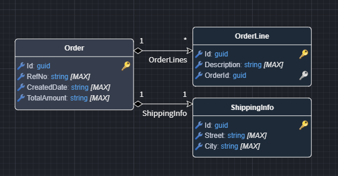
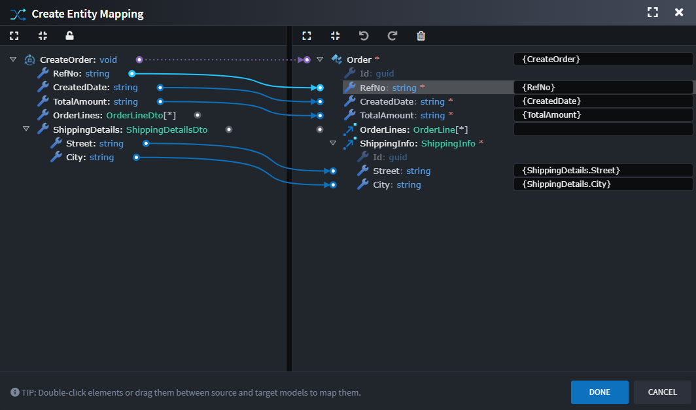

# Designer Scripting: Advanced Mappings

Learn how to automate advanced mapping creation using scripts. This guide is for module builders and developers who want to programmatically create mappings between designer elements.

## What You'll Learn

This guide covers:
- Creating basic field-to-field mappings
- Mapping collections and nested objects
- Querying and validating existing mappings
- Common patterns and troubleshooting

## What Are Advanced Mappings?

Advanced Mappings are **blueprints for code generation**. When you map a `CreateOrder` command to an `Order` entity, you're telling templates:
- Which constructor or method to call (**Invocation Mapping**)
- Which fields map to which properties (**Data Mapping**)
- How to filter or query data (**Filter Mapping**)

Templates read these mappings and can generate code like this:

```csharp
// Your mapping creates this blueprint:
// Invocation: new Order()
// Data: RefNo → RefNo, CreatedDate → CreatedDate

// Template generates:
var order = new Order
{
    RefNo = command.RefNo,
    CreatedDate = command.CreatedDate
};
```

## Learn through examples

### Complete setup script

> [!IMPORTANT]
> 
> Before running any examples, execute this comprehensive setup script. It creates all the model elements needed for every example in this guide.

#### Step 1: Domain designer setup

Open your **Domain Designer** and run this script:

```javascript
// Get the first package
let packageId = getPackages()[0]?.id;
if (!packageId) {
    await dialogService.error("Create a Domain package first");
    return;
}

const GuidTypeId = "6b649125-18ea-48fd-a6ba-0bfff0d8f488";

// Create Order entity with attributes
let order = createElement("Class", "Order", packageId);
createElement("Attribute", "RefNo", order.id);
createElement("Attribute", "CreatedDate", order.id);
createElement("Attribute", "TotalAmount", order.id);

// Create OrderLine entity for collection example
let orderLine = createElement("Class", "OrderLine", packageId);
createElement("Attribute", "Description", orderLine.id);

// Order -> OrderLines (1:many)
let orderLinesAssoc = createAssociation("Association", order.id, orderLine.id, "OrderLines");
orderLinesAssoc.typeReference.setIsCollection(true);
orderLinesAssoc.getOtherEnd().typeReference.setIsCollection(false);

// Create ShippingInfo for nested object example
let shippingInfo = createElement("Class", "ShippingInfo", packageId);
createElement("Attribute", "Street", shippingInfo.id);
createElement("Attribute", "City", shippingInfo.id);

// Order -> ShippingInfo (1:1)
let shippingAssoc = createAssociation("Association", order.id, shippingInfo.id, "ShippingInfo");
shippingAssoc.typeReference.setIsCollection(false);
shippingAssoc.getOtherEnd().typeReference.setIsCollection(false);

const diagram = getCurrentDiagram();
let space = diagram.findEmptySpace(diagram.getViewPort().getCenter(),  { width: 500, height: 550 });
diagram.layoutVisuals(getPackages()[0], space, true);

await dialogService.info("Domain entities created!");
```

#### Step 2: Services designer setup

Switch to your **Services Designer** and run this script:

```javascript
// Get the first package
let packageId = getPackages()[0]?.id;
if (!packageId) {
    await dialogService.error("Create a Services package first");
    return;
}

const GuidTypeId = "6b649125-18ea-48fd-a6ba-0bfff0d8f488";

// Create CreateOrder command
let createOrder = createElement("Command", "CreateOrder", packageId);
createElement("DTO-Field", "RefNo", createOrder.id);
createElement("DTO-Field", "CreatedDate", createOrder.id);
createElement("DTO-Field", "TotalAmount", createOrder.id);

// Create OrderLineDto for collection example
let orderLineDto = createElement("DTO", "OrderLineDto", packageId);
createElement("DTO-Field", "Description", orderLineDto.id);

// Add OrderLines collection to CreateOrder
let orderLinesField = createElement("DTO-Field", "OrderLines", createOrder.id);
orderLinesField.typeReference.setType(orderLineDto.id);
orderLinesField.typeReference.setIsCollection(true);

// Create ShippingDetailsDto for nested example
let shippingDetailsDto = createElement("DTO", "ShippingDetailsDto", packageId);
createElement("DTO-Field", "Street", shippingDetailsDto.id);
createElement("DTO-Field", "City", shippingDetailsDto.id);

// Add ShippingDetails to CreateOrder
let shippingField = createElement("DTO-Field", "ShippingDetails", createOrder.id);
shippingField.typeReference.setType(shippingDetailsDto.id);

// Create GetOrderById query
let getOrderById = createElement("Query", "GetOrderById", packageId);
let idField = createElement("DTO-Field", "Id", getOrderById.id);
idField.typeReference.setType(GuidTypeId);

// Create OrderDto for query return
let orderDto = createElement("DTO", "OrderDto", packageId);
idField = createElement("DTO-Field", "Id", orderDto.id);
idField.typeReference.setType(GuidTypeId);
createElement("DTO-Field", "RefNo", orderDto.id);
createElement("DTO-Field", "CreatedDate", orderDto.id);
createElement("DTO-Field", "TotalAmount", orderDto.id);

getOrderById.typeReference.setType(orderDto.id);

await dialogService.info("Services elements created!");
```




**What was created:**
- `Order`, `OrderLine`, `ShippingInfo` entities with associations (Domain)
- `CreateOrder` command with fields, collections, and nested objects (Services)
- `GetOrderById` query and `OrderDto` for query example (Services)

---

All examples run in the **Services Designer**. Make sure you've completed the [setup scripts](#complete-setup-script) first.

### Example 1: Map command fields to Entity

Map `CreateOrder` command fields to `Order` entity attributes using the three-step process.

```javascript
// Find the command and entity
let command = lookupTypesOf("Command").find(x => x.getName() === "CreateOrder");
let entity = lookupTypesOf("Class").find(x => x.getName() === "Order");

// Step 1: Create association (declares intent)
let action = createAssociation("Create Entity Action", command.id, entity.id);

// Step 2: Create the mapping
let mapping = action.createAdvancedMapping(command.id, entity.id);

// Step 3a: Add invocation (tells template to call constructor)
mapping.addMappedEnd("Invocation Mapping", [command.id], [entity.id]);

// Step 3b: Map simple fields
let fields = ["RefNo", "CreatedDate", "TotalAmount"];
fields.forEach(name => {
    let field = command.getChildren("DTO-Field").find(x => x.getName() === name);
    let attr = entity.getChildren("Attribute").find(x => x.getName() === name);
    
    if (field && attr) {
        mapping.addMappedEnd(
            "Data Mapping",
            [command.id, field.id],  // Source: command.Field
            [entity.id, attr.id]     // Target: entity.Attribute
        );
    }
});

// Step 3c: Map shipping info fields (nested object with multi-level paths)
let shippingField = command.getChildren("DTO-Field").find(x => x.getName() === "ShippingDetails");
let shippingAssoc = entity.getAssociations("Association").find(x => x.getName() === "ShippingInfo");

if (shippingField && shippingAssoc) {
    let shippingDto = shippingField.typeReference.getType();
    let shippingEntity = shippingAssoc.typeReference.getType();
    
    // Map each nested field
    ["Street", "City"].forEach(fieldName => {
        let dtoField = shippingDto.getChildren("DTO-Field").find(x => x.getName() === fieldName);
        let entityAttr = shippingEntity.getChildren("Attribute").find(x => x.getName() === fieldName);
        
        if (dtoField && entityAttr) {
            mapping.addMappedEnd(
                "Data Mapping",
                [command.id, shippingField.id, dtoField.id],      // command.ShippingDetails.Street
                [entity.id, shippingAssoc.id, entityAttr.id]      // entity.ShippingInfo.Street
            );
        }
    });
}

await dialogService.info("Mapping created!");
```

**Understanding the code:**
- `lookupTypesOf("Command")` - Finds all Commands in the Services Designer
- `createAssociation()` - Creates "Create Entity Action" connecting command to entity
- `createAdvancedMapping()` - Creates the mapping blueprint on the association
- `addMappedEnd()` - Adds each transformation rule (Invocation + Data mappings)
- **Path arrays** `[command.id, field.id]` - Represents "command.RefNo" traversal
- **Nested fields** - Use 3-level paths like `[command.id, shippingField.id, streetField.id]` to map individual nested properties



**Possible generated code:**
```csharp
var order = new Order  // From Invocation Mapping
{
    RefNo = command.RefNo,             // From Data Mapping
    CreatedDate = command.CreatedDate, // From Data Mapping
    TotalAmount = command.TotalAmount, // From Data Mapping
    ShippingInfo = new ShippingInfo
    {
        Street = command.ShippingDetails.Street,  // From 3-level Data Mapping
        City = command.ShippingDetails.City       // From 3-level Data Mapping
    }
};
```

### Example 2: Filter mapping for queries

Create a query mapping that filters by ID.

```javascript
let query = lookupTypesOf("Query").find(x => x.getName() === "GetOrderById");
let entity = lookupTypesOf("Class").find(x => x.getName() === "Order");

// Create query action and mapping
let action = createAssociation("Query Entity Action", query.id, entity.id);
let mapping = action.createAdvancedMapping(query.id, entity.id);

// Map Id field to Id attribute (filter condition)
let idField = query.getChildren("DTO-Field").find(x => x.getName() === "Id");
let idAttr = entity.getChildren("Attribute").find(x => x.getName() === "Id");

if (idField && idAttr) {
    mapping.addMappedEnd(
        "Filter Mapping",  // Tells template this is a WHERE clause
        [query.id, idField.id],
        [entity.id, idAttr.id]
    );
}

await dialogService.info("Filter mapping created!");
```

**Understanding the code:**
- `"Query Entity Action"` - Association type for query operations
- `"Filter Mapping"` - Tells templates to generate a WHERE clause
- Same path array pattern: `[parent.id, child.id]`


**Possible generated code:**
```csharp
var order = dbContext.Orders
    .Where(x => x.Id == query.Id)  // From Filter Mapping
    .FirstOrDefault();
```

### Example 3: Map collection fields

Map a collection property from command to entity.

```javascript
let command = lookupTypesOf("Command").find(x => x.getName() === "CreateOrder");
let entity = lookupTypesOf("Class").find(x => x.getName() === "Order");

// Get or create mapping (reuse from Example 1 if it exists)
let action = command.getAssociations("Create Entity Action")
    .find(x => x.typeReference?.typeId === entity.id);
if (!action) {
    action = createAssociation("Create Entity Action", command.id, entity.id);
}

let mapping = action.getAdvancedMappings()[0];
if (!mapping) {
    mapping = action.createAdvancedMapping(command.id, entity.id);
}

// Find collection field and association
let orderLinesField = command.getChildren("DTO-Field").find(x => x.getName() === "OrderLines");
let orderLinesAssoc = entity.getAssociations("Association").find(x => x.getName() === "OrderLines");

if (orderLinesField && orderLinesAssoc) {
    // Map the collection
    mapping.addMappedEnd(
        "Data Mapping",
        [command.id, orderLinesField.id],
        [entity.id, orderLinesAssoc.id]
    );
    
    // Map fields within the collection
    let lineDto = orderLinesField.typeReference.getType();
    let lineEntity = orderLinesAssoc.typeReference.getType();
    
    let descField = lineDto.getChildren("DTO-Field").find(x => x.getName() === "Description");
    let descAttr = lineEntity.getChildren("Attribute").find(x => x.getName() === "Description");
    
    if (descField && descAttr) {
        mapping.addMappedEnd(
            "Data Mapping",
            [command.id, orderLinesField.id, descField.id],  // 3-level path
            [entity.id, orderLinesAssoc.id, descAttr.id]     // command.OrderLines[].Description
        );
    }
}

await dialogService.info("Collection mapping created!");
```

**Understanding the code:**
- **3-level paths** `[command.id, orderLinesField.id, descField.id]` - Represents "command.OrderLines[].Description"
- First `addMappedEnd()` maps the collection itself
- Second `addMappedEnd()` maps fields within each collection item


**Possible generated code:**
```csharp
OrderLines = command.OrderLines.Select(line => new OrderLine
{
    Description = line.Description  // From 3-level Data Mapping
}).ToList()
```

---

## Common Issues

### Duplicate mappings

**Cause:** Running the same script multiple times.

**Fix:** Check if mapping exists before creating:

```javascript
let action = element.getAssociations("Create Entity Action")
    .find(x => x.typeReference?.typeId === targetElement.id);

if (!action) {
    action = createAssociation("Create Entity Action", element.id, targetElement.id);
}
```

### Wrong generated code

**Cause:** Incorrect path arrays. Must be in traversal order: `[parent.id, child.id]`.

**Fix:** Build paths from root to leaf:

```javascript
// ✅ Correct: command → ShippingDetails → Street
[command.id, shippingDetailsField.id, streetField.id]

// ❌ Wrong: Missing intermediate element
[command.id, streetField.id]
```

## Quick Reference

### Common Mapping Type IDs

```javascript
// Use these constants at the top of your scripts
const CreateEntityMappingId = "5f172141-fdba-426b-980e-163e782ff53e";
const UpdateEntityMappingId = "01721b1a-a85d-4320-a5cd-8bd39247196a";
const QueryEntityMappingId = "25f25af9-c38b-4053-9474-b0fabe9d7ea7";
```

### Key Methods

```javascript
// Finding elements
lookupTypesOf("Command")                      // Get all commands
element.getChildren("DTO-Field")              // Get child elements
element.getAssociations("Create Entity Action") // Get associations by type

// Creating mappings
createAssociation(type, sourceId, targetId)   // Step 1: Create association
action.createAdvancedMapping(srcId, tgtId)    // Step 2: Create mapping
mapping.addMappedEnd(type, sourcePath, targetPath) // Step 3: Add mapped ends
```

## Next Steps

- **[Designer Scripting Guide](xref:module-building.designers.designer-scripting)** - Learn the full Designer Scripting API.
- **[Advanced Mapping Tutorial](xref:module-building.tutorial-advanced-mapping)** - Configure mapping-enabled designers in the Module Builder.
- **[API Documentation](https://github.com/IntentArchitect/Intent.Modules/tree/development/DesignerMacros/typings)** - Review Full API Documentation in the Designer Scripting reference for detailed method signatures.
