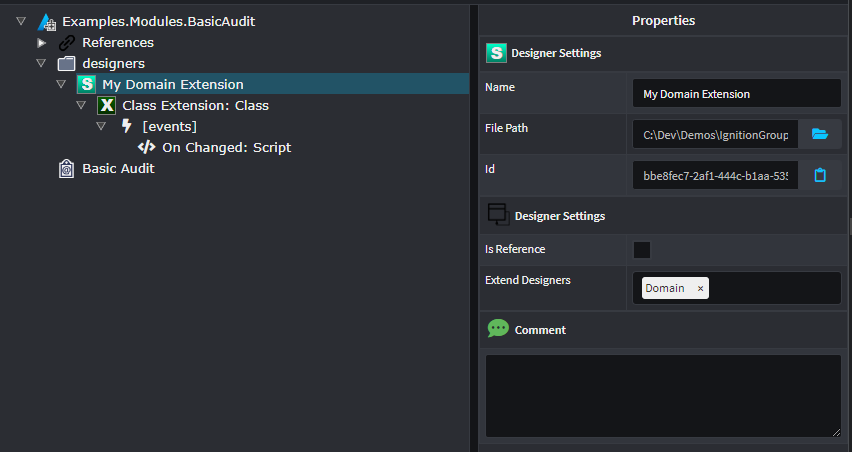
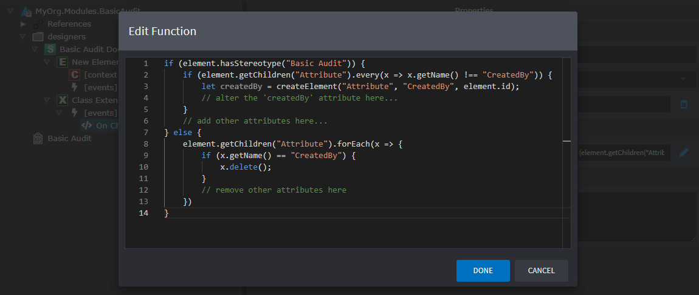

# Designer Scripting

Designers in Intent Architect support the configuration of scripts which can be triggered automatically on events or manually by the user. These scripts are written in JavaScript and configured in the [Module Builder](xref:module-building.about-the-module-builder).

## Manually triggered scripts

Scripts can triggered manually by creating a `Run Script Option` context-menu item against a Package, Element or Association.

### Example: Adding a script context-menu option

In this scenario we want to add a context-menu option to our `Class` elements in the Domain designer. We can achieve this in the following way:


 Access to the element instance can be done through the `element` variable. For example, the following script will set the value of a stereotype's property for the element:

 ```javascript
element.getStereotype("Stereotype Name").getProperty("Property Name").setValue("<value>");
 ```

## Automatically triggered scripts

Scrips can be configured to execute automatically on certain events.

### Element Events

 * `On Loaded` - executed once when the designer is loaded.
 * `On Created` - executed when an Element is created.
 * `On Changed` - executed whenever a change related to the Element occurs. It is important that this script is idempotent as it can lead to looped executions.
 * `On Name Changed` - executed whenever the Element's name is changed. It is important that this script is idempotent as it can lead to looped executions.
 * `On Type Changed` - executed whenever the Element's type reference is changed. It is important that this script is idempotent as it can lead to looped executions.
 * `On Mapped` - executed when the Element is mapped.
 * `On Deleted` - executed when the Element is deleted.

 Access to the element instance can be done through the `element` variable.

### Association Events

 * `On Loaded` - executed once when the designer is loaded.
 * `On Created` - executed when an Association is created.
 * `On Changed` - executed whenever a change related to the Association occurs. It is important that this script is idempotent as it can lead to looped executions.
 * `On Name Changed` - executed whenever the Association's name is changed. It is important that this script is idempotent as it can lead to looped executions.
 * `On Type Changed` - executed whenever the Association's type reference is changed. It is important that this script is idempotent as it can lead to looped executions.
 * `On Deleted` - executed when the Association is deleted.

 Access to the association instance can be done through the `association` variable. Note that this is the target-end of the association. To access the source-end, use `association.getOtherEnd()`.

### Example: Auto-adding attributes on classes in the Domain designer

In this scenario we want to extend the Domain designer to automatically add a set of basic auditing attributes to a class whenever a stereotype (called "Basic Audit") is applied to it.

First, we can set up the Designer Extension as follows:



Example of the `On Changed` script:



Now, once this module is installed, it will automatically add a `Created By` attribute to any class that applies the `Basic Audit` stereotype. Note that it checks before adding it twice. If the stereotype is removed, it will also remove any field with the name `Created By`.
