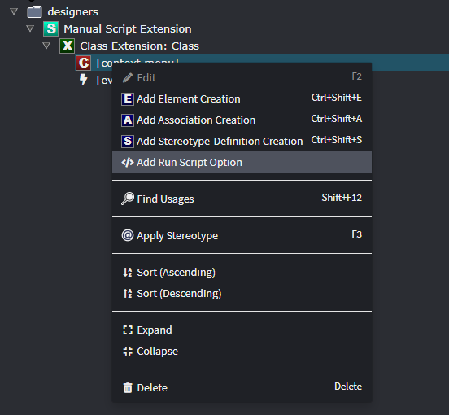

# Designer Scripting

Designer scripting allows you to automate modeling tasks in Intent Architect's designers through JavaScript-based scripts. Whether you need to create dozens of entities at once, enforce modeling conventions, or generate boilerplate structures, designer scripting can save significant time and ensure consistency across your models.

There are two primary ways to use designer scripting:

- **Execute Script Dialog**: Run ad-hoc scripts to perform one-time bulk operations or automate repetitive modeling tasks
- **Event Handlers**: Create automated responses to modeling events (e.g., automatically configure new entities or associations as they're created)

Both approaches share the same powerful API that gives you full programmatic access to create, modify, and configure elements in your designers. IntelliSense and inline documentation are available throughout the scripting environment to help you discover available functions and their usage.

## Getting Started with the Execute Script Dialog

Intent Architect includes a scripting editor which can be launched by clicking the Execute Script Dialog button (`</>`) located in the designer toolbar. This editor allows you to write and execute JavaScript scripts directly within your designer environment.


You can access detailed documentation by clicking on the small arrow beside each code construct in the IntelliSense dropdown to expand the respective documentation and learn more about the available functions.

### Your First Script

Here's a simple example that creates a class with five attributes:

```javascript
let mainPackage = getPackages()[0];
let newClass = createElement("Class", "Customer", mainPackage.id);

const stringTypeId = "d384db9c-a279-45e1-801e-e4e8099625f2";

for (let i = 1; i <= 5; i++) {
    let attr = createElement("Attribute", `Attribute${i}`, newClass.id);
    attr.typeReference.setType(stringTypeId);
}
```

This script demonstrates the core concepts:
- `getPackages()` retrieves available packages in your designer
- `createElement(type, name, parentId)` creates new elements
- Type IDs (like the string type ID) are used to set data types
- Elements are created hierarchically (attributes belong to a class)

## Understanding the Basics

Before diving into more complex examples, it's helpful to understand the key concepts and building blocks available in designer scripting.

### Element Types by Designer

Different designers support different element types. Here are the most common ones:

**Domain Designer:**
- Class
- Attribute
- Association
- Constructor
- Operation

**Services Designer:**
- Service
- DTO
- DTO-Field
- Command
- Query
- Operation

**Common (available in multiple designers):**
- Operation
- Parameter
- Package (folder)

### Common Type IDs

When setting type references for attributes, parameters, or return types, you'll need to use type IDs. Here are the most commonly used ones:

| Type | ID |
|------|-----|
| string | `d384db9c-a279-45e1-801e-e4e8099625f2` |
| int | `fb0a362d-e9e2-40de-b6ff-5ce8167cbe74` |
| long | `33013006-E404-48C2-AC46-24EF5A5774FD` |
| bool | `e6f92b09-b2c5-4536-8270-a4d9e5bbd930` |
| guid | `6b649125-18ea-48fd-a6ba-0bfff0d8f488` |
| datetime | `a4107c29-7851-4121-9416-cf1236908f1e` |
| decimal | `675c7b84-997a-44e0-82b9-cd724c07c9e6` |
| double | `24A77F70-5B97-40DD-8F9A-4208AD5F9219` |

**Best practice:** Define these as constants at the top of your script rather than using magic strings:

```javascript
// Define type constants for better maintainability
const stringType = "d384db9c-a279-45e1-801e-e4e8099625f2";
const intType = "fb0a362d-e9e2-40de-b6ff-5ce8167cbe74";
const guidType = "6b649125-18ea-48fd-a6ba-0bfff0d8f488";
```

### Working with Packages

Packages are the containers (folders) that organize elements in your designer. You can find existing packages or create new ones:

```javascript
// Get all packages
let allPackages = getPackages();

// Find a specific package by name
let domainPackage = getPackages().find(p => p.name === "Domain");

// Use the first package as default if target not found
let targetPackage = getPackages().find(p => p.name === "MyPackage") || getPackages()[0];
```

### Printing to the Console

When running scripts in the Execute Script dialog you can write messages and inspect objects using `console.log`. The output is shown in the [Task Output Console](xref:release-notes.intent-architect-v4.3#task-output-console) in Intent Architect. For complex objects use `JSON.stringify` to get a readable JSON representation.

```javascript
// Get all packages and print them
let allPackages = getPackages();
console.log(`allPackages = ${JSON.stringify(allPackages)}`);

// Find a named package and print it (may be undefined if not present)
let domainPackage = getPackages().find(p => p.name === "Domain");
console.log(`domainPackage = ${JSON.stringify(domainPackage)}`);

// Use the first package as default if target not found
let targetPackage = getPackages().find(p => p.name === "MyPackage") || getPackages()[0];
console.log(`targetPackage = ${JSON.stringify(targetPackage)}`);
```

> [!TIP]
>
> `JSON.stringify` provides compact output; if you prefer pretty output use `JSON.stringify(obj, null, 2)`.

Example of what the results pane might show (trimmed/simplified):

```text
[12:24:56] Executed Script: Executing script (0ms)
allPackages = [{"specializationId":"1a824508-4623-45d9-accc-f572091ade5a","specialization":"Domain Package","id":"fad9fe56-bb78-4b1d-8945-0e40ca9d77d3","name":"NewApplication.Domain",...}]
domainPackage = undefined
targetPackage = {"specializationId":"1a824508-4623-45d9-accc-f572091ade5a","specialization":"Domain Package","id":"fad9fe56-bb78-4b1d-8945-0e40ca9d77d3","name":"NewApplication.Domain",...}
```

This mirrors the example screenshots in the editor: objects printed as JSON, `undefined` printed when a find returns nothing, and the selected fallback package printed when the named package is not found.


### Creating Elements and Setting Types

The basic pattern for creating elements is:

```javascript
// Get arbitrary package ID
let packageId = getPackages()[0].id;

// Create an element: createElement(elementType, name, parentId)
let myClass = createElement("Class", "Customer", packageId);

// Create a child element
let myAttribute = createElement("Attribute", "Name", myClass.id);

// Set the attribute's type
const stringTypeId = "d384db9c-a279-45e1-801e-e4e8099625f2";
myAttribute.typeReference.setType(stringTypeId);

```

### Working with Stereotypes

Stereotypes provide a way to extend elements with additional metadata and properties. The scripting API gives you full access to check, retrieve, and modify stereotype information on elements.

#### Checking if a stereotype is applied

```javascript
// Check if an element has a specific stereotype by name
if (element.hasStereotype("Audit")) {
    console.log("Element has the Audit stereotype");
}

// You can also check using the stereotype ID
const auditStereotypeId = "9a8c3e2f-4b1d-4e2c-8f3a-2c1e4d5f6g7h";
if (element.hasStereotype(auditStereotypeId)) {
    console.log("Element has the Audit stereotype");
}
```

> [!TIP]
>
> You can use either the stereotype name or its ID when calling `hasStereotype()` or `getStereotype()`. Using IDs is more reliable when working with stereotypes that might have been renamed. Define stereotype IDs as constants to avoid magic strings throughout your code.

#### Getting and modifying stereotype properties

```javascript
// Get a stereotype by name
let stereotype = element.getStereotype("Audit");

// Get a property within the stereotype and set its value
stereotype.getProperty("CreatedBy").setValue("System");
stereotype.getProperty("CreatedDate").setValue(new Date().toISOString());

// Access nested properties
let auditStereotype = element.getStereotype("Audit");
if (auditStereotype) {
    let createdByProp = auditStereotype.getProperty("CreatedBy");
    if (createdByProp) {
        createdByProp.setValue("AdminUser");
    }
}
```

#### Applying stereotypes programmatically

```javascript
// Apply a stereotype to an element by name
element.applyStereotype("Soft Delete Entity");

// Remove a stereotype
element.removeStereotype("Soft Delete Entity");
```

#### Practical example: Stereotype-driven configuration

```javascript
// Check for specific stereotypes and configure element accordingly
if (element.hasStereotype("Aggregate Root")) {
    // Add specific attributes for aggregate roots
    let versionAttr = createElement("Attribute", "Version", element.id);
    versionAttr.typeReference.setType("33013006-E404-48C2-AC46-24EF5A5774FD"); // long type
}

if (element.hasStereotype("Value Object")) {
    // Value Objects are typically immutable
    element.getChildren("Attribute").forEach(attr => {
        attr.setMetadata("is-readonly", true);
    });
}
```

## Practical Examples: Ad-hoc Scripts

The following examples demonstrate common scenarios where ad-hoc scripts can save significant time. You can copy these examples and adapt them to your needs.

### Bulk Domain Model Creation

This example creates a complete e-commerce domain model with multiple entities and different relationship types. This is useful when you need to quickly scaffold a domain model based on existing documentation or requirements.

```javascript
// Define type constants
const stringType = "d384db9c-a279-45e1-801e-e4e8099625f2";
const guidType = "6b649125-18ea-48fd-a6ba-0bfff0d8f488";
const intType = "fb0a362d-e9e2-40de-b6ff-5ce8167cbe74";
const datetimeType = "a4107c29-7851-4121-9416-cf1236908f1e";
const decimalType = "675c7b84-997a-44e0-82b9-cd724c07c9e6";

// Helper function to add attributes to entities
function addAttributes(entity, attributes) {
    // Note: Id attributes are auto-generated when Intent.Metadata.RDBMS module is installed
    attributes.forEach(attr => {
        let attribute = createElement("Attribute", attr.name, entity.id);
        attribute.typeReference.setType(attr.type);
    });
}

// Find target package
let domainPackage = getPackages().find(p => p.name === "Domain") || getPackages()[0];

// Create entities
let customer = createElement("Class", "Customer", domainPackage.id);
let order = createElement("Class", "Order", domainPackage.id);
let orderItem = createElement("Class", "OrderItem", domainPackage.id);
let product = createElement("Class", "Product", domainPackage.id);

// Add attributes to each entity
// Use (or create) a DTO package to hold generated DTOs
// (fall back to the first package if a dedicated DTOs package doesn't exist)
let dtosPackage = getPackages().find(p => p.name === "DTOs") || getPackages()[0];
addAttributes(customer, [
    { name: "Name", type: stringType },
    { name: "Email", type: stringType }
]);

addAttributes(order, [
    { name: "OrderDate", type: datetimeType },
    { name: "TotalAmount", type: decimalType }
]);

addAttributes(orderItem, [
    { name: "Quantity", type: intType },
    { name: "UnitPrice", type: decimalType }
]);

addAttributes(product, [
    { name: "Name", type: stringType }
]);

// Create relationships with different patterns:

// 1. Aggregate: Customer -> Orders (defaults to 1-to-many aggregate relationship)
createAssociation("Association", customer.id, order.id);

// 2. Composition: Order -> OrderItems (1-to-many composite - OrderItem can't exist without Order)
// Key: Use getOtherEnd() to configure both sides for composite relationships
let orderItemAssoc = createAssociation("Association", order.id, orderItem.id);
orderItemAssoc.getOtherEnd().typeReference.setIsCollection(false); // Order side (one)
orderItemAssoc.typeReference.setIsCollection(true); // OrderItem side (many)

// 3. Reference: OrderItem -> Product (many-to-1 reference - Product exists independently)
createAssociation("Association", orderItem.id, product.id);

await dialogService.info("Created e-commerce domain model with proper relationship types!");
```

Once created, you can drag them onto the diagram to resemble this:


### Gathering User Input with Dynamic Forms

When you need to make your scripts more flexible and reusable, you can prompt users for input using dynamic forms. This example shows how to create a configurable entity generator that asks users what entities to create and what common fields to add.

```javascript
// Define type constants
const guidType = "6b649125-18ea-48fd-a6ba-0bfff0d8f488";
const intType = "fb0a362d-e9e2-40de-b6ff-5ce8167cbe74";
const longType = "33013006-E404-48C2-AC46-24EF5A5774FD";
const datetimeType = "a4107c29-7851-4121-9416-cf1236908f1e";

// Configure a form to collect entity generation parameters
let formConfig = {
    title: "Bulk Entity Generator",
    submitButtonText: "Generate Entities",
    minWidth: "500px",
    fields: [
        {
            id: "entityNames",
            fieldType: "textarea",
            label: "Entity Names (one per line)",
            isRequired: true,
            placeholder: "Customer\nOrder\nProduct\nCategory",
            hint: "Enter each entity name on a separate line"
        },
        {
            id: "addIdAttribute",
            fieldType: "checkbox",
            label: "Add Id attribute to each entity",
            value: true
        },
        {
            id: "idType",
            fieldType: "select",
            label: "Id Type",
            selectOptions: [
                { id: guidType, description: "Guid" },
                { id: intType, description: "Int" },
                { id: longType, description: "Long" }
            ],
            value: guidType
        },
        {
            id: "addAuditFields",
            fieldType: "checkbox",
            label: "Add audit fields (CreatedDate, UpdatedDate)",
            value: true
        }
    ]
};

// Show the form and get user input
let result = await dialogService.openForm(formConfig);
let entityNames = result.entityNames.split('\n').filter(name => name.trim());

// Create entities based on form input
let targetPackage = getPackages()[0];
entityNames.forEach(name => {
    let entity = createElement("Class", name.trim(), targetPackage.id);
    
    // Add Id attribute if requested
    if (result.addIdAttribute) {
        let idAttr = createElement("Attribute", "Id", entity.id);
        idAttr.typeReference.setType(result.idType);
    }
    
    // Add audit fields if requested
    if (result.addAuditFields) {
        let createdDate = createElement("Attribute", "CreatedDate", entity.id);
        createdDate.typeReference.setType(datetimeType);
        
        let updatedDate = createElement("Attribute", "UpdatedDate", entity.id);
        updatedDate.typeReference.setType(datetimeType);
    }
});

await dialogService.info(`Successfully created ${entityNames.length} entities!`);
```

### Service Layer Generation

This example generates CRUD (Create, Read, Update, Delete) operations for existing domain entities. This is particularly useful when you've modeled your domain and need to quickly create a corresponding service layer.

> [!NOTE]
>
> You need to have domain entities modeled before running this script.

```javascript
// Define type constants
const guidType = "6b649125-18ea-48fd-a6ba-0bfff0d8f488";

// Generate CRUD operations for all domain classes
let domainClasses = lookupTypesOf("Class");
let servicesPackage = getPackages().find(p => p.name === "Services") || getPackages()[0];

// Use (or create) a DTO package to hold generated DTOs
let dtosPackage = getPackages().find(p => p.name === "DTOs") || servicesPackage;

domainClasses.forEach(domainClass => {
    // Create or reuse a DTO that represents the domain entity in service layer APIs
    const dtoName = `${domainClass.getName()}Dto`;
    let dto = lookupTypesOf("DTO").find(d => d.getName() === dtoName);
    if (!dto) {
        dto = createElement("DTO", dtoName, dtosPackage.id);
    }

    // Copy attributes from the domain class into DTO fields where available
    // (This keeps the service layer decoupled from domain element types)
    domainClass.getChildren("Attribute").forEach(attr => {
        let field = createElement("DTO-Field", attr.getName(), dto.id);
        if (attr.typeReference) {
            // Use the attribute's type for the DTO field when possible
            field.typeReference.setType(attr.typeReference.getTypeId());
            field.typeReference.setIsNullable(attr.typeReference.getIsNullable());
            field.typeReference.setIsCollection(attr.typeReference.getIsCollection());
        }
    });

    let service = createElement("Service", `${domainClass.getName()}Service`, servicesPackage.id);
    
    // Create CRUD operations
    let createOp = createElement("Operation", `Create${domainClass.getName()}`, service.id);
    let getOp = createElement("Operation", `Get${domainClass.getName()}`, service.id);
    let updateOp = createElement("Operation", `Update${domainClass.getName()}`, service.id);
    let deleteOp = createElement("Operation", `Delete${domainClass.getName()}`, service.id);
    
    // Set return/parameter types to the DTO (not the domain element)
    // Get should return the DTO representation
    getOp.typeReference.setType(dto.id);
    // Create returns an id (guid)
    createOp.typeReference.setType(guidType);
    
    // Add parameters to operations - use DTO for payloads
    let createParam = createElement("Parameter", `create${domainClass.getName()}Request`, createOp.id);
    createParam.typeReference.setType(dto.id);
    
    let idParam = createElement("Parameter", "id", getOp.id);
    idParam.typeReference.setType(guidType);
});
```

### Command/Query Pattern Generator

If you're following the CQRS (Command Query Responsibility Segregation) pattern, this script can automatically generate Commands and Queries from existing Service Operations. It analyzes operation names to determine whether to create a Command or Query and copies parameters as DTO fields.

> [!TIP]
>
> Run the script in [Service Layer Generation](xref:module-building.designers.designer-scripting#service-layer-generation) before executing this one.

```javascript
// Generate Commands and Queries for selected service operations
let services = lookupTypesOf("Service");
let commandsPackage = getPackages()[0];
let queriesPackage = getPackages()[0];

services.forEach(service => {
    service.getChildren("Operation").forEach(operation => {
        let operationName = operation.getName();
        
        if (operationName.startsWith("Get") || operationName.startsWith("Find") || operationName.startsWith("Search")) {
            // Create Query
            let query = createElement("Query", `${operationName}Query`, queriesPackage.id);
            
            // Copy parameters as DTO fields
            operation.getChildren("Parameter").forEach(param => {
                let field = createElement("DTO-Field", param.getName(), query.id);
                if (param.typeReference) {
                    field.typeReference.setType(param.typeReference.getTypeId());
                    field.typeReference.setIsNullable(param.typeReference.getIsNullable());
                    field.typeReference.setIsCollection(param.typeReference.getIsCollection());
                }
            });
            
            // Set return type to match operation
            if (operation.typeReference && operation.typeReference.getTypeId()) {
                query.typeReference.setType(operation.typeReference.getTypeId());
                query.typeReference.setIsCollection(operation.typeReference.getIsCollection());
            }
            
        } else {
            // Create Command
            let command = createElement("Command", `${operationName}Command`, commandsPackage.id);
            
            // Copy parameters as DTO fields
            operation.getChildren("Parameter").forEach(param => {
                let field = createElement("DTO-Field", param.getName(), command.id);
                if (param.typeReference) {
                    field.typeReference.setType(param.typeReference.getTypeId());
                    field.typeReference.setIsNullable(param.typeReference.getIsNullable());
                    field.typeReference.setIsCollection(param.typeReference.getIsCollection());
                }
            });
            
            // Commands typically return void or an ID
            if (operation.typeReference && operation.typeReference.getTypeId()) {
                command.typeReference.setType(operation.typeReference.getTypeId());
            }
        }
    });
});

await dialogService.info("Commands and Queries generated successfully!");
```

## Working with Advanced Mappings

For scenarios beyond basic element creation and modification, Intent Architect also supports programmatically creating **Advanced Mappings** - declarative configurations that define data transformation paths between model elements. This is particularly useful when generating CRUD operations that need sophisticated mapping logic.

See [Scripting Advanced Mappings](xref:module-building.designers.scripting-advanced-mappings) for detailed examples of creating Invocation Mappings, Data Mappings, and Filter Mappings programmatically.

## Configuring Scripts in the Module Builder

While the Execute Script Dialog is great for one-off scripting, creating reusable scripts as part of a module requires configuration in the [Module Builder](xref:module-building.about-the-module-builder). This section covers how to set up scripts that persist as part of your module and are automatically available to users.

### Designer Settings for Script Configuration

When configuring context menu scripts and event handlers in the Module Builder, you need to ensure the designer is properly configured to support scripting:

1. **Create or extend a Designer** in the Module Builder
2. **Add Element or Association Extensions** to define where scripts can be configured
3. **Configure event handlers** on specific events (e.g., `On Created`, `On Changed`, etc.)

### Example: Setting up a Designer Extension with Script Support

In the Module Builder designer, you can extend an existing designer element to add script support:


Key steps:
- Select the element type you want to extend (e.g., `Class`)
- Add Element Event Handlers for the events where your script should execute
- Write your JavaScript logic in the event handler script editor

The scripts you configure here become part of your module and will automatically execute when users interact with the designer in their Intent Architect applications.

> [!NOTE]
>
> Scripts configured in the Module Builder are deployed as part of your module and execute automatically for all users who have the module installed. This is different from ad-hoc scripts in the Execute Script Dialog, which are one-time operations.

## Context Menu Scripts

Context menu scripts allow users to manually trigger JavaScript operations directly from the designer UI. These scripts are invoked through right-click context menus on elements, associations, or packages, providing a way to automate modeling tasks on demand.

### Adding a Context Menu Script Option

To add a context menu script option in the Module Builder:

1. Create a **Designer Extension** targeting the element type (e.g., `Class`, `Association`, or `Package`)
2. Add a **Run Script Option** to the extension
3. Configure the script that should execute when the user selects that option from the context menu

#### Example: Adding a context-menu option to Class elements

Here's how you might add a context menu option to the `Class` element in the Domain designer:



When a user right-clicks a Class element, they'll see your custom script option in the context menu. Clicking it will execute your JavaScript.

### Accessing Elements in Context Menu Scripts

In a context menu script, you have access to the element that was right-clicked through the `element` variable:

```javascript
// Access the element that triggered the context menu
console.log(`Element name: ${element.getName()}`);

// Modify element properties
element.getStereotype("Stereotype Name").getProperty("Property Name").setValue("<value>");

// Get the element's type
let elementType = element.specialization;
console.log(`Element type: ${elementType}`);

// Access child elements
element.getChildren("Attribute").forEach(attr => {
    console.log(`Attribute: ${attr.getName()}`);
});
```

### Example: Stereotype-based context menu script

Here's a practical example that configures caching for a service by applying the `Cacheable` stereotype and setting cache-related properties:

```javascript
const cacheableStereotype = "Cacheable";

// Check if the stereotype is already applied
if (element.hasStereotype(cacheableStereotype)) {
    // Element is already marked as cacheable
    return;
}

// Apply the stereotype
element.applyStereotype(cacheableStereotype);

// Configure cache properties
let stereotype = element.getStereotype(cacheableStereotype);
if (stereotype) {
    // Set cache duration in seconds
    stereotype.getProperty("DurationSeconds").setValue("300");
    
    // Set cache strategy
    stereotype.getProperty("Strategy").setValue("Distributed");
    
    // Set cache key pattern
    stereotype.getProperty("KeyPattern").setValue("${ClassName}:${MethodName}");
}

await dialogService.info(`Applied ${cacheableStereotype} to ${element.getName()} with 5-minute cache duration`);
```

## Event-Driven Automation

While ad-hoc scripts are great for one-time operations, event handlers allow you to automate responses to modeling actions. Event handlers run automatically when specific events occur, such as when an element is created, modified, or when an association is drawn.

Event handlers are particularly useful for:
- Enforcing modeling conventions automatically
- Auto-configuring new elements with common attributes
- Maintaining relationships between elements
- Applying stereotypes and metadata consistently

> [!NOTE]
> Event handlers are created in the Module Builder designer and become part of a module. This section assumes you're familiar with basic module building concepts. See [Module Builder overview](xref:module-building.about-the-module-builder) for conceptual background.

### Element Event Handlers

Element event handlers execute when an element is created or modified. This example shows how to automatically manage a "soft delete" pattern by adding or removing an `IsDeleted` attribute based on whether a stereotype is applied.


Inside the Module Builder designer, you can add Element Event Handlers for an Element you've created or extend an existing Element from a Designer.

Installed as: Element Event Handler on the `Class` element's `On Changed` event.
Requires a Stereotype `Soft Delete Entity`.

```javascript
const softDeleteStereotype = "Soft Delete Entity";
const boolTypeId = "e6f92b09-b2c5-4536-8270-a4d9e5bbd930";

if (element.hasStereotype(softDeleteStereotype)) {
    let isDeleteAttr = element.getChildren("Attribute").filter(x => x.hasMetadata("soft-delete"))[0] ||
        createElement("Attribute", "IsDeleted", element.id);
    isDeleteAttr.typeReference.setType(boolTypeId);
    isDeleteAttr.setMetadata("soft-delete", true);
    return;
}

let isDeleteAttr = element.getChildren("Attribute").filter(x => x.hasMetadata("soft-delete"))[0];
if (isDeleteAttr) {
    isDeleteAttr.delete();
}
```

In this JavaScript example, the script activates when a Class element is modified. It performs the following actions:

- When a Class has a Soft Delete stereotype applied, it adds an `IsDeleted` attribute of boolean type, marked with soft-delete metadata
- When the Soft Delete stereotype is removed, it searches for any attribute with soft-delete metadata and deletes it from the Class

### Auto-Configuring New Entities

This example shows how to automatically add common attributes (like Id, CreatedDate, UpdatedDate) whenever a new entity is created. This ensures consistency across your domain model without manual repetition.

Installed as: Element Event Handler on the `Class` element's `On Created` event.

```javascript
// Define type constants
const guidType = "6b649125-18ea-48fd-a6ba-0bfff0d8f488";
const datetimeType = "a4107c29-7851-4121-9416-cf1236908f1e";

// When a new Class is created, auto-add common attributes
if (element.specialization === "Class") {
    // Add Id attribute if it doesn't exist
    let hasId = element.getChildren("Attribute").some(attr => attr.getName().toLowerCase() === "id");
    if (!hasId) {
        let idAttr = createElement("Attribute", "Id", element.id);
        idAttr.typeReference.setType(guidType);
    }
    
    // Add CreatedDate and UpdatedDate for audit trail
    let createdDate = createElement("Attribute", "CreatedDate", element.id);
    createdDate.typeReference.setType(datetimeType);
    
    let updatedDate = createElement("Attribute", "UpdatedDate", element.id);
    updatedDate.typeReference.setType(datetimeType);
}
```

### Association Event Handlers

Association event handlers execute when associations (relationships) are created between elements. This is useful for automatically configuring relationship properties based on conventions or element types.


Inside the Module Builder designer, you can add Association Event Handlers for an Association you've created or extend an existing Association from a Designer.

Installed as: Association Event Handler on the `Association` element's `On Created` event.

Here's a simple example that automatically configures new associations so that the source is the composite owner of the relationship (no matter which association type you use):

```javascript
if (!association) {
    return;
}
let sourceEnd = association.getOtherEnd().typeReference;
sourceEnd.setIsCollection(false);
sourceEnd.setIsNullable(false);
```

This script gets executed when an association is created and turns it into a 1-to-1 composite relationship by disabling `Is Collection` and `Is Nullable` on the source end of the association.

### Auto-configuring association properties by aggregate semantics

Rather than relying on literal type names, this example shows a more robust approach: determine whether an element is an aggregate root (no other entity composes it) or a value object (specialization `Value Object`), and apply relationship semantics accordingly.

Installed as: Association Event Handler on the `Association` element's `On Created` event.

```javascript
// Auto-configure association properties using aggregate-root inference
if (!association) { return; }

function isAggregateRoot(element) {
    return !element.getAssociations("Association")
        .some(x => x.isSourceEnd() && !x.typeReference.isCollection && !x.typeReference.isNullable);
}

const sourceElement = association.getOtherEnd().typeReference.getType();
const targetElement = association.typeReference.getType();

// 1) If target is explicitly a Value Object -> make it a composition (parent one -> child many)
if (targetElement && targetElement.specialization === 'Value Object') {
    association.getOtherEnd().typeReference.setIsCollection(false); // Parent: only one composite owner
    association.typeReference.setIsCollection(true); // Child: collection of value objects
    association.typeReference.setIsNullable(false); // Child instances cannot be null
    return;
}

// 2) If target is an aggregate root (no composite owners) -> make relationship a required reference (many-to-one)
if (isAggregateRoot(targetElement)) {
    association.getOtherEnd().typeReference.setIsCollection(false); // Source end: single reference
    association.typeReference.setIsCollection(false); // Target end: single reference
    association.typeReference.setIsNullable(false); // Target must be present (required)
    return;
}

// 3) Fallback: optional reference (one-to-one optional)
association.getOtherEnd().typeReference.setIsCollection(false);
association.typeReference.setIsCollection(false);
association.typeReference.setIsNullable(true);
```

## Full API Documentation

Complete API documentation with IntelliSense is available in the built-in script editor. For the full TypeScript definitions, see the [GitHub repository](https://github.com/IntentArchitect/Intent.Modules/tree/development/DesignerMacros/typings).
