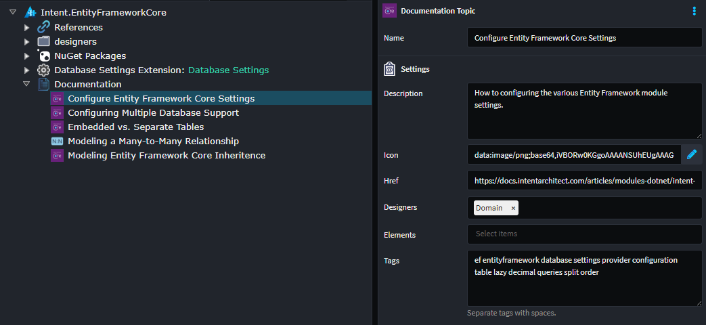

# Document Modules with Help Topics

You can make your documentation easily discoverable through the application's built-in Help feature. This system allows users to search for relevant topics directly within the app, which then directs them to your module's documentation website. The Help feature is context-aware, meaning it intelligently surfaces your documentation topics based on the specific designer page or module elements the user is currently working with, ensuring your carefully crafted explanations reach users precisely when they need them most.

Example of topics introduced by installed modules:

## Creating Help Topics

To create help topics for your module, you will need to ensure you have the module `Intent.ModuleBuilder` installed starting from version `3.12.0`.

To add documentation to your module, in the `Module Builder` designer, follow these steps:

- Right click on the package at the top of the tree-view page and select `Add Documentation`.
- A Documentation element will be created. Right click on it and select `Add Topic`.
- In the `Description` property, supply a description that will be visible on the tile representing the Help Topic.
- In the `Icon` property, provide an icon that will give a distinct visual appearance for your Help Topic.
- In the `Href` property, specify a URI location to direct the user when they click on your Help Topic.
- In the `Designers` property _(optional)_, select the designers where the Help Topic should appear. If no designers are selected, you can access the Help Topic irrespective of the designer page that is open.
- In the `Elements` property _(optional)_, select the elements related to the Help Topic. Right click on those elements in their respective designers will feature a `Help` option which will display your Help Topics.
- In the `Tags` property _(optional)_, define keywords (separated by spaces) which will help make your Help Topic more discoverable when a search phrase is entered in the Help screen in Intent Architect.
- Save and run the Software Factory to apply those changes to your module before building it.

Example of Help Topics in the Entity Framework module:

