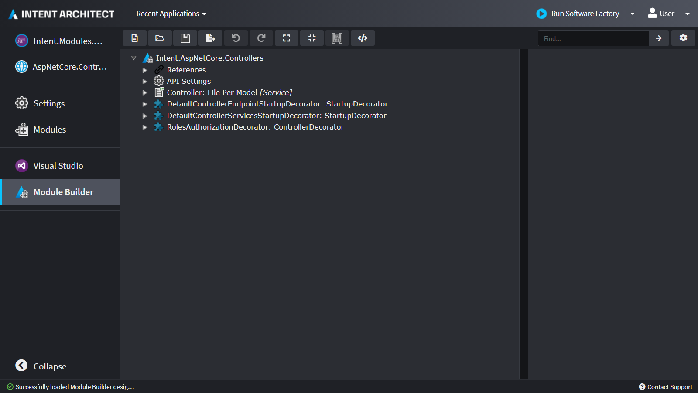
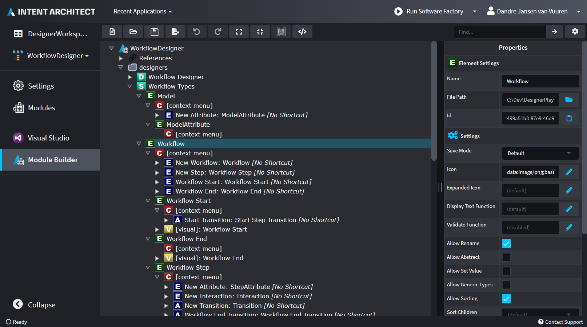
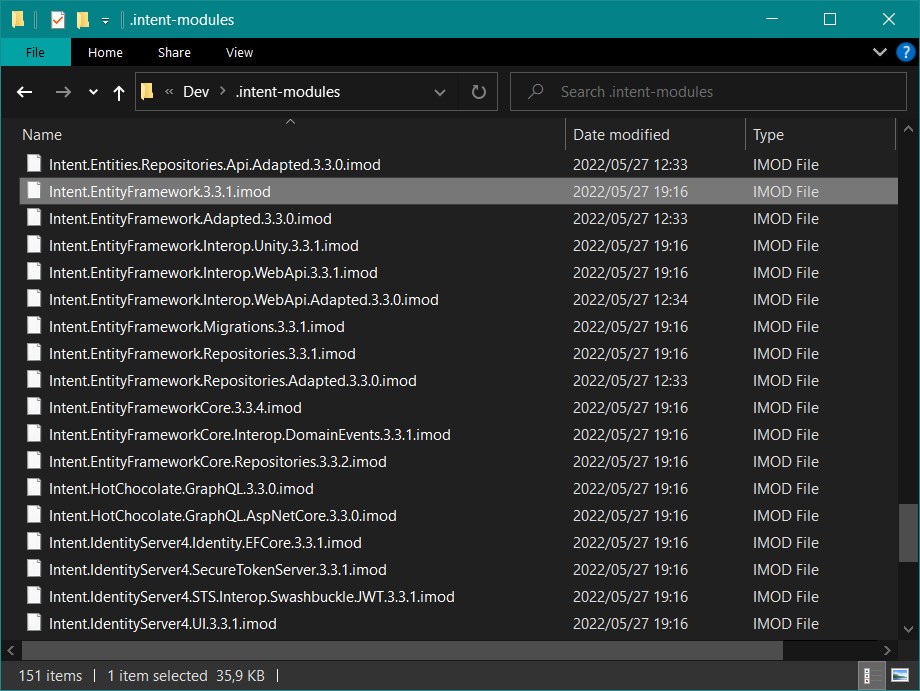

# About the Module Builder

The `Intent.ModuleBuilder` [Module](xref:application-development.applications-and-solutions.about-modules) provides a designer for modelling Intent Architect Modules along with their components such as [Templates](xref:module-building.templates.about-templates-csharp), [Designers](xref:application-development.modelling.about-designers), [Designer Extensions](xref:module-building.designer-extensions.about-designer-extensions), [Decorators](xref:module-building.decorators.about-decorators), [Factory Extensions](xref:application-development.code-weaving-and-generation.about-software-factory-execution) and [Stereotypes](xref:application-development.modelling.about-stereotypes).

## Build Modules that produce code

The Module Builder can be used to create a Module that can be installed to provide additional code generation and further automate your application creation process using Intent Architect.

## Build Modules that provide custom designers

The Module Builder can be used to create a Module that can be installed to provide custom designers that is better tailored to tackle a given problem or capture metadata in a different way.

## Distribute your modules

Compile your Module into an `imod` artifact that you can distribute amongst your team or even publish it for others to download and install, similar to how packages are distributed through well known package managers like nuget, npm, yarn, pip, etc.

## Getting started

Look at this [tutorial](xref:module-building.tutorials.create-a-module.introduction) to get started to build your own Module.

## See More

- 
- 
- 
  