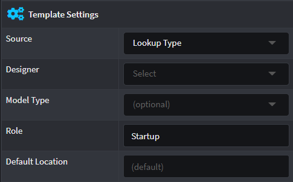

# Configuring the template default output location

## Template Outputs

`Template Output`s in the designers are used by the Software Factory to know where on the file system that template output should be written, in particular under which sub-folder. As modules are installed, for each template within them, a `Template Output` is automatically created with its name being the value of the `TemplateId` property of the template as specified during module building.

To see how Template Outputs affect the Application Development side [read this](xref:application-development.code-weaving-and-generation.about-template-output-targeting).

## Roles and Default Locations

Templates in the module builder can have their `Role` and `Default Location` configured. These are used by Intent Architect during module installation to determine where the template's `Template Output` should be placed.

As part of the module installation Intent Architect will search "Output Configuration" designers for a `Role` element with a name matching the `Role` value captured in the Module Builder.

If a `Role` with a matching name is found, then Intent Architect will then add any additional sub-folders specified in the `Default Location` as needed and finally place the new `Template Output` for the template within the correct sub-folder as specified by the template's `Default Location`. If `Default Location` was blank, then the `Template Output` is placed in the same folder as the `Role`.

If no `Role` with a matching name was found then the `Template Output` is placed in the "root" folder of the designer.

The following example depicts a Template created in the Module Builder and installed in a target Application.

The `Role` is set to `Distribution` and `Default Location` is set to `Controllers`.

In the example above the `Distribution` `Role` can be identified by the blue badge icon and at the same tree depth is the `Controllers` Folder.

Once that Module is installed, it will create the `Template Output` named `Intent.AspNetCore.Controllers.Controller` where the `Role` named `Distribution` is located but in a folder location relative to the `Role` which is `Controllers`.

> [!NOTE]
> Re-installing a Module may cause unassigned Template Outputs to be relocated, however assigned Template Outputs will remain untouched. This will allow you as a user to customize the output layout as you need it to be.
