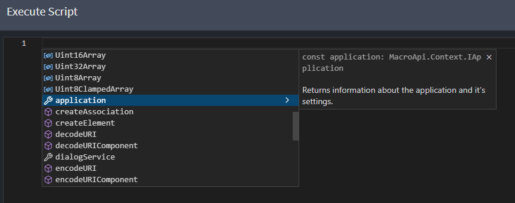

# Scripting

In the coding editor, documentation for code constructs is readily available, along with powerful scripting capabilities that allow developers to automate certain front-end related concerns. To access the documentation, simply click on the small arrow beside each code construct to expand the respective documentation and learn more about the available functions for automation.



## Execute Script Dialog

Intent Architect includes a scripting editor, which can be launched by clicking the on the Execute Script Dialog button (`</>`) located in the toolbar. This editor allows you to execute scripts directly within your designer environment.

```typescript
let mainPackage = getPackages()[0];
for (let classIndex = 1; classIndex <= 10; classIndex++) {
    let newClass = createElement("Class", `Class${classIndex}`, mainPackage.id);
    for (let attrIndex = 1; attrIndex <= 5; attrIndex++) {
        let attr = createElement("Attribute", `Attribute${attrIndex}`, newClass.id);
        const stringTypeId = "d384db9c-a279-45e1-801e-e4e8099625f2";
        attr.typeReference.setType(stringTypeId);
    }
}
```

_Example Script_

The following TypeScript declarations serve as a reference guide for understanding the scripting capabilities within the Intent Architect environment. By examining these declarations, users can determine the functions available for execution and gain insight into their intended purposes, allowing the automation of various operations directly within their design workspace.

```typescript
/**
 * Returns information about the application and it's settings.
 */
declare const application: IApplication;

/**
 * Creates an element of specialization type with the specified name, as a child of the specified parent.
 */
declare function createElement(specialization: string, name: string, parentId: string): IElementApi;

/**
 * Creates an association of specialization type with from a sourceElementId and optionally to a targetElementId.
 */
declare function createAssociation(specialization: string, sourceElementId: string, targetElementId?: string): IAssociationApi;

/**
 * Returns the packages currently loaded into the designer.
 */
declare function getPackages(): IPackageApi[];

/**
 * Present a popup dialog for user feedback or intervention.
 */
declare const dialogService: IDialogService;

/**
 * Finds the element with the specified id across all loaded packages.
 */
declare function lookup(id: string): IElementApi;

/**
 * Finds the elements of the specified type(s) across all loaded packages.
 */
declare function lookupTypesOf(types: string | string[]): IElementApi[];

/**
 * Removes specified prefixes from the provided string.
 * @param string The string from which the prefixes should be removed.
 * @param prefixes An array of prefix strings to remove.
 */
declare function removePrefix(string: string, ...prefixes: string[]): string;

/**
 * Removes specified suffixes from the provided string.
 * @param string The string from which the suffixes should be removed.
 * @param suffixes An array of suffix strings to remove.
 */
declare function removeSuffix(string: string, ...suffixes: string[]): string;

/**
* Returns the plural form of the specified word.
*/
declare function pluralize(word: string): string;

/**
* Returns the singular form of the specified word.
*/
declare function singularize(word: string): string;
```

