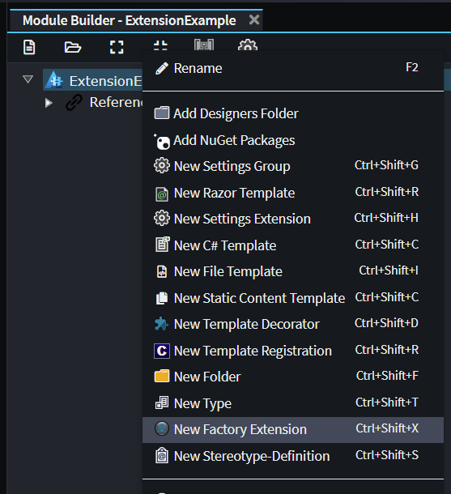
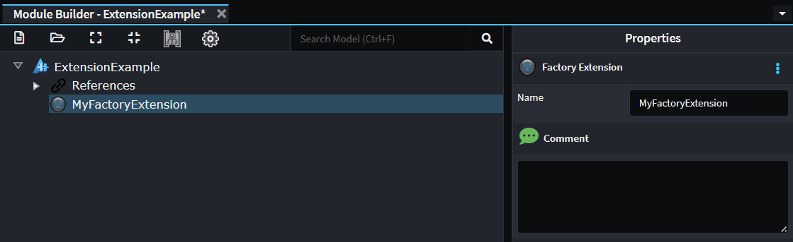
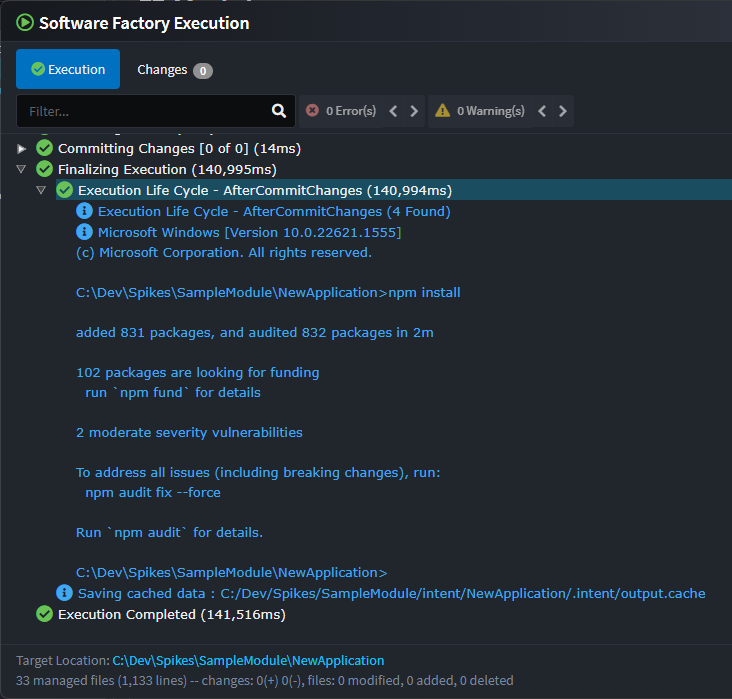

# Software Factory Extensions

Software Factory Extensions allow hooking into any of the various Software Execution phases to perform additional arbitrary actions which wouldn't make sense to be performed by a particular template. Examples of use cases for Software Factory extensions include (but are not limited to) post processing which needs to be performed after all templates have been executed or perhaps manipulating templates from other modules.

This article assumes that you have a Module Builder Intent Architect application already set up, please refer to our [Create Module](xref:module-building.tutorial-create-a-template.create-a-template-introduction) article for details on how to make a Module Building Intent Architect application.

## Creating a Software Factory Extension

Creating a Software Factory extension is done through the Module Builder by using the _New Factory Extension_ context menu option:



Choose a name for the Factory Extension which completes the work needed inside the Module Builder designer as there is nothing else which can be configured:



Run the Software Factory, apply changes and then open the generated file in Visual Studio. Factory Extensions always have the same boilerplate content:

```csharp
[IntentManaged(Mode.Fully, Body = Mode.Merge)]
public class MyFactoryExtension : FactoryExtensionBase
{
    public override string Id => "ExtensionExample.MyFactoryExtension";

    [IntentManaged(Mode.Ignore)]
    public override int Order => 0;

    /// <summary>
    /// This is an example override which would extend the
    /// <see cref="ExecutionLifeCycleSteps.AfterTemplateRegistrations"/> phase of the Software Factory execution.
    /// See <see cref="FactoryExtensionBase"/> for all available overrides.
    /// </summary>
    /// <remarks>
    /// It is safe to update or delete this method.
    /// </remarks>
    protected override void OnAfterTemplateRegistrations(IApplication application)
    {
        // Your custom logic here.
    }

    /// <summary>
    /// This is an example override which would extend the
    /// <see cref="ExecutionLifeCycleSteps.BeforeTemplateExecution"/> phase of the Software Factory execution.
    /// See <see cref="FactoryExtensionBase"/> for all available overrides.
    /// </summary>
    /// <remarks>
    /// It is safe to update or delete this method.
    /// </remarks>
    protected override void OnBeforeTemplateExecution(IApplication application)
    {
        // Your custom logic here.
    }
}
```

As noted in the comments above each of the methods, they are merely examples of overriding the relevant base methods. If you don't need one or both of these overrides, it is safe to delete the methods.

Each overridden method is called during a particular phase of the Software Factory execution, the following is a list of the all phases which can be hooked into in their execution order:

| Method Name                   | Description |
|-------------------------------|-------------|
| OnStart                       | Called once the Software Factory start up is complete. |
| OnBeforeMetadataLoad          | Called before metadata loading commences. Typically used to register custom metadata providers. |
| OnAfterMetadataLoad           | Called after metadata loading is complete. |
| OnBeforeTemplateRegistrations | Called before template registration and instantiation (construction) is performed. |
| OnAfterTemplateRegistrations  | Called after template registration and instantiation (construction) has been completed. This is the most commonly overridden method for Factory Extensions. |
| OnBeforeTemplateExecution     | Called before the `RunTemplate` is called on all template. |
| OnAfterTemplateExecution      | Called after the `RunTemplate` called has been completed on all templates. |
| OnBeforeCommitChanges         | Called immediately before "Changes" view is presented in the Software Factory window. |
| OnAfterCommitChanges          | Called after the user has pressed "Apply" on the Software Factory window and all confirmed changes have been committed to the file system. |

## Examples

### Creating a Factory Extension to manipulate files generated from other modules

For cases where you want your module to be able to manipulate content generated by templates in other modules, most Intent Architect authored templates use the C# File Builder which allows for easy manipulation of the file without requiring direct dependencies on the template's .NET assembly. These template instances can be found and manipulated from within Software Factory extensions.

For this example we will create a Factory Extension which finds all template instances which generate CQRS commands (from the `Intent.Application.MediatR` module), read a stereotype value off their model and if present then add an additional attribute to the generated class.

Begin by [creating a new Factory Extension](#creating-a-software-factory-extension), giving it a name, applying the Software Changes and then opening it inside of your IDE.

In our Factory Extension we will need to ensure we have overridden the `OnAfterTemplateRegistrations` method and change its content to the following:

```csharp
protected override void OnAfterTemplateRegistrations(IApplication application)
{
    var templates = application.FindTemplateInstances<ICSharpFileBuilderTemplate>("Intent.Application.MediatR.CommandModels");

    foreach (var template in templates)
    {
        if (template.TryGetModel<IHasStereotypes>(out var hasStereotypes))
        {
            throw new Exception("TryGetModel returned false");
        }

        if (hasStereotypes.HasStereotype("StereotypeNameOrId"))
        {
            var stereotypeValue = hasStereotypes.GetStereotypeProperty<string>("StereotypeNameOrId", "StereotypePropertyName");

            template.CSharpFile.OnBuild(file =>
            {
                var @class = file.Classes.FirstOrDefault() ?? throw new Exception("Could not find class on file");

                @class.AddAttribute($"MyCustomAttribute(\"{stereotypeValue}\")");
            });
        }
    }
}
```

In the above example we start with the following line:

```csharp
var templates = application.FindTemplateInstances<ICSharpFileBuilderTemplate>("Intent.Application.MediatR.CommandModels");
```

This retrieves all the template instances which generate `Command`s, the `"Intent.Application.MediatR.CommandModels"` argument allows specifying that we only want template instances for that Template ID.

> [!TIP]
>
> To work out the Template Id of a template you want to be able to find, either refer to the `TemplateId` field in the source code of the template or alternatively if it's a C# file you can open a file generated by the template and copy the value of the `IntentTemplate` assembly attribute at the top of the file.

We use the generic type argument of `ICSharpFileBuilderTemplate` which will cast all templates instances to this type.

When iterating over each template we:

- Use the `TryGetModel` method with a generic type argument of `IHasStereotypes` to try get the model for the template and we cast it to an `IHasStereotypes` which will allow us to read the stereotypes off the model without us needing to reference a NuGet package with the specific model type.
- Check if the appropriate stereotype is applied.
- Read a property off the stereotype using the generic type argument of `string` to convert it to this type.
- The `CSharpFile.OnBuild` method is called and in which we can then do anything on the file in the same way as when we're authoring the template in its own constructor.
- Find the class on the template.
- Add a custom attribute to the class.

If you build and install the module, it will now update commands to add this attribute.

### Creating a Factory Extension to run an external program

For this example we will create a Factory Extension which runs the following command:

```cmd
npm install
```

Begin by [creating a new Factory Extension](#creating-a-software-factory-extension), giving it a name, applying the Software Changes and then opening it inside of your IDE.

In our Factory Extension we will need to ensure we have overridden the `OnAfterCommitChanges` method and change its content to the following:

```csharp
protected override void OnAfterCommitChanges(IApplication application)
{
    try
    {
        var cmd = new Process
        {
            StartInfo =
                {
                    FileName = "cmd.exe",
                    RedirectStandardInput = true,
                    RedirectStandardOutput = true,
                    CreateNoWindow = false,
                    UseShellExecute = false,
                    WorkingDirectory = Path.GetFullPath(application.RootLocation)
                }
        };
        cmd.Start();

        cmd.StandardInput.WriteLine("npm install");

        cmd.StandardInput.Flush();
        cmd.StandardInput.Close();

        var output = cmd.StandardOutput.ReadToEnd();
        Logging.Log.Info(output);
    }
    catch (Exception e)
    {
        Logging.Log.Failure($@"Failed to execute: ""npm install"", Reason: {e.Message}");
    }
}
```

Install your Module to your Test Application in Intent Architect. Follow these [steps](xref:module-building.tutorial-create-a-template.install-and-run-the-module#install-the-module) if you are not sure how.

Run the Software Factory, click on the Apply button and then observe the following at the end of the process in the console output:


