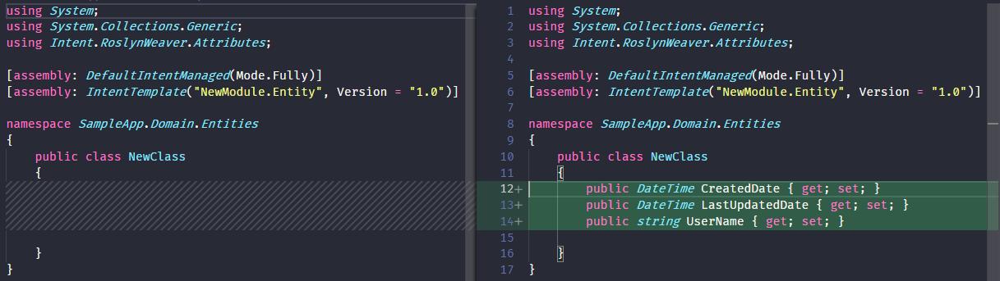

# How to use Stereotypes

This how-to will explain how to define [Stereotypes](xref:application-development.modelling.about-stereotypes) that are contained in your [Modules](xref:application-development.extensions.about-modules) and how to apply them to your applications.

Stereotypes defined in Modules are useable in the following ways:

- During use of the Designers in Intent Architect: Stereotypes can be manually or automatically applied to Elements by everyday users.
- During module authoring in the IDE: Intent Architect generates "APIs" for Stereotypes for easily retrieving them and their properties for use in Templates and other aspects of module building.

## Create a Stereotype Definition

[Stereotype Definitions](xref:module-building.stereotypes.about-stereotype-definitions) are used to creates "types" of Stereotypes which can then be applied to Element(s) (such as a Class in a Domain).

> [!NOTE]
> This how-to requires that the Domain Module's metadata is [installed](xref:module-building.tutorials.creating-modules-net.create-templates-per-model#install-the-domain-metadata). Although this how-to uses the Domain Designer, the same principles can be applied to the use of any Designer.

Create or open a Module Builder application (such as the one created in [](xref:module-building.tutorials.create-a-module.create-a-simple-module)) in Intent Architect, open the Module Builder Designer, right-click on the package in the designer and select `New Stereotype-Definition`.

In the Properties pane on the right of the screen, ensure that:

- `Name` has a value (eg: `Entity`).
- `Target Mode` is set to `Elements of Type`.
- `Targets` has `Class`.
- `Apply Mode` is set to `Manually`.
- `Icon` is specified to be a Boxed Character "E" on a Black background `E|#0`.
- `Display Icon` is checked.

[!Video-Loop videos/create-basic-stereotype.mp4]

> [!NOTE]
> During the Software Factory Execution, it generated a `ClassModelExtensions.cs` which contains an "API" for being able to more easily use the Stereotype during module building, such as for Templates. Use of this will be discussed in more detail [further below](#query-stereotypes-from-templates).

## Configure Module packaging for Stereotype Definitions

Open the Module application in Intent Architect where your Stereotype Definition is located, then open the `Module Builder` Designer and click on the package.

In the Properties pane on the right of the screen:

- Check `Include in Module`.
- For `Reference in Designer` ensure that `Domain` is included.

[!Video-Loop videos/package-stereotype.mp4]

## Add properties to a Stereotype

Properties on a Stereotype are additional "fields" (of metadata) which can be configured on an applied Stereotype.

Open the Module application in Intent Architect containing the Stereotype Definition you created above and then open the `Module Builder` Designer.

Right-click on the `Entity` Stereotype Definition.

- Select `Add Property`.
- Set the Name to `Change Detection`.
- Select the Type `Checkbox`.

[!Video-Loop videos/stereotype-add-property.mp4]

## Query Stereotypes from Templates

Open the Module application in Intent Architect where your [Stereotype Definition](#add-properties-to-a-stereotype) is located, then open the `Module Builder` Designer.

Add a Template called `EntityClass` and once you have executed the Software Factory, add the following content to the generated `EntityClassTemplate.tt` file:

```cs
<#@ template language="C#" inherits="CSharpTemplateBase<Intent.Modelers.Domain.Api.ClassModel>" #>
<#@ assembly name="System.Core" #>
<#@ import namespace="System.Collections.Generic" #>
<#@ import namespace="System.Linq" #>
<#@ import namespace="Intent.Modules.Common" #>
<#@ import namespace="Intent.Modules.Common.Templates" #>
<#@ import namespace="Intent.Modules.Common.CSharp.Templates" #>
<#@ import namespace="Intent.Templates" #>
<#@ import namespace="Intent.Metadata.Models" #>

using System;
using System.Collections.Generic;

[assembly: DefaultIntentManaged(Mode.Fully)]

namespace <#= Namespace #>
{
    public class <#= ClassName #>
    {
<#  foreach(var attribute in Model.Attributes) { #>

        public <#= GetTypeName(attribute) #> <#= attribute.Name.ToPascalCase() #> { get; set; }
<#  } #>
<#  foreach(var associationEnd in Model.AssociatedClasses.Where(x => x.IsNavigable)) { #>

        public <#= GetTypeName(associationEnd) #> <#= associationEnd.Name.ToPascalCase() #> { get; set; }
<#  } #>
    }
}
```

> [!NOTE]
> Your code Solution (the project generated by the Software Factory from the Module application) should contain an `API` folder with a file called `ClassModelExtensions.cs`.
>
> It contains a Class with Extension Methods for performing queries against a Class Element with regards to the `Entity` Stereotype. The Module Builder generates these extension methods for each of thee entries specified in the `Targets` property of the Stereotype Definition.

A Class Element can be queried for the presence of the `Entity` Stereotype. This can be invoked within your Template code:

```cs
bool hasEntityStereotype = Model.HasEntity();
```

The `Change Detection` Property of the `Entity` Stereotype can also be queried by invoking it within your Template code:

```cs
bool hasChangeDetection = Model.GetEntity().ChangeDetection();
```

The example below uses these extension methods in the `EntityClass` Template to determine whether or not it should generate additional properties:

```cs
<#  if (Model.HasEntity() && Model.GetEntity().ChangeDetection()) 
    { #>
        public DateTime CreatedDate { get; set; }
        public DateTime LastUpdatedDate { get; set; }
        public string UserName { get; set; }
<#  } #>
```

> [!IMPORTANT]
> Don't forget to add the `import` directive to the Template file that references the namespace of the `ClassModelExtensions` class.
>
> In this example it would be `<#@ import namespace="NewModule.Api" #>`

After applying the example above, the complete Template should be as follows:

```cs
<#@ template language="C#" inherits="CSharpTemplateBase<Intent.Modelers.Domain.Api.ClassModel>" #>
<#@ assembly name="System.Core" #>
<#@ import namespace="System.Collections.Generic" #>
<#@ import namespace="System.Linq" #>
<#@ import namespace="Intent.Modules.Common" #>
<#@ import namespace="Intent.Modules.Common.Templates" #>
<#@ import namespace="Intent.Modules.Common.CSharp.Templates" #>
<#@ import namespace="Intent.Templates" #>
<#@ import namespace="Intent.Metadata.Models" #>
<#@ import namespace="NewModule.Api" #>

using System;
using System.Collections.Generic;

[assembly: DefaultIntentManaged(Mode.Fully)]

namespace <#= Namespace #>
{
    public class <#= ClassName #>
    {
<#  if (Model.HasEntity() && Model.GetEntity().ChangeDetection()) 
    { #>
        public DateTime CreatedDate { get; set; }
        public DateTime LastUpdatedDate { get; set; }
        public string UserName { get; set; }
<#  } #>

<#  foreach(var attribute in Model.Attributes) { #>

        public <#= GetTypeName(attribute) #> <#= attribute.Name.ToPascalCase() #> { get; set; }
<#  } #>
<#  foreach(var associationEnd in Model.AssociatedClasses.Where(x => x.IsNavigable)) { #>

        public <#= GetTypeName(associationEnd) #> <#= associationEnd.Name.ToPascalCase() #> { get; set; }
<#  } #>
    }
}
```

## Apply a Stereotype (manually)

Create or open an ASP.NET Core application in Intent Architect.

[Install the module](xref:module-building.tutorials.create-a-module.install-and-run-the-module#install-the-module) that contains the [newly created Stereotype Definition](#create-a-stereotype-definition).

Open the Domain Designer and create or select a Class Element.

Right-click on the Element and select Add Stereotype. A popup dialog appears with a list of Stereotypes Definitions whose `Targets` property contains this `Element` type.
Select your `Entity` Stereotype. Locate the Stereotype in the Properties pane on the right and check the checkbox next to "Change Detection".

[!Video-Loop videos/apply-stereotype-manually.mp4]

Save the Designer and run the Software Factory.

See that with the `Change Detection` checkbox selected, it has generated the additional properties on the C# class.

If you un-selected the checkbox and ran the Software Factory again, you would see that it would no longer generate those additional properties.



## Summary

We have learnt how to create a Stereotype Definition in a module and make that Stereotype available for use in an Application as well as read the Stereotype Definition's value from within a template.
