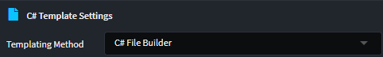

# C# File Builder System

The C# File Builder System is Intent Architect's primary method for generating and manipulating C# source code through templates. It provides a fluent, builder-pattern API that allows you to construct C# files programmatically using semantically meaningful methods that align with C# language constructs.

## What is the C# File Builder System?

The C# File Builder System replaces traditional text-based templating approaches (like T4 templates) with a code-first builder pattern. Instead of writing string-based templates, you use strongly-typed C# code to construct your output files.

This approach is similar to working with an [Abstract Syntax Tree (AST)](https://en.wikipedia.org/wiki/Abstract_syntax_tree), where you build up the structure of your code programmatically rather than manipulating text strings. This provides a more maintainable, type-safe way to generate C# code that integrates seamlessly with other Intent Architect components like Factory Extensions.

### Why Use the File Builder System?

- **Type Safety**: Unlike text-based templates, the builder system provides compile-time checking of your template logic.
- **IntelliSense Support**: Full IDE support with auto-completion for all available methods and properties.
- **Refactoring Safety**: Changes to your template logic are caught by the compiler rather than failing at runtime.
- **Code Interrogation**: Other templates and Factory Extensions can inspect and modify the code being generated through the builder objects.
- **Better Maintainability**: Complex generation logic is easier to understand and maintain when written as structured C# code.

## Core Concepts

### The `ICSharpFileBuilderTemplate` Interface

When creating a C# Template, it is set to use the File Builder System by default. If not you would need to:

1. Set the **Templating Method** to `C# File Builder` in the Module Builder Designer
2. Your template class will automatically implement the `ICSharpFileBuilderTemplate` interface



The initial output will be as follows:

```csharp
public partial class MyTemplate : CSharpTemplateBase<MyModel>, ICSharpFileBuilderTemplate
{
    public const string TemplateId = "MyModule.MyTemplate";

    public MyTemplate(IOutputTarget outputTarget, MyModel model) : base(TemplateId, outputTarget, model)
    {
        CSharpFile = new CSharpFile(this.GetNamespace(), this.GetFolderPath())
            .AddClass($"{Model.Name}", @class =>
            {
                // Configure the class using builder methods
            });
    }

    [IntentManaged(Mode.Fully)]
    public CSharpFile CSharpFile { get; }

    [IntentManaged(Mode.Fully)]
    protected override CSharpFileConfig DefineFileConfig()
    {
        return CSharpFile.GetConfig();
    }

    [IntentManaged(Mode.Fully)]
    public override string TransformText()
    {
        return CSharpFile.ToString();
    }
}
```

Or for templates whose names are suffixed with `Interface` it will be as follows:

```csharp
public partial class MyTemplateInterface : CSharpTemplateBase<MyModel>, ICSharpFileBuilderTemplate
{
    public const string TemplateId = "MyModule.MyTemplateInterface";

    public MyTemplateInterface(IOutputTarget outputTarget, MyModel model) : base(TemplateId, outputTarget, model)
    {
        CSharpFile = new CSharpFile(this.GetNamespace(), this.GetFolderPath())
            .AddInterface($"I{Model.Name}", @class =>
            {
                // Configure the interface using builder methods
            });
    }

    [IntentManaged(Mode.Fully)]
    public CSharpFile CSharpFile { get; }

    [IntentManaged(Mode.Fully)]
    protected override CSharpFileConfig DefineFileConfig()
    {
        return CSharpFile.GetConfig();
    }

    [IntentManaged(Mode.Fully)]
    public override string TransformText()
    {
        return CSharpFile.ToString();
    }
}
```

### The `CSharpFile` Object

The `CSharpFile` object is the root of the builder hierarchy. It represents an entire C# source file and provides methods to add top-level constructs:

```csharp
CSharpFile = new CSharpFile(namespace: "MyApp.Domain", relativeLocation: "Entities")
    .AddUsing("System")
    .AddUsing("System.Collections.Generic")
    .AddClass("Customer", @class => 
    {
        // Class configuration
    })
    .ImplementsInterface("ICustomerService", @interface =>
    {
        // Interface configuration  
    });
```

## Building Classes

Classes are the most common construct you'll build when using the File Builder System. The builder provides extensive methods for configuring class members:

### Basic Class Structure

Sample Builder Code:

```csharp
.AddClass("Customer", @class =>
{
    @class
        .WithBaseType("EntityBase")
        .ImplementsInterface("ICustomer")
        .AddProperty("string", "FirstName")
        .AddProperty("string", "LastName")
        .AddProperty("DateTime", "CreatedDate");
})
```

Example Output:

```csharp
public class Customer : EntityBase, ICustomer
{
    public string FirstName { get; set; }
    public string LastName { get; set; }
    public DateTime CreatedDate { get; set; }
}
```

### Adding Constructors

Sample Builder Code:

```csharp
.AddClass("Customer", @class =>
{
    @class.AddConstructor(ctor =>
    {
        ctor.AddParameter("string", "firstName", param =>
        {
            param.IntroduceReadonlyField(); // Creates private readonly field
        });
        ctor.AddParameter("string", "lastName", param =>
        {
            param.IntroduceProperty(); // Creates property and assigns it
        });
    });
})
```

Example Output:

```csharp
public class Customer
{
    private readonly string _firstName;

    public Customer(string firstName, string lastName)
    {
        _firstName = firstName;
        LastName = lastName;
    }

    public string LastName { get; set; }
}
```

### Adding Methods

Sample Builder Code:

```csharp
.AddClass("CustomerService", @class =>
{
    @class.AddMethod("Customer", "GetCustomerById", method =>
    {
        method
            .AddParameter("int", "customerId")
            .AddStatement("var customer = _repository.FindById(customerId);")
            .AddReturn("customer ?? throw new CustomerNotFoundException(customerId)");
    });
})
```

Example Output:

```csharp
public class CustomerService
{
    public Customer GetCustomerById(int customerId)
    {
        var customer = _repository.FindById(customerId);
        return customer ?? throw new CustomerNotFoundException(customerId);
    }
}
```

### Adding Properties with Different Configurations

Sample Builder Code:

```csharp
.AddClass("Customer", @class =>
{
    // Simple auto-property
    @class.AddProperty("string", "FirstName");
    
    // Property with private setter
    @class.AddProperty("DateTime", "CreatedDate", property => 
    {
        property.PrivateSetter();
    });
    
    // Property with initial value
    @class.AddProperty("bool", "IsActive", property =>
    {
        property.WithInitialValue("true");
    });
    
    // Property with custom getter logic
    @class.AddProperty("string", "FullName", property =>
    {
        property.WithoutSetter();
        property.Getter.WithBodyImplementation(@"return $""{FirstName} {LastName}"";");
    });

    // Property with expression implementation
    @class.AddProperty("string", "FullNameExpression", property =>
    {
        property.WithoutSetter();
        property.Getter.WithExpressionImplementation(@"$""{FirstName} {LastName}""");
    });
})
```

Example Output:

```csharp
public class Customer
{
    public string FirstName { get; set; }
    public DateTime CreatedDate { get; private set; }
    public bool IsActive { get; set; } = true;
    public string FullName
    {
        get { return $"{FirstName} {LastName}"; }
    }
    public string FullNameExpression => $"{FirstName} {LastName}";
}
```

### Controlling Accessibility and Modifiers

You can control the accessibility and modifiers of classes, methods, and properties:

```csharp
.AddClass("CustomerService", @class =>
{
    // Public static class
    @class.Static();
    
    // Private method
    @class.AddMethod("void", "ValidateCustomer", method =>
    {
        method.Private();
        method.AddParameter("Customer", "customer");
    });
    
    // Protected virtual method
    @class.AddMethod("bool", "CanProcess", method =>
    {
        method.Protected().Virtual();
        method.AddReturn("true");
    });
    
    // Static method with XML documentation
    @class.AddMethod("Customer", "CreateDefault", method =>
    {
        method
            .Static()
            .WithComments("""
                          /// <summary>
                          /// Creates a default customer instance.
                          /// </summary>
                          /// <returns>A new customer with default values.</returns>
                          """);
        method.AddReturn("new Customer()");
    });
})
```

Example Output:

```csharp
public static class CustomerService
{
    private void ValidateCustomer(Customer customer)
    {
    }

    protected virtual bool CanProcess()
    {
        return true;
    }

    /// <summary>
    /// Creates a default customer instance.
    /// </summary>
    /// <returns>A new customer with default values.</returns>
    public static Customer CreateDefault()
    {
        return new Customer();
    }
}
```

### Working with Async Methods

The File Builder System supports async methods with proper return type handling:

```csharp
.AddClass("CustomerService", @class =>
{
    // Async method returning Task
    @class.AddMethod("Customer", "GetCustomerAsync", method =>
    {
        method
            .Async() // Will set the return type to Task<Customer>
            .AddParameter("int", "customerId");
        method.AddReturn("await _repository.FindByIdAsync(customerId)");
    });
    
    // Async method returning ValueTask
    @class.AddMethod("bool", "ExistsAsync", method =>
    {
        method
            .Async(true) // Will set the return type to ValueTask<bool>
            .AddParameter("int", "customerId");
        method.AddReturn("await _repository.ExistsAsync(customerId)");
    });
    
    // Async void method (for event handlers)
    @class.AddMethod("void", "OnCustomerChanged", method =>
    {
        method
            .Async() // Will set the return type to Task
            .AddParameter("object", "sender")
            .AddParameter("CustomerChangedEventArgs", "e");
        method.AddStatement("await ProcessCustomerChangeAsync(e.Customer);");
    });

    // Using standard Task type without async / await keywords
    @class.AddMethod("Task", "CompletedAsync", method =>
    {
        method.AddReturn("Task.CompletedTask");
    });
})
```

Example Output:

```csharp
public class CustomerService
{
    public async System.Threading.Tasks.Task<Customer> GetCustomerAsync(int customerId)
    {
        return await _repository.FindByIdAsync(customerId);
    }

    public async System.Threading.Tasks.ValueTask<bool> ExistsAsync(int customerId)
    {
        return await _repository.ExistsAsync(customerId);
    }

    public async System.Threading.Tasks.Task OnCustomerChanged(object sender, CustomerChangedEventArgs e)
    {
        await ProcessCustomerChangeAsync(e.Customer);
    }

    public Task CompletedAsync()
    {
        return Task.CompletedTask;
    }
}
```

## Common Builder Patterns

### Conditional Code Generation

Sample Builder Code:

```csharp
.AddClass($"{Model.Name}", @class =>
{
    // Add properties for each attribute in the model
    foreach (var attribute in Model.Attributes)
    {
        @class.AddProperty(GetTypeName(attribute), attribute.Name.ToPascalCase());
    }
    
    // Conditionally add validation logic
    if (Model.HasStereotype("Validated"))
    {
        @class.AddMethod("bool", "IsValid", method =>
        {
            method.AddStatement("// Validation logic here");
            method.AddReturn("true");
        });
    }
})
```

Example Output:

```csharp
public class Customer
{
    public string FirstName { get; set; }
    
    public bool IsValid()
    {
        // Validation logic here
        return true;
    }
}

public class Address
{
    public string Line1 { get; set; }
    public string Line2 { get; set; }
    public string City { get; set; }
    public string PostalCode { get; set; }
}
```

### C# Attributes

Sample Builder Code:

```csharp
.AddClass("ApiController", @class =>
{
    @class
        .WithBaseType("ControllerBase")
        .AddAttribute("[ApiController]") // C# Attribute with square brackets
        .AddAttribute("Route", attr => attr.AddArgument(@"""api/[controller]""")); // C# Attribute with mutable arguments
        
    foreach (var operation in Model.Operations)
    {
        @class.AddMethod("IActionResult", operation.Name, method =>
        {
            method
                .AddAttribute($"[Http{operation.Verb}]")
                .AddParameter(GetTypeName(operation.RequestType), "request")
                .AddStatement("// Do Processing Here...")
                .AddReturn("Ok()");
        });
    }
})
```

Example Output:

```csharp
[ApiController]
[Route("api/[controller]")]
public class ApiController : ControllerBase
{
    [HttpPost]
    public IActionResult Post(RequestDto request)
    {
        // Do Processing Here...
        return Ok();
    }
}
```

### Working with CSharp Statements

The File Builder System provides a rich set of statement types and control over their formatting:

```csharp
.AddMethod("void", "ProcessCustomer", method =>
{
    // Basic statements
    method.AddStatement("var isValid = ValidateCustomer(customer);");
    
    // Statements with spacing control
    method
        .AddStatement("// First validation step")
        .AddStatement("var basicValidation = customer.Name != null;")
        .AddStatement("var advancedValidation = customer.Email?.Contains(\"@\") == true;")
        .AddStatement("// Processing logic", stmt => stmt.SeparatedFromPrevious()) // Adds extra spacing before this statement
        .AddIfStatement("isValid", ifStmt =>
        {
            ifStmt.AddStatement("ProcessValidCustomer(customer);");
            ifStmt.AddStatement("LogSuccess(customer.Id);");
        })
        .AddElseStatement(elseStmt =>
        {
            elseStmt.AddStatement("LogError($\"Invalid customer: {customer.Id}\");");
            elseStmt.AddStatement("throw new InvalidOperationException(\"Customer validation failed\");");
        });
})
```

Example Output:

```csharp
public void ProcessCustomer()
{
    var isValid = ValidateCustomer(customer);
    // First validation step
    var basicValidation = customer.Name != null;
    var advancedValidation = customer.Email?.Contains("@") == true;

    // Processing logic

    if (isValid)
    {
        ProcessValidCustomer(customer);
        LogSuccess(customer.Id);
    }
    else
    {
        LogError($"Invalid customer: {customer.Id}");
        throw new InvalidOperationException("Customer validation failed");
    }
}
```

### Method Invocations with Lambda Expressions

You can create method calls that accept lambda expressions as arguments:

```csharp
.AddMethod("void", "ConfigureServices", method =>
{
    // Method invocation with lambda argument
    method.AddInvocationStatement("services.Configure<AppSettings>", invocation =>
    {
        invocation.AddArgument(new CSharpLambdaBlock("options"), lambda =>
        {
            lambda.AddStatement(@"options.ConnectionString = configuration.GetConnectionString(""Default"");");
            lambda.AddStatement("options.EnableRetry = true;");
        });
    });
    
    // Multiple lambda arguments
    method.AddInvocationStatement("app.UseWhen", invocation =>
    {
        invocation.AddArgument(new CSharpLambdaBlock("context"), lambda => 
            lambda.WithExpressionBody(@"context.Request.Path.StartsWithSegments(""/api"")"));

        invocation.AddArgument(new CSharpLambdaBlock("appBuilder"), lambda =>
        {
            lambda.AddStatement("appBuilder.UseAuthentication();");
            lambda.AddStatement("appBuilder.UseAuthorization();");
        });
    });
})
```

Example Output:

```csharp
public class ApiController
{
    public void ConfigureServices()
    {
        services.Configure<AppSettings>(options =>
        {
            options.ConnectionString = configuration.GetConnectionString("Default");
            options.EnableRetry = true;
        });
        app.UseWhen(context => context.Request.Path.StartsWithSegments("/api"), appBuilder =>
        {
            appBuilder.UseAuthentication();
            appBuilder.UseAuthorization();
        });
    }
}
```

### Chained method invocations

```csharp
method.AddStatement(new CSharpAssignmentStatement(
    new CSharpVariableDeclaration("activeItems"),
    new CSharpStatement("Items")
        .AddInvocation("Where", i => i.AddArgument(new CSharpLambdaBlock("x"), a => a.WithExpressionBody("x.IsActive")).OnNewLine())
        .AddInvocation("Select", i => i.OnNewLine())
));
```

Example Output:

```csharp
public void Method()
{
    var activeItems = Items
        .Where(x => x.IsActive)
        .ToArray();
}
```

### OnBuild vs AfterBuild Callbacks

The File Builder System provides two types of callbacks for modifying generated code. These callbacks are essential because they execute at the correct time during the software factory execution process, allowing you to access existing template information that wouldn't be available under normal circumstances (since templates aren't ready yet).

Both callbacks execute right before templates generate their final output.

```csharp
// In your template constructor
CSharpFile = new CSharpFile(this.GetNamespace(), this.GetFolderPath())
    .AddClass("Customer", @class =>
    {
        @class.AddProperty("string", "Name");
    });

// OnBuild: Executes during the file building process
// Use this when you need to modify the structure before other templates can see it
// Optional priority parameter for ordering (lower numbers execute first)
CSharpFile.OnBuild(file =>
{
    var customerClass = file.Classes.First(c => c.Name == "Customer");
    customerClass.AddProperty("DateTime", "CreatedAt");
    
    // This modification is visible to other templates and Factory Extensions
}, priority: 100);

// AfterBuild: Executes after all OnBuild callbacks are complete
// Generally discouraged - use priorities with OnBuild instead
CSharpFile.AfterBuild(file =>
{
    var customerClass = file.Classes.First(c => c.Name == "Customer");
    
    // Add final validation or cleanup
    if (!customerClass.Properties.Any(p => p.Name == "Id"))
    {
        customerClass.AddProperty("int", "Id", prop => prop.WithInitialValue("0"));
    }
}, priority: 200);
```

> [!WARNING]
>
> Always use OnBuild or AfterBuild callbacks when interacting with a template instance's CSharpFile. Direct access outside these callbacks will fail because templates and their information aren't ready during normal template construction.
> [!TIP]
>
> Use OnBuild with priority ordering instead of AfterBuild whenever possible. AfterBuild is rarely needed and should generally be avoided - priority-based OnBuild callbacks can handle most ordering requirements.

## Working with Using Directives

You can manually add using directives by explicitly adding them:

```csharp
CSharpFile = new CSharpFile(this.GetNamespace(), this.GetFolderPath())
    .AddUsing("System.Collections.Generic") // Explicit using
    .AddClass("MyClass", @class =>
    {
        // When you add usings explicitly, the type is used as-is
        @class.AddProperty("IEnumerable<string>", "Items");
    });
```

Alternatively, you can use `UseType()` to automatically manage using directives:

```csharp
CSharpFile = new CSharpFile(this.GetNamespace(), this.GetFolderPath())
    .AddClass("MyClass", @class =>
    {
        // This will automatically add "using System.Collections.Generic;" if not already present
        @class.AddProperty($"{UseType("System.Collections.Generic.IEnumerable")}<string>", "Items");
    });
```

### Resolving Type Names

Use the template's `GetTypeName()` methods to resolve types correctly:

```csharp
.AddClass("CustomerService", @class =>
{
    // GetTypeName will automatically apply the correct using directive
    @class.AddMethod(GetTypeName("Domain.Customer", Model), "GetCustomer", method =>
    {
        method.AddParameter("int", "id");
    });
})
```

### Template Type Resolution Methods

You can also use generated template extension methods for type resolution. When you create templates in the Module Builder, extension methods are automatically generated for resolving types from other templates:

```csharp
.AddClass($"{Model.Name}Repository", @class =>
{
    @class.ImplementsInterface(this.GetRepositoryInterfaceName(Model));
    // ...
}
```

## Best Practices

### Use semantic method names

Instead of building complex strings, use the builder's semantic methods:

```csharp
// Good
method.AddIfStatement("mode == 1", stmt =>
{
    stmt.AddReturn("true");
});

// Avoid - string-based approach
method.AddStatements(
    """
    if (mode == 1)
    {
        return true;
    }
    """
);
```

> [!NOTE]
> String-based code generation may work for simple cases, but you'll lose correct indentation and the ability to mutate statements at runtime through Factory Extensions.

### Leverage lambda configuration

All C# File Builder semantic methods use a consistent signature pattern:

- **Return Type** - The type the method/property returns
- **Object Name** - The name of the method/property/class
- **Configuration Lambda** - A lambda expression for configuring the object

```csharp
.AddMethod("void", "ConfigureServices", method =>
{
    method.AddParameter("IServiceCollection", "services");
    
    foreach (var service in GetServices())
    {
        method.AddStatement($"services.AddScoped<{service.Interface}, {service.Implementation}>();");
    }
});
```

### Keep builder logic focused

Don't mix business logic with building logic:

```csharp
// Good - separate concerns
var properties = CalculateRequiredProperties(Model);
.AddClass(Model.Name, @class =>
{
    foreach (var prop in properties)
    {
        @class.AddProperty(prop.Type, prop.Name);
    }
});

// Avoid - mixed concerns
.AddClass(Model.Name, @class =>
{
    // Complex business logic mixed with building
    if (Model.HasComplexBusinessRule() && SomeOtherCondition())
    {
        // ... complex logic
        MethodThatObscuresTheCreationOfProperties();
    }
});
```

## Manipulate Templates with the C# File Builder from Factory Extensions

Factory Extensions can manipulate File Builder templates using the same `OnBuild` and `AfterBuild` callbacks, making them incredibly powerful for cross-cutting concerns:

```csharp
protected override void OnAfterTemplateRegistrations(IApplication application)
{
    var templates = application.FindTemplateInstances<ICSharpFileBuilderTemplate>("MyModule.Entity");

    foreach (var template in templates)
    {
        // Use OnBuild to add cross-cutting concerns
        template.CSharpFile.OnBuild(file =>
        {
            var @class = file.Classes.FirstOrDefault();
            if (@class != null)
            {
                // Add auditing properties to all entities
                @class.AddProperty("DateTime", "CreatedAt");
                @class.AddProperty("string", "CreatedBy");
                
                // Add interface implementation
                @class.ImplementsInterface("IAuditable");
            }
        });
        
        // Use AfterBuild for final validation or cleanup
        template.CSharpFile.AfterBuild(file =>
        {
            var @class = file.Classes.FirstOrDefault();
            
            // Ensure all entities have required using statements
            if (@class?.Interfaces.Any(i => i.Contains("IAuditable")) == true)
            {
                file.AddUsing("MyApp.Core.Interfaces");
            }
        });
    }
}
```

> [!NOTE]
> Factory Extensions have access to the same builder APIs as templates, allowing them to perform sophisticated code modifications across multiple modules.

### Working with Statement Spacing and Organization

You can control the visual organization of your generated code using spacing methods:

```csharp
.AddMethod("void", "ProcessOrder", method =>
{
    // Group related statements
    method.AddStatement("// Validation phase");
    method.AddStatement("ValidateOrder(order);");
    method.AddStatement("CheckInventory(order);");
    
    // Add visual separation before processing
    method
        .AddStatement("// Processing phase", stmt => stmt.SeparatedFromPrevious())
        .AddStatement("var result = ProcessPayment(order);")
        .AddIfStatement("result.IsSuccess", ifStmt =>
        {
            ifStmt.AddStatement("CompleteOrder(order);");
            ifStmt.AddStatement("SendConfirmation(order.CustomerEmail);");
        });
        
    // Final cleanup section
    method
        .AddStatement("// Cleanup", stmt => stmt.SeparatedFromPrevious())
        .AddStatement("LogOrderProcessing(order.Id, result);");
})
```

Example:

```csharp
public void ProcessOrder()
{
    // Validation phase
    ValidateOrder(order);
    CheckInventory(order);

    // Processing phase
    var result = ProcessPayment(order);

    if (result.IsSuccess)
    {
        CompleteOrder(order);
        SendConfirmation(order.CustomerEmail);
    }

    // Cleanup
    LogOrderProcessing(order.Id, result);
}
```

## Examples

### Repository Pattern Generation

Sample Builder Code:

```csharp
.AddClass($"{Model.Name}Repository", @class =>
{
    @class
        .ImplementsInterface($"I{Model.Name}Repository")
        .AddConstructor(ctor =>
        {
            ctor.AddParameter("DbContext", "context", param => param.IntroduceReadonlyField());
        })
        .AddMethod($"{Model.Name}", "GetById", method =>
        {
            method
                .AddParameter("int", "id")
                .AddReturn($"_context.{Model.Name.Pluralize()}.FirstOrDefault(x => x.Id == id)");
        })
        .AddMethod("void", "Add", method =>
        {
            method
                .AddParameter($"{Model.Name}", "entity")
                .AddStatement("_context.Add(entity);");
        });
})
```

Example:

```csharp
public class CustomerRepository : ICustomerRepository
{
    private readonly DbContext _context;

    public CustomerRepository(DbContext context)
    {
        _context = context;
    }

    public Customer GetById(int id)
    {
        return _context.Customers.FirstOrDefault(x => x.Id == id);
    }

    public void Add(Customer entity)
    {
        _context.Add(entity);
    }
}
```

### DTO Generation

Sample Builder Code:

```csharp
.AddClass($"{Model.Name}Dto", @class =>
{
    foreach (var attribute in Model.Attributes.Where(a => a.IsPublic))
    {
        @class.AddProperty(GetTypeName(attribute), attribute.Name.ToPascalCase());
    }
    
    // Add conversion methods
    @class.AddMethod(@class.Name, "FromDomain", method =>
    {
        method
            .Static()
            .AddParameter(GetTypeName(Model), "entity")
            .AddObjectInitializerBlock($"return new {@class.Name}", block =>
            {
                foreach (var attr in Model.Attributes.Where(a => a.IsPublic))
                {
                    block.AddInitStatement(attr.Name.ToPascalCase(), $"entity.{attr.Name.ToPascalCase()}");
                }
            });
    });
})
```

Example:

```csharp
public class CustomerDto
{
    public string FirstName { get; set; }
    public string LastName { get; set; }

    public static CustomerDto FromDomain(Customer entity)
    {
        return new CustomerDto
        {
            FirstName = entity.FirstName,
            LastName = entity.LastName
        };
    }
}
```

## Error Handling and Debugging

### Common issues

- **Missing using directives**: If your generated code has compilation errors due to missing using statements, ensure you're using `GetTypeName()` methods or explicitly adding using directives with `AddUsing()`.
- **Incorrect type resolution**: Always use the template's type resolution methods rather than hardcoded type names.
- **Builder method order**: Some builder methods must be called in a specific order. Consult the IntelliSense documentation for guidance.

### Debugging tips

- **Review generated output**: Always check the actual generated C# code to understand what the builder is producing.
- **Use the debugger**: You can debug your templates and inspect the real-time state of C# File Builder objects using the [.NET Debugger](xref:module-building.debugging-modules).

## Migration from T4 Templates

If you're migrating from T4 templates to the File Builder System:

### Before (T4)

```csharp
namespace <#= Namespace #>
{
    public class <#= ClassName #>
    {
<# foreach(var prop in Model.Properties) { #>
        public <#= GetTypeName(prop) #> <#= prop.Name #> { get; set; }
<# } #>
    }
}
```

### After (File Builder)

```csharp
CSharpFile = new CSharpFile(this.GetNamespace(), this.GetFolderPath())
    .AddClass(ClassName, @class =>
    {
        foreach (var prop in Model.Properties)
        {
            @class.AddProperty(GetTypeName(prop), prop.Name);
        }
    });
```

The File Builder approach provides better maintainability, type safety, and integration capabilities.

## Next Steps

- [Factory Extensions Integration](xref:module-building.additional-tools.software-factory-extensions)
