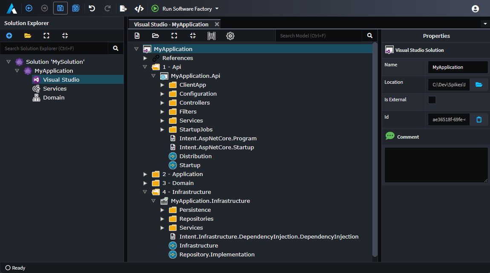

# How to add project dependencies (C#)

## Add a reference as needed to access a referenced type

When a template uses [`GetTypeName(...)`](xref:module-building.templates-general.resolving-type-names) and the type is from another template which is output to a different `.csproj`, then Intent Architect will automatically add a `<ProjectReference />` element to the `.csproj`.

## Add a reference manually to a project containing a particular role

You can specify a project dependency to another project in the Visual Studio designer based on it containing a particular _Role_. Consider the following layout in the Visual Studio designer:



From the above example, you can specify `MyApplication.Api` to have a reference to `MyApplication.Infrastructure`. In the constructor for a template within the project where the reference should be created, for example `Intent.AspNetCore.Startup`, add the following:

```csharp
AddProjectDependency("Infrastructure");
```

`Infrastructure` in this case is the name of a role which can be seen in the above screenshot as being within the `MyApplication.Infrastructure` project. With this line added, the software factory when running the `Intent.AspNetCore.Startup` template will ensure that a project reference exists to the project containing the role, `MyApplication.Infrastructure`.

## Add a reference manually to a project which is not modelled in the Visual Studio designer

The following will add a `<ProjectReference/>` with its `Include` set to any arbitrary relative path that you specify:

```csharp
AddAssemblyReference(new ProjectReference("..\\Project\\Project.csproj"));
```

> [!NOTE]
>
> Even on operating systems using `/` as their path separator, a `<ProjectReference/>` should have its path separated using a `\`.
>
> [!NOTE]
>
> `ProjectReference` is available from the `Intent.Modules.Common.VisualStudio` namespace and requires that at least version `3.8.2` of the `Intent.Common.CSharp` module is installed.
