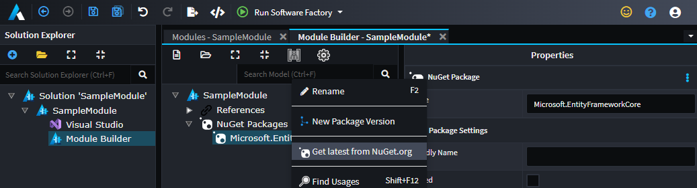

# How to Model NuGet Dependencies (C#)

Often when building modules, the generated patterns require that NuGet packages be installed. These NuGet dependencies can be modeled and managed within the module building ecosystem.

> [!NOTE]
> This functionality is available from `Intent.ModuleBuilder.CSharp` v3.6.*.

In this example, we will model our module to have a dependency on the `Microsoft.EntityFrameworkCore` NuGet package.

- Right-click on the `Module Builder` root and select `Add NuGet Packages`.


- Right-click on the `NuGet Packages` element and select `Add NuGet Package`.


- Type in the name of the NuGet package you have a dependency on, e.g., `Microsoft.EntityFrameworkCore`, `MediatR`, etc.


- Right-click on the package you added and select `Get latest from NuGet.org`.

This will retrieve the latest version information and configure the latest versions to be installed per .NET Framework version. This process is additive and will update existing entries (it will not remove any existing entries).

> [!NOTE]
> You can get the latest for all packages by performing `Get latest from NuGet.org` on the `NuGet Packages` element.



You will see the relevant versioning information under the package.


> [!NOTE]
> The versions are `>=`. In this example, version `7.0.20` will be used for `.net6` and `.net7`, while `8.0.8` will be used for `.net8`.

At this point, if you run the Software Factory, it will add a `NugetPackages` class to your module. This class is responsible for registering your module's `NuGet` requirements and has accessor methods for your templates to declare their specific `NuGet` dependencies.

```csharp
public class NugetPackages : INugetPackages
{
    public const string MicrosoftEntityFrameworkCorePackageName = "Microsoft.EntityFrameworkCore";

    public void RegisterPackages()
    {
        NugetRegistry.Register(MicrosoftEntityFrameworkCorePackageName,
            (framework) => framework switch
                {
                    ( >= 8, 0) => new PackageVersion("8.0.8"),
                    ( >= 6, 0) => new PackageVersion("7.0.20"),
                    _ => throw new Exception($"Unsupported Framework `{framework.Major}` for NuGet package '{MicrosoftEntityFrameworkCorePackageName}'"),
                }
            );
    }

    public static NugetPackageInfo MicrosoftEntityFrameworkCore(IOutputTarget outputTarget) 
        => NugetRegistry.GetVersion(MicrosoftEntityFrameworkCorePackageName, outputTarget.GetMaxNetAppVersion());
}
```

Then in your template, you can use the `AddNugetDependency` method:

```csharp
[IntentManaged(Mode.Merge, Signature = Mode.Fully)]
partial class MyTemplateTemplate : CSharpTemplateBase<object>
{
...
    [IntentManaged(Mode.Merge, Signature = Mode.Fully)]
    public MyTemplateTemplate(IOutputTarget outputTarget, object model = null) : base(TemplateId, outputTarget, model)
    {
        AddNugetDependency(NugetPackages.MicrosoftEntityFrameworkCore(outputTarget));
    }
...
```

> [!IMPORTANT]
> The `AddNugetDependency` method call must be invoked in either the `Constructor` or in the overridden `BeforeTemplateExecution` method, as the updates to the Visual Studio Project files may not reflect when the Software Factory execution occurs.

Once the template executes in the Software Factory, it will introduce a `PackageReference` in the corresponding Visual Studio Project file:

```xml
<ItemGroup>
    <PackageReference Include="Microsoft.EntityFrameworkCore" Version="8.0.8" />
    ...
</ItemGroup>
```

> [!NOTE]
> Actual package restoration is still handled by your IDE (`Visual Studio`, `Rider`, etc.) or `dotnet` commands for package restoration. Refer to the NuGet documentation on how to manage package sources.

## Modules Vote on Versions

If you have multiple modules installed, all requesting the same `NuGet` package, the `Software Factory` will select the highest version of the package specified by the modules.
For example, if:

- `Module1` wants `Microsoft.EntityFrameworkCore` `8.0.7`, and
- `Module2` wants `Microsoft.EntityFrameworkCore` `8.0.8`,

then `Microsoft.EntityFrameworkCore` `8.0.8` will be installed.

This is true provided none of the modules are `locking` the versions. If there are locked versions, the lowest locked version will be used.

## Locking NuGet Package Versions

In the Module Designer, you can `lock` your NuGet versions, either at the package level or for a specific .NET Framework version.

This will do two things:

- The `Get latest from NuGet.org` function will not change locked versions.
- When deciding which version of the NuGet package to install, the `Software Factory` will favor locked versions (installing the lowest locked version if there are multiple).

In the example below, we can see that the `Microsoft.EntityFrameworkCore` NuGet package is configured such that:

- For `.net6` and `.net7`, the version will be locked at `7.0.20` and will not go above this version.
- For `.net8`, it is locked at `8.0.8` but can be bumped up by another module requesting a newer version, say `8.0.9`.

