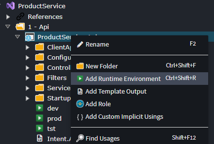
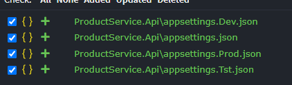

# How to update `appsettings.json` files

The `Intent.VisualStudio.Projects` module automatically generates the `appsettings.json` file for relevant .NET project types.

## How to update from a Template

To have additional configuration applied to an `appsettings.json` file, use the `ApplyAppSetting` extension method in your Template, for example:

```csharp
public override void BeforeTemplateExecution()
{
    this.ApplyAppSetting(
        field: "CustomSectionName:SomeStringField",
        value: "Some Value");

    this.ApplyAppSetting(
        field: "OtherCustomSectionName",
        value: new
        {
            IntValue = 10,
            StrValue = "My String"
        });
}
```

> [!NOTE]
> This extension method requires `Intent.Modules.Common.CSharp` NuGet package to be installed in your module project.
>
> [!IMPORTANT]
> This can only be invoked after construction of the template, otherwise the template which responds to this event might not yet have been constructed.
> 
> Placing this method in the override of either the `AfterTemplateRegistration` or `BeforeTemplateExecution` methods will ensure it is called only after all other templates have been constructed.

In the example above, your `appsettings.json` file will receive the following:

```json
{
    // ... other configuration...

    "CustomSectionName": {
        "SomeStringField": "Some Value"
    },
    "OtherCustomSectionName": {
        "IntValue": 10,
        "StrValue": "My String"
    }
}
```

## How to update from a Factory Extension

It is also possible to have additional configuration applied to an appsettings.json file from a `Factory Extension`, using the `EventDispatcher`.

``` csharp
protected override void OnAfterTemplateRegistrations(IApplication application)
{
    base.OnAfterTemplateRegistrations(application);
    
     application.EventDispatcher.Publish(new AppSettingRegistrationRequest(
        key: "CustomSectionName:SomeStringField",
        value: "Some Value"));

    application.EventDispatcher.Publish(new AppSettingRegistrationRequest(
        key: "OtherCustomSectionName",
        value: new
        {
            IntValue = 10,
            StrValue = "My String"
        }));
}
```

In the example above, your `appsettings.json` file will receive the following, the same as in the above `Template` example:

```json
{
    // ... other configuration...

    "CustomSectionName": {
        "SomeStringField": "Some Value"
    },
    "OtherCustomSectionName": {
        "IntValue": 10,
        "StrValue": "My String"
    }
}
```

## Variable field names

To create appsettings.json entries which have variable field names, or to update an already existing appsettings.json section, the following syntax can be used.

``` csharp
this.ApplyAppSetting(
   field: "OtherCustomSectionName:AdditionalStringValue",
   value: "AdditionalStrValue");
```

Executing the above after the above examples, will result in your `appsettings.json` file receiving the following:

```json
{
    // ... other configuration...

    "CustomSectionName": {
        "SomeStringField": "Some Value"
    },
    "OtherCustomSectionName": {
        "IntValue": 10,
        "StrValue": "My String",
        "AdditionalStringValue" : "AdditionalStrValue"
    }
}
```

## Environment specific appsettings.json files

To enable Intent Architect to generate separate appsettings.json files for each environment, you must configure the `runtime environments` in the *Visual Studio Designer*.



This configuration will generate three additional appsettings files, in addition to the base appsettings.json file.



When the `ApplySetting` method is called, the `runtime environment` can be supplied, which will result in the setting only being applied to the relevant appsettings file.

``` csharp
this.ApplyAppSetting(
   field: "ProductionOnlySetting",
   value: "ProductionValue",
   runtimeEnvironment: "prod");
```
