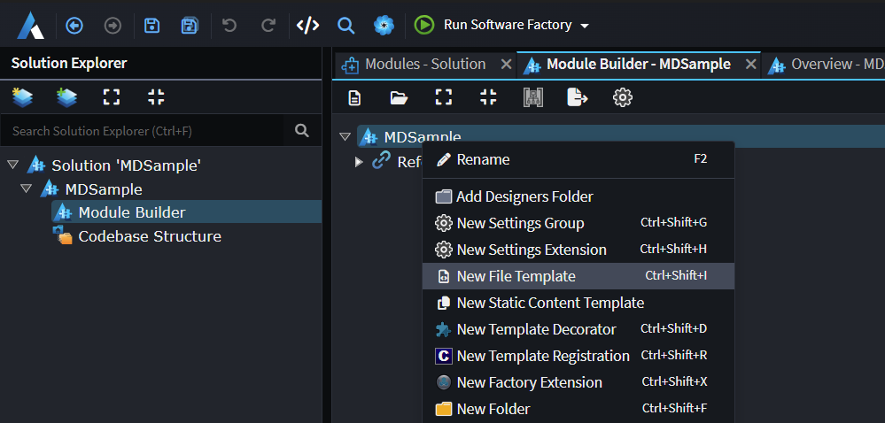
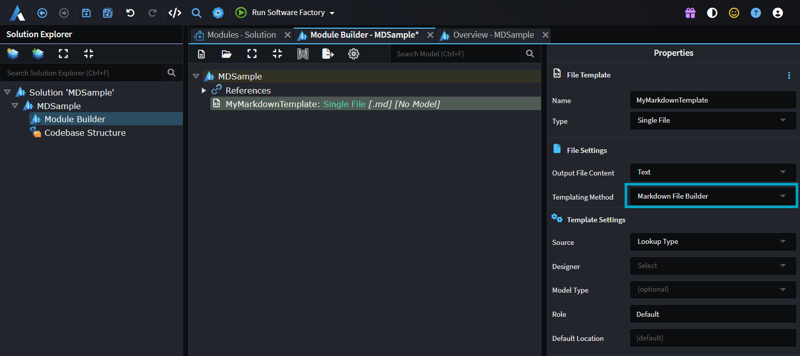

# How to generate Markdown files

Intent Architect has first class support for generation of Markdown files. These are particularly useful for creating things like AI skill and instruction files.

To create a Markdown template, open the `Module Builder` designer, right-click the package and select `New File Template`:



> [!NOTE]
> You require Intent.ModuleBuilder v 3.18.6+ Module for this option to appear.

In the properties panel, set the `Templating Method` to `Markdown File Builder`:



Run the Software Factory Execution. The following template class will be generated:

```csharp

    public class MyMarkdownTemplate : MarkdownBaseTemplate<object>, IMarkdownFileBuilderTemplate
    {
        ...

        [IntentManaged(Mode.Fully, Body = Mode.Ignore)]
        public MyMarkdownTemplate(IOutputTarget outputTarget, object model = null) : base(TemplateId, outputTarget, model)
        {
            WithContentHashing = true;
            MarkdownFile = new MarkdownFile($"MyMarkdown")
                .FromMarkdown("""
---
name: my-markdown-output
description: what its about.
---

# My Markdown File

Your Content Here
""");
        }

        ...
    }

```

> [!NOTE]
> You require the Intent.Common v 3.11.1+ NuGet Package.

## MarkdownFile Builder Usage

---

## Creating a file from scratch

```csharp
MarkdownFile = new MarkdownFile("SKILL", relativeLocation: ".agents/skills/my-skill")
    .WithFrontMatter(fm =>
    {
        fm.Set("name", "my-skill");
        fm.Set("description", "Does something useful.");
    })
    .WithSection("Overview", section =>
    {
        section.WithText("This skill does something useful.");
    })
    .WithSection("Rules", section =>
    {
        section.WithListItems("""
            - Always prefer existing patterns.
            - Never modify unrelated code.
            """);
    });
```

---

## Seeding from an existing Markdown string

`FromMarkdown` parses the string immediately, so any `OnBuild` augmentations registered afterwards will see the fully-parsed sections and front matter.

```csharp
MarkdownFile = new MarkdownFile("SKILL", relativeLocation: ".agents/skills/my-skill")
    .FromMarkdown(existingMarkdownString);
```

---

## Front matter

```csharp
file.WithFrontMatter(fm =>
{
    fm.Set("name", "my-skill");           // add or update
    fm.Set("version", "1.0");
    fm.Remove("contentHash");             // remove a key
});
```

---

## Adding and configuring sections

Section titles are matched case-insensitively. You can pass a plain title (`"Core rules"`) or a heading-prefixed title (`"## Core rules"`) — both resolve to the same section.

```csharp
// Get-or-create at the end of the file
file.WithSection("Core rules", section =>
{
    section.WithListItem("Always do X.");
    section.WithListItem("Never do Y.");
});

// Insert before a named section (inherits that section's heading level)
file.BeforeSection("Output expectations", "Entity Framework guidance", section =>
{
    section.WithListItems("""
        - Do not call repository.Update(...) when using EF repositories.
        - EF tracks loaded entities automatically.
        """);
});

// Insert after a named section
file.AfterSection("Core rules", "Extended rules", section =>
{
    section.WithListItem("An additional rule.");
});
```

`BeforeSection` and `AfterSection` both:

- Match the anchor section at any heading depth (`#`, `##`, `###`, etc.)
- Create the new section at the **same heading level** as the anchor (pass an explicit `headingLevel` to override)
- Fall back to appending at the end when the anchor section is not found

---

## Augmenting an existing section

```csharp
file.ConfigureSection("Core rules", section =>
{
    // Append a new rule
    section.WithListItem("One more rule.");

    // Insert immediately after a specific item
    section.AfterListItem(
        item => item.Content.Contains("Never do Y"),
        "Also never do Z.");

    // Remove matching items
    section.RemoveListItem(item => item.Content.Contains("obsolete rule"));
});
```

---

## Removing a section

```csharp
file.RemoveSection("Deprecated section");
```

---

## Checking for a section

```csharp
if (!file.HasSection("Entity Framework guidance"))
{
    file.WithSection("Entity Framework guidance", section => { ... });
}

// Or find it and work with it directly
var section = file.FindSection("Core rules");
```

---

## Sub-list items

Indent sub-items with two spaces per level. Both `WithListItems` (bulk string) and `FromMarkdown` (parsed files) preserve indentation depth.

```csharp
section.WithListItems("""
    - Top-level rule.
      - Sub-item detail.
      - Another sub-item detail.
    - Another top-level rule.
    - Allowed exception (rare):
      - Only when AutoMapper is not reasonable.
      - Must include an inline comment explaining why.
    """);
```

The indent level of a new item added via `AfterListItem` is inherited from the matched sibling automatically.

---

## Adding text and code blocks to a section

```csharp
file.WithSection("Examples", section =>
{
    section.WithText("The following snippet shows the pattern:");

    // Without a title
    section.WithCodeBlock("""
        var result = await _repository.GetAsync(id, cancellationToken);
        result.Apply(command);
        """, language: "csharp");

    // With a title — rendered as a bold label above the fence
    section.WithCodeBlock("""
        public class CustomerDtoProfile : Profile
        {
            public CustomerDtoProfile()
            {
                CreateMap<Customer, CustomerDto>();
            }
        }
        """, language: "csharp", title: "AutoMapper profile example");
});
```

A titled code block renders as:

```text
**AutoMapper profile example**
```

```csharp
public class CustomerDtoProfile : Profile
...
```

---

## Ordered lists

Ordered list items are numbered automatically. A numbered sequence interrupted by a text block (e.g. indented sub-bullets) continues its counter rather than resetting.

```csharp
file.WithSection("Workflow", section =>
{
    section.WithOrderedListItem("Read the existing handler.");
    section.WithOrderedListItem("Identify missing capabilities.");
    section.WithOrderedListItem("Implement and verify.");
});

// Or bulk-parse a raw ordered list string
section.WithListItems("""
    1. Read the existing handler.
    2. Identify missing capabilities.
    3. Implement and verify.
    """);
```

---

## Extending Markdown Templates

You can easily intercept and modify / compose Markdown files using the MarkdownBuilder, below is an example of a **Software Factory Extension** which can find and modify and existing Markdown Template, in this scenario adding `AutoMapper guidance` before the `Output expectations` section of the file.

```csharp

protected override void OnAfterTemplateRegistrations(IApplication application)
{
    var mdTemplate = application.FindTemplateInstance<IMarkdownFileBuilderTemplate>("MyMarkdownTemplateId");
    mdTemplate?.MarkdownFile.OnBuild(file => 
    {
        file.BeforeSection("Output expectations", "AutoMapper guidance", section =>
        {
            section.WithListItems("""
        - Any read/query method, including application services, that returns Application-layer DTOs (*Dto) derived from Domain entities must use AutoMapper.
            - Do not manually construct DTOs (`new XxxDto { ... }`) on read/query paths.
        - If the required mapping does not exist, create it:
            - Add an AutoMapper Profile.
            - Include mapping extension methods in the same file, matching existing conventions.
        - Before using repository `ProjectTo` operations, verify that the required AutoMapper mappings exist.
        - Manual DTO construction is allowed only when the DTO is a non-entity-shaped view model/aggregation and AutoMapper is not reasonable.
            - This must include an inline code comment explaining why AutoMapper is not reasonable.
            - “Mapping doesn’t exist yet” is not a valid exception.
        """);
    
            section.WithCodeBlock("""
        public class CustomerDtoProfile : Profile
        {
            public CustomerDtoProfile()
            {
                CreateMap<Customer, CustomerDto>();
            }
        }
    
        public static class CustomerDtoMappingExtensions
        {
            public static CustomerDto MapToCustomerDto(this Customer projectFrom, IMapper mapper) =>
                mapper.Map<CustomerDto>(projectFrom);
    
            public static List<CustomerDto> MapToCustomerDtoList(this IEnumerable<Customer> projectFrom, IMapper mapper) =>
                projectFrom.Select(x => x.MapToCustomerDto(mapper)).ToList();
        }
        """, "csharp", "Example:");
        });
    });

}
```

## What is ContentHashing ?

If you enable `ContentHashing` the template will include a content hash in the Markdowns Frontmatter, which can be used to detect if the file content has changed.
If the file content has been changed, say by the developer, the template will automatically stop changing the file and preserve the developers changes.
When ever the template wants to change the MD file, it will only do so if the current content is unmodified.

> [!NOTE]
> If you have a modified file and you want to get back to the generated version simply remove the `contenthash` from the Frontmatter.
