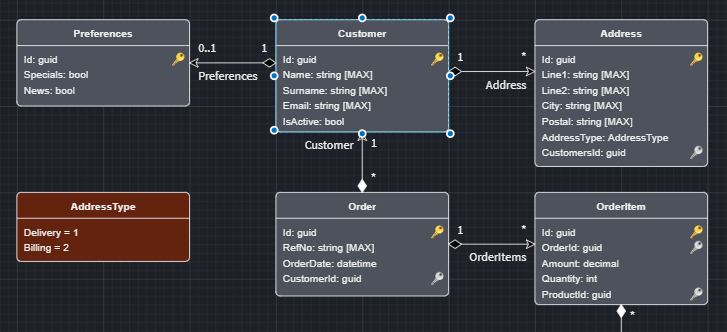
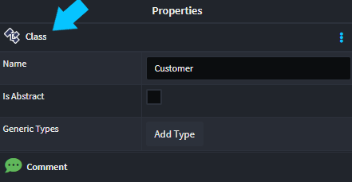
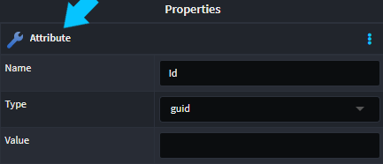
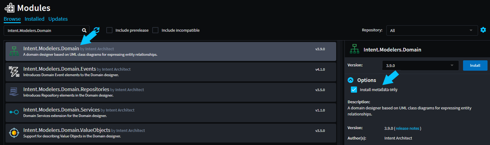

# How to access designer models in templates?

When building modules using Intent Architect, it is a very common to want to use the metadata you have modeled in the designers as part of the code generation. As an example lets say you've built out a Domain model you would want to generate a set of C# classes which is the code realization of that domain model. This article covers how to achieve this.

## Overview of Designer Models and their usage within templates

When using Intent Architect you build up metadata models in the various designers, as an example In the `Domain Designer` you create a domain model which reflects your business domain. This designer would describe concepts like `Class`es, `Attribute`s, `Associations` etc. All of these concepts are models in their own right, and holistically make up your domain model.



If you select individual items in the Domain Designer, you can see what type it is by looking at the Properties pane.

For example if you select `Customer` we can see this is of type `Class`, in code this will be represented by a `ClassModel`.



Now if you select an attribute on the `Customer` we can see this is of type `Attribute`, in code this will be represented by a `AttributeModel`.



These models can then be used as data for your templates to work with. Here is a simple example of reading this data from within a template.

```csharp

//Get the Domain Designer for my currently running Application
var domainDesigner = ExecutionContext.MetadataManager.Domain(ExecutionContext.GetApplicationConfig().Id);
var classModels = domainDesigner.GetClassModels()

```

Based on what we can visually see in the Domain Designer above this would a list 5 `ClassModel`s namely:

- Preferences
- Customer
- Address
- Order
- OrderItem

This is a simplified view of what the ClassModel looks like.

```csharp

public class ClassModel : ...
{
    public const string SpecializationType = "Class";

    public const string SpecializationTypeId = "04e12b51-ed12-42a3-9667-a6aa81bb6d10";

    public string Name { get; }

    public bool IsAbstract { get; }

    public IEnumerable<string> GenericTypes { get; } 

    public IEnumerable<IStereotype> Stereotypes { get; }

    public FolderModel Folder { get; }

    public IList<AttributeModel> Attributes { get; }

    ...
}

```

There are two common scenarios of how this data would be accessed

- Binding Models to the template within `Module Designer`.
- Fetching the models using `MetadataManager` from within a template.

> [!NOTE]
> `ClassModel` and the `Domain` extension method off of `ExecutionContext` will not be present in your own module by default. As Intent Architect is a modular extensible platform, these concepts are bundled and packaged with the `Domain Designer`. The next section covers how to set this up.

## Accessing the Designer data in your own Module

Assuming you were building your own Module and you would like to access the metadata from the Domain Designer. To achieve this you can simply install the `Intent.Modelers.Domain` with the `Install Metadata only` option checked, the option can be made visible by clicking on the Options arrow:



Next you may need to add the Designers `Nuget` package to your solution. Simply add the `Intent.Modules.Modelers.Domain` package to your module in your IDE (e.g. Visual Studio).

> [!NOTE]
> There are certain actions you may perform in the `Module Builder` which will cause the designer package to automatically be added. The NuGet package name is convention based off of the Module name, i.e. the same as the module name with a `.Modules` after the `Intent` part i.e. `Intent.Modelers.Domain`'s NuGet package is `Intent.Modules.Modelers.Domain`. The version numbers of NuGet packages correlate with the version of the Modules, e.g. a version 3.9 module will have a version 3.9 NuGet package.

You should now have access to all the API's you need to access the Designer data, these will be in the `Intent.Modelers.Domain.Api` namespace. This would include:

- Designer's Model classes
- Extension methods to `MetadataManager` for accessing the designer's Model classes.
- Stereotype extension methods

> [!NOTE]
> This article has being using the `Domain Designer` as an example, of how to achieve this, but all the same principles apply to any of the `Designer Modules`.

## Designer Extensions

It is worth noting that Designers can be extended, i.e. new functionality added through additional modules. As an example the `Intent.Modelers.Services.CQRS` module extends the `Intent.Modelers.Services` designer introducing `CQRS` paradigm models to the `Services Designer`.

This all works exactly the same as mentioned above, it's just worth noting that you would need to add these Modules and Nuget packages if you want to access the extension data.

## Common Intent Architect designers

### Domain Designer (Intent.Modelers.Domain)

This Designer is centered around describing your Domain / Persistence model.

Common Extensions

- **Modelers.Domain.ValueObjects**
- **Modelers.Domain.Services**
- **Modelers.Domain.Events**

### Services Designer (Intent.Modelers.Services)

This Designer is used to model your Services and more broadly your application layer.

Common Extensions

- **Modelers.Services.CQRS**
- **Modelers.Services.DomainInteractions**
- **Modelers.Services.EventInteractions**
- **Modelers.Services.GraphQL**

### Visual Studio Designer (Intent.Modelers.Services)

Model out how Intent Architect integrates with Visual Studio.

## Accessing the models in template code

As mentioned previously, these models can be accessed through extension methods off of the `IMetadataManager` interface. for example:

```csharp

//Get the Domain Designer for my currently running Application
var domainDesigner = ExecutionContext.MetadataManager.Domain(ExecutionContext.GetApplicationConfig().Id);
//Get all the Class models from the Domain Designer
var classModels = domainDesigner.GetClassModels()

```

The `IMetadataManager` interface can be accessed in the following ways:

### Within a template which inherits from `IntentTemplateBase`

`IMetadataManager` is available on the template instance through the `ExecutionContext.MetadataManager` property.

```csharp

var metadataManger = ExecutionContext.MetadataManager;

var metadataManger = this.ExecutionContext.MetadataManager;

```

### Within a `FactoryExtension`

`IMetadataManager` is available on the `IApplication` interface.

```csharp

    public class MyFactoryExtensionExtension : FactoryExtensionBase
    {
        ...
        protected override void OnAfterTemplateRegistrations(IApplication application)
        {
            var metadataManger = application.MetadataManager;
        }
    }
```

> [!NOTE]
> This section has covered fetching the Designer models directly within your template. The other way to get access to Designer Models in your templates is to data bind them to the template. In this scenario the Model(s) will be injected into your templates constructor. [](xref:module-building.templates-general.how-do-i-bind-designer-models-to-templates)

## See more

- [](xref:module-building.templates-general.how-do-i-bind-designer-models-to-templates)
