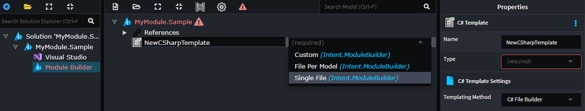
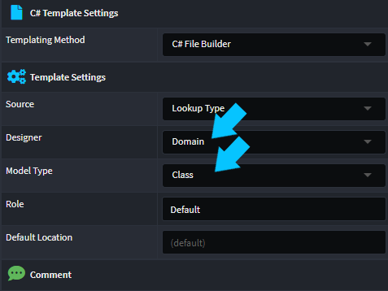

# Data-binding Designer Models to templates

When adding `Template`s to your own module, there are several template types which support data-binding to designer models.

Commonly used template's which support this feature:

- C# Template
- File Template

These templates allow you to select the nature of how the data models affects the template, by specifying a `Type`:

- **Single File**, the template will generate a single file regardless of how many models are bound.
- **File Per Model**, the template will generate a multiple files, one for each model bound.
- **Custom**, This option allows you to completely customize this process and is beyond the scope of this article.



Next, in the `Template Settings` you can specify which `Designer` and which `Model` within that designer you would like to data-bind your template to.



> [!NOTE]
> If the Designer you are looking for is not in the drop down make sure you have added the Designer module as a reference. [](xref:module-building.templates-general.how-do-i-access-designer-models)

Looking at the above example, we are binding our template to the `Domain Designer`'s `Class` model, this will set up your template such that the Designer model(s) are injected into your template's constructor, as per your selections. Here are examples of what the code would look like:

`Single File` Template Example

```csharp
public partial class MySingleTemplate : CSharpTemplateBase<IList<ClassModel>>, ICSharpFileBuilderTemplate
{
    ...
                                                        //Data-bound designer models
    public MySingleTemplate(IOutputTarget outputTarget, IList<ClassModel> model) : base(TemplateId, outputTarget, model)
    {
        ...
    }
    ...
}

```

`File Per Model` Template Example

```csharp

public partial class MyFilePerModelTemplate : CSharpTemplateBase<IList<ClassModel>>, ICSharpFileBuilderTemplate
{
    ...
                                                              //Data-bound designer model
    public MyFilePerModelTemplate(IOutputTarget outputTarget, ClassModel model) : base(TemplateId, outputTarget, model)
    {
        ...
    }
    ...
}

```

> [!NOTE]
> `File Per Model` templates always require a data-binding, with `Single File` templates data-binding is optional. If you do not bind a model the constructor model parameter will be of type `object` and have a value of `null`.

## How can I filter which designer models are bound to my template?

Templates are instantiated through a factory, and this factory is responsible for binding the data. These factories are commonly referred to a template registrations. When you look at the source code for a template you will notice is has a corresponding template registration file.

Here are examples of the registrations for the above files.

`Single File` Template Registration (with data bound)

```csharp
public class MySingleTemplateRegistration : SingleFileListModelTemplateRegistration<ClassModel>
{
    ...
    // Template Factory Method
    public override ITemplate CreateTemplateInstance(IOutputTarget outputTarget, IList<ClassModel> models)
    {
        return new MySingleTemplate(outputTarget, models);
    }

    // Select which data to bind
    public override IList<ClassModel> GetModels(IApplication application)
    {
        return _metadataManager.Domain(application).GetClassModels().ToList();
    }
}
```

`File Per Model` Template Registration

```csharp

public class MyFilePerModelTemplate : FilePerModelTemplateRegistration<ClassModel>
{
    ...
    // Template Factory Method
    public override ITemplate CreateTemplateInstance(IOutputTarget outputTarget, ClassModel model)
    {
        return new MyFilePerModelTemplate(outputTarget, model);
    }

    // Select which data to bind
    public override IList<ClassModel> GetModels(IApplication application)
    {
        return _metadataManager.Domain(application).GetClassModels();
    }
}

```

In either scenario, to filter that data which is bound to your template you can simply alter the `GetModels` to apply the desired filter to the data.

Here are some examples:

### Simple filter sample

This filter will select all `Class`s which are not abstract.

```csharp
[IntentIgnore]
public override IList<ClassModel> GetModels(IApplication application)
{
    // Return all non-abstract classes
    return _metadataManager.Domain(application)
        .GetClassModels()
        .Where(c => !c.IsAbstract);
}

```

### Complex filter sample

This filter will select all `Class`s which are aggregate roots.

```csharp
[IntentIgnore]
public override IList<ClassModel> GetModels(IApplication application)
{
    // Return all aggregate roots
    return _metadataManager.Domain(application)
        .GetClassModels()
        .Where(c => IsAggregateRoot(c));
}

public bool IsAggregateRoot(ClassModel classModel)
{
    AssociationEndModel[] source = (from x in classModel.AssociationEnds()
                                    where x.IsSourceEnd() && !x.IsCollection && !x.IsNullable
                                    select x).ToArray();
    return !source.Any();
}

```

### Stereotype filter sample

This filter will select all `Class`s which have the `Table` stereotype applied.

```csharp
[IntentIgnore]
public override IList<ClassModel> GetModels(IApplication application)
{
    // Return all Classes which have the `Table` stereotype
    return _metadataManager.Domain(application)
        .GetClassModels()
        .Where(c => c.HasTable());
}

```
