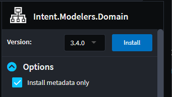
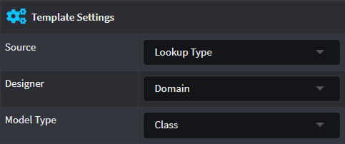

# How to query models from different designers

When a Template is configured to be a _File per Model_ a `Designer` and `Model Type` need to be specified under `Template Settings`. For additional Designers along with their Model Types to be available for selection, their corresponding Module needs installed with the `Install Metadata only` option checked.

For the purposes of demonstration, this how-to will explain using the `Domain` Designer and the `Class` Model Type from it.

## Install the module

Install the `Intent.Modelers.Domain` with the `Install Metadata only` option checked, the option can be made visible by clicking on the `Options` arrow:



## Select the `Designer` and `Model Type`

Create or select a Template and in the properties panel and for `Designer` select `Domain` and for `Model Type` select `Class`:



## Run the Software Factory

Run the Software Factory and open the Template's corresponding Registration class.

It has generated a `GetModels` method that will look in the `Domain` for `Class` models using the `GetClassModels()` query method. When the module is run in an Application an instance of the Template will be instantiated for each `Class` which was modelled in the Domain Designer.

```csharp
public override IEnumerable<ClassModel> GetModels(IApplication application)
{
    return _metadataManager.Domain(application).GetClassModels();
}
```

## Other designers

For any other Designer the query will be different depending on the Designer and the Elements that's provided by the Designer, for example using the `Services` Designer and selecting `Service` as the Model Type will generate the following:

```csharp
public override IEnumerable<ServiceModel> GetModels(IApplication application)
{
    return _metadataManager.Services(application).GetServiceModels();
}
```

## See more

- [](xref:module-building.templates-general.how-to-filter-templates)
