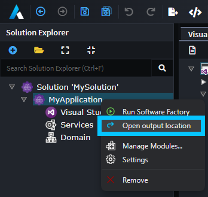

# Create a Module and Template

In this step of the tutorial, we will create a new Module Builder Application in Intent Architect, use the Designer to add a template to it, run the Software Factory against this Application to generate a .NET Core C# solution, and then finally build in our IDE to generate the Module.

## Create a new application

On the home screen, click `Create a new module`.

Fill in a `Name` (such as `MyModules`), review/change the `Location` as desired and click `NEXT`.

Ensure the following components are selected:

- `Module Builder Core`
- `Module Builder - C#`
- `Visual Studio Integration`

Click `CREATE`.

An `Application Installation` dialogue will pop up showing the progress of downloading and installing Modules and Metadata for the Application, once it's finished it will disappear allowing you to start building your own Module.

[!Video-Loop videos/create-a-new-module.mp4]

## Open and rename the package

Click on `Module Builder` on the left of the screen to enter the designer.

Click on the `MyModules` package, right-click and select `Rename`.

> [!NOTE]
> This rename step is optional but demonstrates the process of how to accomplish this if required.

Enter a name for the `Package` (such as `MyModules.Entities`) and press `ENTER`. It will prompt you whether you want to change the underlying files. Click on `YES`. Finally, click on `Save`.

[!Video-Loop videos/open-and-rename-the-package.mp4]

## Create a template

Right-click the Package and click the `New C# Template` option:

Name it `EntityBase` and for its type select `Single File`:

[!Video-Loop videos/create-the-template.mp4]

## Run the software factory

We are now ready to run the software factory. Press the play button near the top right of the screen and the execution will start.

> [!NOTE]
> If your changes are unsaved, you will be asked if you want to save them before proceeding.

Once the Software Factory has executed the templates, it pauses to allow you to review the proposed changes (called staging). You can click an entry and it will open in a diff tool. If you are satisfied with the proposed changes you can press the `APPLY CHANGES` button to continue.

As the Software Factory Execution is running, it will present expandable items that allow you to drill deeper into the current activity currently being performed by the Software Factory.

[!Video-Loop videos/run-the-software-factory.mp4]

When the Software Factory Execution is complete, you can choose to close it (the button with the cross) or minimize it (the button with the underscore). For this tutorial, we recommend you minimize it to make use of Intent Architect's continuous processing feature that runs in the background (which will be demonstrated later in the tutorial).

[!Video-Loop videos/minimize-the-software-factory.mp4]

## Edit the template in Visual Studio

During the Software Factory Execution, Intent Architect generated a Visual Studio solution along with the `EntityBase` template which was added in the [create a template](#create-a-template) step above.

Navigate to the folder where the `.sln` solution file (and associated files) has been placed and open it with Visual Studio.

> [!TIP]
> Intent Architect can open the folder where the generated content was placed by you using the Application's context menu and clicking `Open output location`:
>
> 

Go to the `MyModules` Project and expand the `Templates` folder and then the `EntityBase` folder.

Open the `EntityBaseTemplate.tt` file and update its content to the following:

```csharp
<#@ template language="C#" inherits="CSharpTemplateBase<object>" #>
<#@ assembly name="System.Core" #>
<#@ import namespace="System.Collections.Generic" #>
<#@ import namespace="System.Linq" #>
<#@ import namespace="Intent.Modules.Common" #>
<#@ import namespace="Intent.Modules.Common.Templates" #>
<#@ import namespace="Intent.Modules.Common.CSharp.Templates" #>
<#@ import namespace="Intent.Templates" #>
<#@ import namespace="Intent.Metadata.Models" #>
using System;

[assembly: DefaultIntentManaged(Mode.Fully)]

namespace <#= Namespace #>
{
    public abstract class <#= ClassName #>
    {
        public DateTime CreatedDate { get; set; }

        public DateTime UpdatedDate { get; set; }

        public string CreatedBy { get; set; }

        public string UpdatedBy { get; set; }
    }
}
```

> [!NOTE]
> This is a T4 Template. To learn more, go to [this page](xref:module-building.templates-general.about-t4-templates).

Save your changes and build the project.

[!Video-Loop videos/edit-template-and-build-in-visual-studio.mp4]

Once the build has been completed you will notice that the `Build` log includes the following line:
`Successfully created package C:\Dev\MyModules\Intent.Modules\MyModules.Entities.1.0.0.imod`

This was output by the Intent Packager and lets you know where it has placed the built Module.

## Summary

You have successfully created an Intent Architect Module.

## Next Steps

### [Install and run the module](xref:module-building.templates-general.tutorial-create-a-template.install-and-run-the-module)

Create a test Application to install and run our Module.
