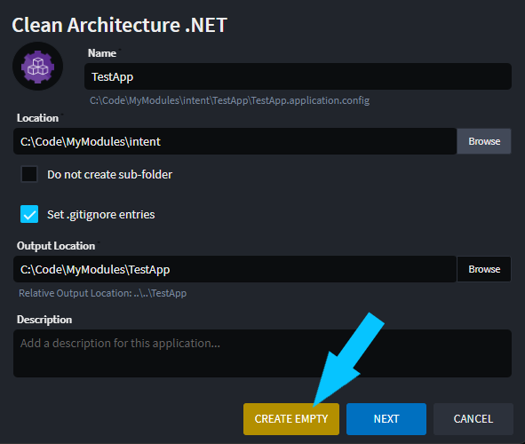
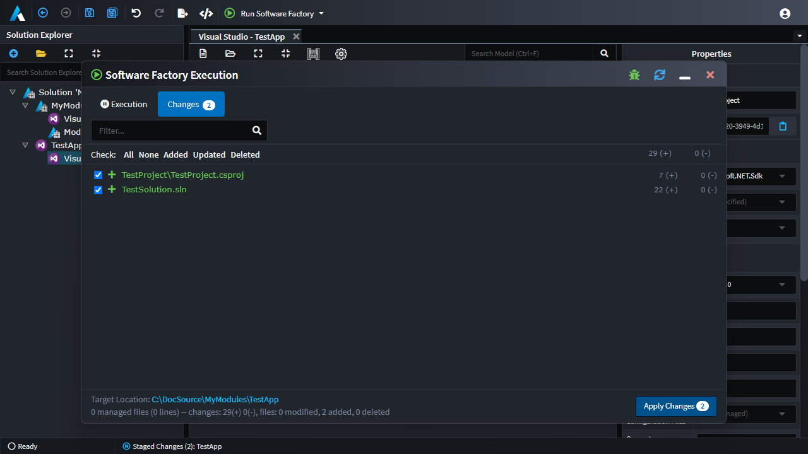
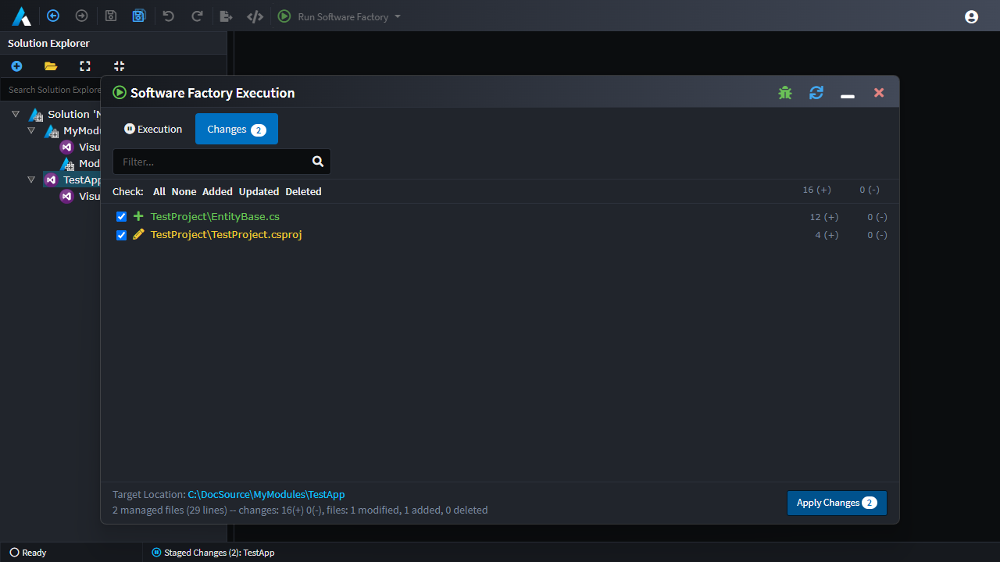

# Install and run the Module

When creating Modules it is often very useful to have a _test_ Application that we can use to test that our Modules are working correctly. This tutorial explains how to create this _test_ Application and how to install and run the Module we created in the [previous tutorial](xref:module-building.templates-general.tutorial-create-a-template.create-the-module-and-a-template).

## Create an empty Application

> [!NOTE]
> If you have already created an Application to install your module in, you can skip this section and jump straight to the [Install the Module](#install-the-module) section.

To get started, let's create an empty Application.

> [!TIP]
> This article will assume you're running only a single instance of Intent Architect, but you can also start a new instance in which you open the new application, this is convenient when you find yourself regularly switching back and forth between the Modules Solution and the Test Application.

1. From the home view, click `Create a new application`.
2. Set the Application's name, location, and Solution name. _NOTE: You can ignore which Application Template is selected. It won't affect an empty application._
3. Click `CREATE EMPTY` _NOTE: With `CREATE EMPTY` the selected application template is ignored._
4. When prompted with a confirmation, click `YES` to continue.

> [!NOTE]
> We typically create Applications with an [Application Template](xref:module-building.application-templates.how-to-create-application-templates). Empty Applications are useful when there aren't any Application Templates that fulfill your needs.

## Set up Visual Studio projects

Applications need a way to know where to output specific code files. Since we're working with .NET we can install the `Intent.VisualStudio.Projects` Module which installs a Designer to configure our .NET solution and project structure.

To install this module we must navigate to the `Modules` tab within our application.

1. Search for the `Intent.VisualStudio.Projects` Module by typing "visual" into the filter.
2. Select the Module.

    
3. In the details pane, click `Install` to install the latest version.

    

You may have noticed that a new `Visual Studio` Designer was installed into our Application. It will allow us to structure the C# projects in our codebase. For this tutorial, we can set up a typical web application project structure that separates Domain, Infrastructure, and API concerns.

1. Click on the `Visual Studio` Designer
2. Create a new `Visual Studio Solution` package by clicking on the `CREATE NEW PACKAGE` button.
3. Fill in the name of the Visual Studio solution, then click `DONE`.
4. Next, create a set of projects by right-clicking on the new Visual Studio Solution package and selecting the project type. We will create a `C# Project (.NET)` project name `TestProject` in this tutorial.

    [!Video-Loop videos/visual-studio-create-projects.mp4]

    The application structure should look as follows:

    
5. To create this project structure, run the Software Factory Execution. Intent Architect should stage the changes as follows:
    
6. Finally, click `APPLY CHANGES` to instruct Intent Architect to create the files in our codebase and minimize the Software Factory Execution.

## Install the Module

Next, let's install the Module we created in the [previous step](xref:module-building.templates-general.tutorial-create-a-template.create-the-module-and-a-template). To do this, we first navigate to the `Modules` tab of our Application. Right click on the `TestApp` application and select `Manage Modules` .

### Finding and Installing the Module

By default, Intent Architect is configured only with the repository for official Modules hosted at [https://intentarchitect.com/](https://intentarchitect.com/). To be able to use our own Module we need to make a new repository which is set to the folder where our `MyModules.Entities.1.0.0.imod` file was created.

1. Open `Manage Repositories` from the [Profile Menu](xref:application-development.applications-and-solutions.how-to-manage-repositories#profile-menu).
2. Add a new Repository with a unique `Name` (e.g. "My Modules") and the `Address` value being the full location of the folder where our Module was created (e.g. `C:\Code\MyModules\Intent.Modules`).
3. Reorder the repositories so that this new one is at the top.
4. Click `Save`.

    [!Video-Loop videos/add-new-modules-repository.mp4]
5. Type in the search field `MyModules.Entities` to locate your new Module.

   > [!TIP]
   > You can also go to the Respository dropdown and select your newly created Respository which will list only the Modules you have created.
6. Install the Module.

### Assigning the Template Output

After the installation of the module, notice that the minimized Software Factory is now showing a warning symbol.

This is due to the background Software Factory Execution process (which you've minimized previously) having detected changes made to your project that triggered a re-run of the Software Factory Execution.

After opening the highlighted status button below, you can drill down into the details to inspect what went wrong.
[!Video-Loop videos/after-module-install-sf-warnings-detail.mp4]

The logged error lets us know that `MyModules.Entities.EntityBase` template hasn't yet had its output location set within the `Visual Studio` Designer, meaning that the Software Factory cannot determine where to place generated output for it.

1. Minimize the Execution window.
2. Navigate to the `Visual Studio` Designer.
3. Drag the `MyModules.Entities.EntityBase` Template Output into the `TestProject` project.

    [!Video-Loop videos/visual-studio-assign-template-output.mp4]
4. Click on Save.

We've now told Intent Architect that when generating the `EntityBase` template, the output should be placed in the `TestProject` project.

## Run the Module

We've created a project structure, installed our Module, and set the Output Target to our `TestProject` project. We are now ready to run our Module.

1. Notice that the Software Factory automatically executed itself when you saved the `Visual Studio` Designer and when clicking on it you should see the following staged changes:

    
2. Click the `APPLY CHANGES` button.
3. Minimize the Software Factory Execution.
4. Open the codebase to verify that the new `EntityBase.cs` file was created in the correct location.

> [!NOTE]
> You may have noticed that a NuGet package (`Intent.RoslynWeaver.Attributes`) was added to the `TestProject.csproj` file. This package provides _non-executing_ C# attributes which are used to instruct the [Code-Management](xref:getting-started.welcome#code-management) systems in C#. This is not a hard dependency, does not affect runtime execution in any way and can be swapped out or removed if needed.

## What's Next

### [Create Files per Model](xref:module-building.templates.tutorial-create-a-template.create-a-files-per-model-template)
