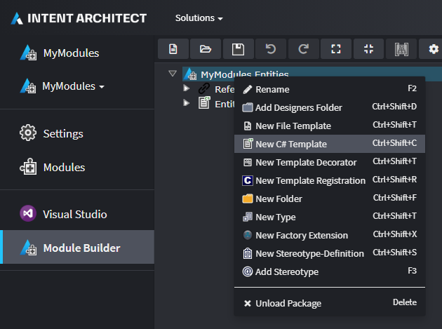
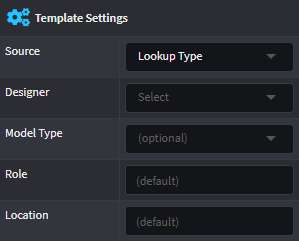
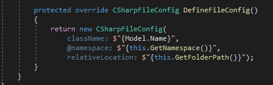
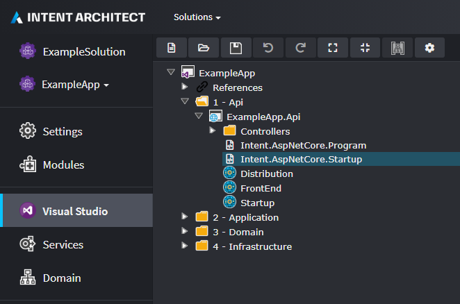

# About Templates (C#)

Intent Architect has first class support for generation and code management of C# files. Out of the box it has [many features](#convenience-and-utility-features-for-c-file-generation) to enable painless authoring of C# templates, for example managing things like namespaces, class names, using clauses, automatic resolution of type names, etc.

> [!NOTE]
> At a fundamental level all Templates in Intent Architect ultimately just produce text. If you look at the code-behind file for a `.tt` file, you will see that it's using a `StringBuilder` on which `.ToString()` is ultimately called.

The easiest way to create a C# Template is by using the [Module Builder](xref:module-building.about-the-module-builder) and ensuring you have the `Intent.ModuleBuilder.CSharp` Module installed. If you selected the `Module Builder - C#` component during the `Create new Module` wizard it will already have been installed, otherwise it can be added at any time through the [Modules](xref:application-development.applications-and-solutions.about-modules) screen for your [Application](xref:application-development.applications-and-solutions.about-applications).

When the Module is installed, inside the Module Builder [Designer](xref:application-development.modelling.about-designers) you will then have the option to create a `New C# Template`.



## C# Template type overviews

The Module Builder has three available options for C# Template types, they are briefly described in the following table and more detail on each is covered later in this article.

| Type                              | Brief description                                  |
| --------------------------------- | -------------------------------------------------- |
| [Single File](#single-file)       | Single file is generated for the application.      |
| [File Per Model](#file-per-model) | A file is generated per model in your application. |
| [Custom](#custom)                 | For advanced use cases.                            |

## Files generated during the Software Factory Execution of the Module Builder

Regardless of the type selected, during the [Software Factory Execution](xref:application-development.software-factory.about-software-factory-execution) the Module Builder will always generate the following three files for each C# Template created in the Module Builder designer.

### 1. Template file

| Generated file name |
| ------------------- |
| `<Name>Template.tt` |

This file is for authoring the output of the template in [T4 syntax](https://docs.microsoft.com/visualstudio/modeling/writing-a-t4-text-template). Every time this file is saved the IDE will auto "pre-compile" it and re-generate the backing `<Name>Template.cs` file which contains a [partial](https://docs.microsoft.com/dotnet/csharp/programming-guide/classes-and-structs/partial-classes-and-methods) class named `<Name>Template`.

### 2. Template partial file

| Generated file name        |
| -------------------------- |
| `<Name>TemplatePartial.cs` |

This file contains the other part of the `<Name>Template` partial class. On initial generation it contains the class constructor and the `DefineFileConfig` method.

In it you can control the instantiation of the template or adjust its config, but it is exceptionally useful though as a place to create helper methods or properties which can be conveniently used in your `.tt` file.

While it's possible to make methods in the `.tt` file itself, we've found (from a code organization and ergonomics perspective) it works much better to create methods in a partial file than the template.

Any methods or properties in this partial class are accessible in the `.tt` as easily as doing `<#= PropertyName #>` (for properties) or `<#= MethodName() #>` (for methods).

### 3. Template registration file

| Generated file name             |
| ------------------------------- |
| `<Name>TemplateRegistration.cs` |

Registration classes act as Factories for the Template types that are _registered_ using them. They will create one or more _instances_ of a given Template during the Software Factory Execution.

> [!NOTE]
> A key concept to understand about Intent Architect is that the Software Factory Execution will output a single file per registered template _instance_. A template may have none, a single or multiple _instances_ of it registered during Software Factory Execution. For example the [Single File](#single-file) C# Template Type will register a single instance of its template, while the [File Per Model](#file-per-model) C# Template Type will register an instance of its template for each occurrence of a model type in a Designer.

## Details of the C# Template types

### Single File

There are two common use cases for a Single File C# Template:

#### 1. Generation of files that act as an aggregation of models from a certain Designer

For example, a Dependency Injection configuration class that registers up all the Services defined in the Services Designer.

The generated [Template registration file](#3-template-registration-file) derives from `SingleFileListModelTemplateRegistration<TModel>` and the code will register a single instance of the template. The registration class derives from `SingleFileListModelTemplateRegistration<TModel>` which allows the amount of code to be kept simple and to a minimum.

The generated [Template partial file](#2-template-partial-file)'s class will have a List of `TModel` as the generic type used to define the `model`.

For both the template registration and partial files, the generated value for `TModel` is determined by the selected `Model Type` in the `Template Settings`:



The `model` for this type of C# Template is essential as each registered template instance will have a separate output file generated with its name and content dependent upon details on the incoming `model`.

#### 2. Generation of infrastructural files

For example, `Startup.cs` in an ASP.NET Core project.

The generated [Template registration file](#3-template-registration-file) derives from `SingleFileTemplateRegistration` and the code will register a single instance of the template. The registration class derives from `SingleFileTemplateRegistration` which allows the amount of code to be kept simple and to a minimum.

The generated [Template partial file](#2-template-partial-file)'s class uses `object` for its generic type parameter with the assumption that there is no `model` to be used.

### File Per Model

This C# Template type is for when you want a separate `.cs` file for each instance of a model in a Designer of a type, EG: domain entities, WebApi endpoint, DTO, etc.

The generated [Template registration file](#3-template-registration-file) derives from `FilePerModelTemplateRegistration<TModel>` and the code will register an instance of the template per model.

The generated [Template partial file](#2-template-partial-file)'s class uses `TModel` for its generic type parameter.

For both the template registration and partial files, the generated value for `TModel` is determined by the selected `Model Type` in the `Template Settings`:


The `model` for this type of C# Template is essential as each registered template instance will have a separate output file generated with its name and content dependent upon details on the incoming `model`.

### Custom

This C# Template type is used far less than the other types and is when the other types' template instance registration doesn't doesn't quite work for a particular use case.

The Custom type allows the Developer to take control of the _registration_ process by invoking `RegisterTemplate()` (off of the `ITemplateInstanceRegistry registry` parameter) and creating _instances_ of the Template in question (which does not impose a Model type restriction like the other types). This Registration class derives from `ITemplateRegistration`.

## Template Configuration

The Template configuration is specified in the [Template partial file](#2-template-partial-file), inside the `DefineFileConfig` method. In this method, the configuration of each instance can be set as literal values or determined by functions and string interpolation. The required values set in the configuration determine the Template's `ClassName` and `Namespace` properties.



### The `ClassName` Property

When working with C# templates, it is recommended that you use `<#= ClassName #>` for a class's name in the `.tt` file:

```csharp
public class <#= ClassName #>
{
    ...
}
```

Intent Architect will then ensure it handles all the rules and edge cases for the naming of your class, including:

- Applying PascalCase naming convention.
- Removing invalid characters, like spaces or punctuation.

### The `Namespace` Property

When working with C# templates, it is recommended that you use `<#= Namespace #>` to declare the file's namespace in the `.tt` file:

```csharp
namespace <#= Namespace #>
{
    ...
}
```

The default Template configuration that uses `this.GetNamespace()` will automatically determine the `Namespace` of the class based on where the file output is created. See below for how to configure the Output Location.

### Configure the Output Location

Ultimately, the output location of a Template instance is determined by two factors:

#### 1. The `Template Output` location

That is to say, under which folder or project the Template's `Template Output` is placed within the application. With C# Templates this is typically determined using the `Visual Studio` Designer. In the example below we can see that the `Template Output` for `Intent.AspNetCore.Startup` will be placed in the `ExampleApp.Api` project:



> [!TIP]
> We can easily change where a Template's output will be created by dragging the `Template Output` element into a different folder or project.

#### 2. The Template's `relativeLocation` configuration

The `relativeLocation` is set relative to the `Template Output`'s location as described above. So for example use the `relativeLocation` of `Controllers` to place the Template inside the `Controllers` folder located in the `ExampleApp.Api` project.

> [!TIP]
> The `relativeLocation`'s default of `this.GetFolderPath()` will respect any folders in the Designer that the `Model` element instance was created within.

## Convenience and utility features for C# file generation

Through extensive experience of building templates for generating C# files, we have added many features which we consider essential to making the C# template authoring process a painless experience.

### Code Management

A core feature of Intent Architect is [Code Management](xref:application-development.code-management.about-code-management) where parts of a file are managed fully by Intent Architect while other parts in the same file are hand crafted and Intent Architect will leave those particular parts alone.

For C# files, you can use [C# attributes](https://docs.microsoft.com/dotnet/csharp/programming-guide/concepts/attributes/) anywhere in the file to opt-out a particular element of code within a file from being overwritten during Software Factory Execution.

For example you could place `[IntentManaged(Mode.Ignore)]` on a particular method and when Intent Architect sees this during Software Factory execution it will make sure to never change anything for it.

### Types in other Templates (dependencies)

Intent Architect will automatically add required [using directives](https://docs.microsoft.com/dotnet/csharp/language-reference/keywords/using-directive) to generated C# files based on specified template dependencies when you use [`GetTypeName(...)`](xref:module-building.templates.resolving-type-names) (this can involve primitive types too like `string`).

During Software Factory Execution, Intent Architect will [determine the namespaces](#the-namespace-property) of those other Template instances and add them as using statements.

### NuGet package dependencies

Intent Architect will automatically install NuGet packages for projects based on specified NuGet package requirements in Templates.

To specify a NuGet package dependency, use the `AddNugetDependency(...)` method in the constructor of the template in the [Template File](#1-template-file):

```csharp
partial class EntityBaseTemplate : CSharpTemplateBase<object>
{
    public EntityBaseTemplate(IOutputTarget outputTarget, object model = null)
        : base(TemplateId, outputTarget, model)
    {
        AddNugetDependency(NuGetPackages.MediatR);
    }
}
```

And then at the root location of the Module's `.csproj`, create a class as follows:

```csharp
public class NuGetPackages
{
    public static INugetPackageInfo MediatR = new NugetPackageInfo("MediatR", "9.0.0");
}
```

> [!TIP]
> While it's not necessary to create a separate static class like the `NuGetPackages` class above, it's highly recommended as a Module will often have multiple Templates using the same NuGet package. This will centralize the version management aspect of nuget packages and enable one to find all usages easily.
> [!NOTE]
> Using managed nuget dependencies, one can more easily install and upgrade the package version globally. Intent Architect will not automatically downgrade any managed nuget dependencies.

### GAC Assembly dependencies

Intent Architect will automatically add [GAC](https://docs.microsoft.com/dotnet/framework/app-domains/gac) Assembly references to `.csproj` files based on specified requirements in Templates.

To specify a GAC Assembly reference requirement, use the `AddAssemblyReference(...)` method in the constructor of the template in the [Template File](#1-template-file):

```csharp
partial class EntityBaseTemplate : CSharpTemplateBase<object>
{
    public EntityBaseTemplate(IOutputTarget outputTarget, object model = null)
        : base(TemplateId, outputTarget, model)
    {
        AddAssemblyReference(new GacAssemblyReference("System.Runtime.Serialization"));
    }
}
```
