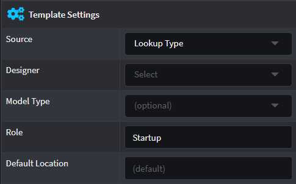
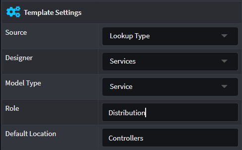
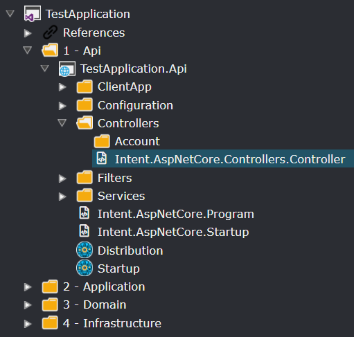

# Configuring a Template's default output location

## Template Outputs

`Template Output`s in the designers are used by the Software Factory to know where on the file system that template output should be written, in particular under which sub-folder. As modules are installed, for each template within them, a `Template Output` is automatically created with its name being the value of the `TemplateId` property of the template as specified during module building.

To see how Template Outputs affect the Application Development side [read this](xref:application-development.code-weaving-and-generation.about-template-output-targeting).

## Roles and Default Locations

Templates in the module builder can have their `Role` and `Default Location` configured. These are used by Intent Architect during module installation to determine where the template's `Template Output` should be placed.

As part of the module installation Intent Architect will search "Output Configuration" designers for a `Role` element with a name matching the `Role` value captured in the Module Builder.

If a `Role` with a matching name is found, then Intent Architect will then add any additional sub-folders specified in the `Default Location` as needed and finally place the new `Template Output` for the template within the correct sub-folder as specified by the template's `Default Location`. If `Default Location` was blank, then the `Template Output` is placed in the same folder as the `Role`.

If no `Role` with a matching name was found then the `Template Output` is placed in the "root" folder of the designer.

The following example depicts a Template created in the Module Builder and installed in a target Application.

The `Role` is set to `Distribution` and `Default Location` is set to `Controllers`.

In the example above the `Distribution` `Role` can be identified by the blue badge icon and at the same tree depth is the `Controllers` Folder.

Once that Module is installed, it will create the `Template Output` named `Intent.AspNetCore.Controllers.Controller` where the `Role` named `Distribution` is located but in a folder location relative to the `Role` which is `Controllers`.

> [!NOTE]
> Re-installing a Module may cause unassigned Template Outputs to be relocated, however assigned Template Outputs will remain untouched. This will allow you as a user to customize the output layout as you need it to be.

## Frequently asked questions

### What does the "More than one template registration is trying to output to the same path" error mean?

This occurs when there is more than one Template attempting to output to the same path on your file system.

Possible causes for this are:

| Description                                                                                                                                   | Resolution                                                                                                                                                                                                                                                             |
|-----------------------------------------------------------------------------------------------------------------------------------------------|------------------------------------------------------------------------------------------------------------------------------------------------------------------------------------------------------------------------------------------------------------------------|
| Multiple modules installed with Templates that target the same file (the modules aren't intended to be installed together).                   | Uninstall the conflicting module.                                                                                                                                                                                                                                      |
| Multiple models with conflicting names, e.g. two services that have the same name.                                                            | Rename or delete conflicting model (in this case, one of the services).                                                                                                                                                                                                |
| You have written a module that is outputting a file which is already generated by another module, e.g. `appsettings.json`, `Startup.cs`, etc. | Templates for files such as these tend to have extensibility points provided by the module authors, consider consulting the original module's documentation, e.g. see [this how-to](xref:module-building.templates.how-to-update-appsettings-json-files) for example. |
