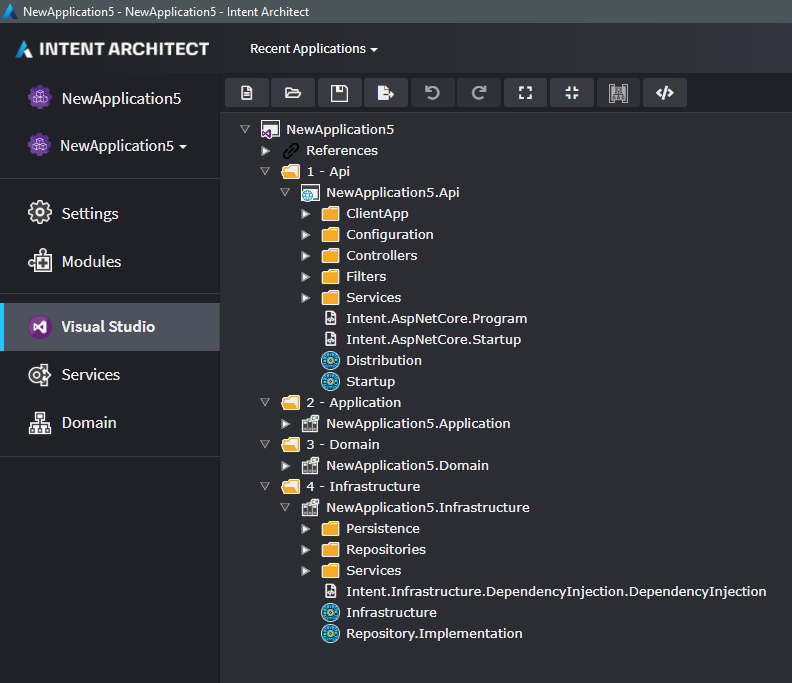

# How to add project dependencies (C#)

When a template uses [`GetTypeName(...)`](xref:module-building.templates.resolving-type-names) and the type is from another template which is output to a different `.csproj`, then Intent Architect will automatically add a `<ProjectReference />` element to the `.csproj`.

For other cases where you want to specify a project dependency without using `GetTypeName(...)`, then you can can manually do so by using the `AddProjectDependency(string roleName)` method. For example, you have the following solution layout:



From the above example, you would like to force `NewApplication5.Api` to have a reference to `NewApplication5.Infrastructure`.

In the constructor for template within the project where the reference should be created, for example `Intent.AspNetCore.Startup`, you would add the following:

```csharp
AddProjectDependency("Infrastructure");
```

`Infrastructure` in this case is the name of a role which can be seen in the above screenshot as being within the `NewApplication5.Infrastructure` project that we want to force a reference to.

With this line added, the software factory when running the `Intent.AspNetCore.Startup` template will ensure that a project reference exists to the project containing the role, `NewApplication5.Infrastructure`.
