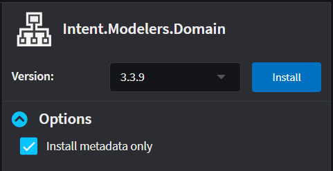
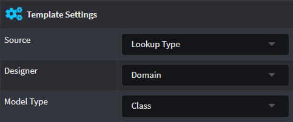

# How to query models from different designers

When creating Templates that are configured to create a _File per Model_, you will need to specify a "source" where the `Models` come from in order to create those Templates. This "source" is represented in the form of a `Designer`. You can gain access to a given Designer by installing the Module that contains that Designer as a `Metadata only` Module.

Assuming the desired Designer is the `Domain Designer` (there are other Designers available, i.e. `Services Designer` as well as custom built designers), install the `Intent.Modelers.Domain` Module with the `Install metadata only` option checked (you will need to expand `Options` first).



Once the Module is installed, create or select a Template and in the properties panel choose the Domain Designer as well as the Model Type that will be represented in the Template (i.e. `Class`).



Run the Software Factory and open the Template's corresponding Registration class.

It has generated a `GetModels` method that will look in the `Domain` for Class models using the `GetClassModels` query method. Thus once the Module is installed in an Intent Architect application, the Classes being modeled in the Domain designer will be queried and transformed into template output for each Class instance.

```csharp
public override IEnumerable<ClassModel> GetModels(IApplication application)
{
    return _metadataManager.Domain(application).GetClassModels();
}
```

For any other Designer the query will be different depending on the Designer and the Elements that's provided by the Designer. An example from a Services Designer will look like:

```csharp
public override IEnumerable<ServiceModel> GetModels(IApplication application)
{
    return _metadataManager.Services(application).GetServiceModels();
}
```

The above example will query the Services Designer for all modeled Services and pass them on to the Template to be generated into code.

## See more

- [](xref:module-building.templates.how-to-filter-templates)
