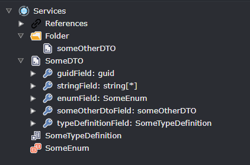
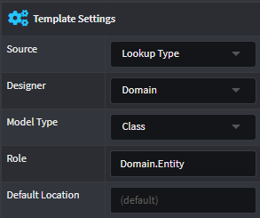
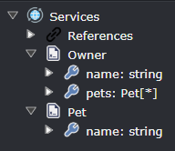

# Resolving type names

Intent Architect has mechanisms and infrastructure to make it easy to resolve type names and generate any additional code to be able to use that type (EG: project references, using directives, imports, etc).

> [!NOTE]
>
> We strongly recommend _against_ using strategies like conventions to work out type names of classes which are generated by templates. There are many edge cases you will have to solve for yourself including handling collections or ensuring that appropriate `using` or `import` directives are also generated. Managing such complexities yourself invariably leads to more complicated templates which might not be able to handle all scenarios correctly.

## The `GetTypeName(...)` method

Consider the following DTOs modelled in the Services designer:



If you were creating a template to generate a DTO for the above `SomeDTO` along with all its fields, you would need to ensure the following is catered for:

- For `guidField`, it would need to be represented as a `System.Guid` in C# or a `UUID` in Java.
- For `stringField`, it would need to be represented as a `System.Collections.Generic.List<string>`.
- For `someOtherDtoField`, it would need to ensure it's using the correct type name from a different template instance, that template happens to pascal-case class names, so we also need to ensure the field's output type name's casing matches the generated class name.
- For `enumField`, enums (for our example) happen to be generated by a template which outputs to a different package or project, we will need to ensure this other package/project is referenced.
- For `typeDefinitionField`, it's referencing a `Type Definition` which are used in Intent to represent types for which there is a no template, but it is instead hand coded in the IDE (or perhaps its from a library) and `Type Definition`s typically specify their fully qualified type.
- For almost all languages using fully qualified type names inline is generally not idiomatic, instead languages like C# use using directives and Java uses import statements.

The `GetTypeName(...)` method handles _all_ of these above above concerns in a manner which doesn't clutter the `.tt` file, for example for C# the `.tt` could be as simple as:

```csharp
<#@ template language="C#" inherits="CSharpTemplateBase<Intent.Modelers.Services.Api.DTOModel>" #>
<#@ import namespace="Intent.Modules.Common.Templates" #>
<#@ import namespace="Intent.Modules.Common.CSharp.Templates" #>

[assembly: DefaultIntentManaged(Mode.Fully)]

namespace <#= Namespace #>
{
    public class <#= ClassName #>
    {
<#
    foreach (var field in Model.Fields)
    {
#>
        <#= GetTypeName(field) #> <#= field.Name.ToPascalCase() #> { get; set; }
<#
    }
#>
    }
}
```

The `GetTypeName(field)` above will:

- For `guidField`, from the `Intent.Common.CSharp` module, know that `Guid` needs to be output and that a using directive for `System` needs to be added to the template output.
- For `stringField`, it would use a [_collection formatter_](#collection-formatting) to make it so that `List<string>` is output and a using directive for `System.Collections.Generic` is added to the template output.
- For `enumField`, look up the template instance which is generating `SomeEnum`, see that it's being generated to a different `.csproj` and add a project reference to it, it also determines from the template instance the namespace and adds it as a using directive.
- For `someOtherDtoField`, similar to `SomeEnum`, the template instance for it is looked up, and the class name (which was pascal cased) is used and a using directive is added since it's in a nested namespace.
- For `typeDefinitionField`, the `Type Definition`'s `C#` Stereotype is checked and its `Namespace` is added as a using directive to the template output.

## The `AddTypeSource(...)` method

The `GetTypeName(field)` requires some additional information to know which template instances to match referenced types against, otherwise it falls back to outputting only the "name" of the element of the referenced type and doesn't know of any references/imports/using directives which may have been needed.

For any of the referenced types which are generated by templates (even the same template type), you will need to use `AddTypeSource(...)` in the partial to let the `GetTypeName` system know which template instances to check against. For the above example, in the template partial's constructor, you would need to use `AddTypeSource` for each of the `TemplateId`s which are used, for example:

```csharp
AddTypeSource(TemplateId);
AddTypeSource(EnumTemplate.TemplateId);
```

Making the entire file look something like:

```csharp
using Intent.Engine;
using Intent.Modelers.Services.Api;
using Intent.Modules.Common;
using Intent.Modules.Common.CSharp.Templates;
using Intent.RoslynWeaver.Attributes;

[assembly: DefaultIntentManaged(Mode.Fully)]
[assembly: IntentTemplate("Intent.ModuleBuilder.CSharp.Templates.CSharpTemplatePartial", Version = "1.0")]

namespace MyModule.Templates.Dto
{
    [IntentManaged(Mode.Fully, Body = Mode.Merge)]
    partial class DtoTemplate : CSharpTemplateBase<DTOModel>
    {
        public const string TemplateId = "NewModule.Dto";

        [IntentManaged(Mode.Fully, Body = Mode.Ignore)]
        public DtoTemplate(IOutputTarget outputTarget, DTOModel model) : base(TemplateId, outputTarget, model)
        {
            AddTypeSource(TemplateId);
            AddTypeSource(EnumTemplate.TemplateId);
        }

        [IntentManaged(Mode.Fully, Body = Mode.Ignore)]
        protected override CSharpFileConfig DefineFileConfig()
        {
            return new CSharpFileConfig(
                className: $"{Model.Name}",
                @namespace: $"{this.GetNamespace()}",
                relativeLocation: $"{this.GetFolderPath()}");
        }
    }
}
```

## Resolving type names for templates fulfilling a role

One of the mechanisms which can be used to decouple modules from each other is to have templates which fulfill roles and then other templates which need to refer to that template's type refer to it by the template's role name. By using a template role name instead of a particular `TemplateId`, it allows any module made at any time to fulfill that role without the "referencing" module being aware of it.

An example of where this is used is with the `Intent.EntityFrameworkCore` module. Due to the non-trivial effort of making templates to generate [entity type configurations](https://docs.microsoft.com/ef/core/modeling/#grouping-configuration), many Intent Architect module builders choose to use Intent Architect's highly mature `Intent.EntityFrameworkCore` module, but in many cases they also want to have their own custom template for generating entities.

With Intent Architect's support for template fulfilling roles, this is possible. The builder of the module simply needs to configure that their entity template fulfills the same template role that Intent Architect's `Intent.EntityFrameworkCore` module's `EntityTypeConfigurationTemplate` is looking for.

The `EntityTypeConfigurationTemplate` has the following method to resolve the entity type:

```csharp
private string GetEntityName()
{
    return GetTypeName("Domain.Entity", Model);
}
```

And then a template fulfills a role by having it configured with the same value for `Role` in its `Template Settings` in the Module Builder:



## Collection formatting

The final key concept to discuss is how the `GetTypeName` system knows that `stringField` should use `List<T>` as its collection type, for this you can configure it with collection format strings.

### Setting the default collection format

The `SetDefaultTypeCollectionFormat(...)` method can be called in the partial's constructor to set the default collection format for types being resolved by `GetTypeName` in that template, for example:

```csharp
SetDefaultTypeCollectionFormat("System.Collections.Generic.List<{0}>");
```

For these formats, `{0}` is what is substituted with the actual type.

### Setting the collection format for types resolved from a particular template

The `AddTypeSource(...)` method has an overload with a `collectionFormat` parameter which takes in a formatted string as above, for example:

```csharp
AddTypeSource(EnumTemplate.TemplateId, "{0}[]");
```

### Setting the collection format for a particular usage of `GetTypeName`

The `GetTypeName(...)` method has an overload with a `collectionFormat` parameter which takes in a formatted string as above, for example:

```csharp
return GetTypeName(field, "System.Collections.ObjectModel.Collection<{0}>");
```

### Forcing `GetTypeName` to resolve the non-collection version of a type

Instead of using `field` as the argument, instead use `field.InternalElement` and use `null` for the `collectionFormat` parameter, for example:

```csharp
return GetTypeName(field.InternalElement, null);
```

### Forcing `GetTypeName` to resolve the collection version of a type

`GetTypeName` doesn't have an overload for doing this directly, but you can just manually output the collection type inline with the [non-collection version of the type](#forcing-gettypename-to-resolve-the-non-collection-version-of-a-type), for example:

```csharp
return $"List<{GetTypeName(field.InternalElement, null)}>";
```

## Module Builder generated `Get<Template>Name` methods

For each module, the Module Builder generates a `TemplateExtensions` file within it, and for each template in that module utility methods are generated which can be used to more conveniently get type names for the templates. These utility methods ultimately call [`GetTypeName(...)`](#the-gettypename-method) so using them has all of the same benefits.

### Single File templates

For cases where the template is configured as `Single File` in the Module Builder, a method is generated which looks similar to:

```csharp
public static string GetBaseRepositoryName<T>(this IntentTemplateBase<T> template)
{
    return template.GetTypeName(BaseRepositoryTemplate.TemplateId);
}
```

Methods like the above are useful for scenarios like having to specify a base type, for example you have a `Repository` template which is generated per Class in the domain, but the generated class needs to derive from a `BaseRepository` which is generated by a different template. In such case you can simply use `<#= this.GetBaseRepositoryName() #>` in the templates `.tt` file and it will correctly resolve the type name.

> [!NOTE]
>
> The `this.` is required because the generated `GetBaseRepositoryName(...)` method is an extension method.

### File Per Model templates

For cases where the template is configured as `File Per Model` in the Module Builder, two methods are generated which look similar to:

```csharp
public static string GetRepositoryInterfaceName<T>(this IntentTemplateBase<T> template) where T : Intent.Modelers.Domain.Api.ClassModel
{
    return template.GetTypeName(RepositoryInterfaceTemplate.TemplateId, template.Model);
}

public static string GetRepositoryInterfaceName(this IntentTemplateBase template, Intent.Modelers.Domain.Api.ClassModel model)
{
    return template.GetTypeName(RepositoryInterfaceTemplate.TemplateId, model);
}
```

Because there are potentially multiple instances of the template, `GetTypeName(...)` needs to know which particular instance it should resolve the type from and in this case it will match using the `model` parameter.

The first method can be useful in scenarios like having a repository for a particular Entity derive from an interface for that same particular Entity, for example you want to generate the following:

```csharp
public class MyEntityRepository : IMyEntityRepository
{
}
```

As the model of the template you want to resolve has the same model for the template you are resolving from, you can simply call the first extension method in the `.tt` file:

```csharp
public class <#= Class #> : <#= this.GetRepositoryInterfaceName() #>
{
}
```

The second method is generally only used for advanced scenarios where you know the template which generates the type you wish to resolve, but you don't want to use the [AddTypeSource(...) method](#the-addtypesource-method).

## The `UseType(...)` method

For cases where you want Intent Architect to conditionally add import/using directives for a fully qualified type which isn't template generated (perhaps from a library), use the `UseType(...)` method, for example:

```csharp
private string GetDerivedFromType(ClassModel model)
{
    if (!model.IsAggregateRoot())
    {
        return string.Empty;
    }

    return $" : {UseType("Library.IAggregateRoot")}";
}
```

For the above example, `UseType(...)` will ensure that `using Library;` is in the generated template output and return `IAggregateRoot`, but the using directive won't be added if `IsAggregateRoot()` returns false.

## Examples

### Scenario: the same template for the type

You want to create a template which generates [POCO](https://en.wikipedia.org/wiki/Plain_old_CLR_object)s for DTOs defined in the Services Designer and where the DTOs may have fields whose type is another DTO, for example:



We want our template to output the following for the `Owner` DTO:

```csharp
public class OwnerDto
{
    public string Name { get; set; }
    public IEnumerable<PetDto> Pets { get; set; }
}
```

Notice that we intend to have the template automatically suffix the type names with `Dto`.

#### The template

The `.cs` partial file for the template would be:

```csharp
partial class DtoTemplate : CSharpTemplateBase<DTOModel>
{
    public const string TemplateId = "MyModule.Dto";

    public DtoTemplate(IOutputTarget outputTarget, DTOModel model) :
        base(TemplateId, outputTarget, model)
    {
        AddTypeSource(DtoTemplate.TemplateId);
    }

    protected override CSharpFileConfig DefineFileConfig()
    {
        return new CSharpFileConfig(
            className: $"{Model.Name}Dto",
            @namespace: $"{this.GetNamespace()}",
            relativeLocation: $"{this.GetFolderPath()}");
    }
}
```

And the `.tt` file would be:

```csharp
[assembly: DefaultIntentManaged(Mode.Fully)]

namespace <#= Namespace #>
{
    public class <#= ClassName #>
    {
<# foreach(var field in Model.Fields) { #>
        public <#= GetTypeName(field) #> <#= field.Name.ToPascalCase() #> { get; set; }
<# } #>
    }
}
```

Note the `<#= GetTypeName(field) #>` part, this will instruct the template to automatically "get" the correct name of the type by finding a template instance using the passed in `field`, reading the `ClassName` property from it and it will also wrap it in `IEnumerable<>` if the `Is Collection` property has been selected for the Field in the Services Designer.

Also note the `AddTypeSource(DtoTemplate.TemplateId);` line in the constructor, this instructs the `GetTypeName` system to also search for template instances with the provided `TemplateId` when resolving the type name.

### Scenario: customizing the collection type to generate

This scenario is identical to the [above scenario](#scenario-the-same-template-for-the-type) except that we want the collection type to be a `List<>` rather than an `IEnumerable<>` which would change our template output to:

```csharp
public class OwnerDto
{
    public string Name { get; set; }
    public List<PetDto> Pets { get; set; }
}
```

The typical way to achieve this is to add the following to the constructor of the template's partial class:

```csharp
SetDefaultTypeCollectionFormat("List<{0}>");
```

This makes it so that any time `GetTypeName(...)` is used within that template it will by default use the entered format.

> [!TIP]
>
> The `{0}` within the [composite string](https://docs.microsoft.com/dotnet/standard/base-types/composite-formatting) will be replaced by the resolved type.

If you only want to change the collection format for a single `GetTypeName(...)` call, then you can do so using the overload which takes in `string collectionFormat`. In the `.tt` file change `<#= GetTypeName(field) #>` to instead be `<#= GetTypeName(field, "List<{0}>") #>` which will override the default collection format for just this call.

### Scenario: different template for the type

You want to create two templates, one which generates an interface for each service and another which generates an implementation of that interface.

For the interface template, we want it to output the following:

```csharp
public interface IOwnerService
{
    // ...
}
```

For the implementation template, we want it to output the following:

```csharp
public class OwnerService : IOwnerService
{
    // ...
}
```

#### The templates

The partial file for the interface template would be:

```csharp
partial class ServiceInterfaceTemplate : CSharpTemplateBase<ServiceModel>
{
    public const string TemplateId = "MyModule.ServiceInterface";

    public ServiceInterfaceTemplate(IOutputTarget outputTarget, ServiceModel model) :
        base(TemplateId, outputTarget, model)
    {
    }

    protected override CSharpFileConfig DefineFileConfig()
    {
        return new CSharpFileConfig(
            className: $"I{Model.Name}Service",
            @namespace: $"{this.GetNamespace()}",
            relativeLocation: $"{this.GetFolderPath()}");
    }
}
```

The partial file for the implementation template would be:

```csharp
partial class ServiceTemplate : CSharpTemplateBase<ServiceModel>
{
    public const string TemplateId = "MyModule.Service";

    public ServiceTemplate(IOutputTarget outputTarget, ServiceModel model) :
        base(TemplateId, outputTarget, model)
    {
    }

    protected override CSharpFileConfig DefineFileConfig()
    {
        return new CSharpFileConfig(
            className: $"{Model.Name}Service",
            @namespace: $"{this.GetNamespace()}",
            relativeLocation: $"{this.GetFolderPath()}");
    }
}
```

The `.tt` file for the interface template would be:

```csharp
[assembly: DefaultIntentManaged(Mode.Fully)]

namespace <#= Namespace #>
{
    public interface <#= ClassName #>
    {
        // ...
    }
}
```

The `.tt` file for the implementation template would be:

```csharp
[assembly: DefaultIntentManaged(Mode.Fully)]

namespace <#= Namespace #>
{
    public class <#= ClassName #> : <#= this.GetServiceInterfaceName() #>
    {
        // ...
    }
}
```

In this case the `<#= this.GetServiceInterfaceName() #>` part is a call to the following extension method which the module builder automatically generated:

```csharp
public static string GetServiceInterfaceName<T>(this IntentTemplateBase<T> template)
    where T : ServiceModel
{
    return template.GetTypeName(ServiceInterfaceTemplate.TemplateId, template.Model);
}
```

By using the extension method and not putting the logic directly in the template, it makes the template simpler. As with the [same template for the type scenario](#scenario-the-same-template-for-the-type), `GetTypeName(...)` is ultimately getting called, but in this case we're using an overload which takes in a template ID and from this Intent Architect knows to get the `ClassName` value from the template with that ID.

## Scenario: Resolving type name for a referenced type where the generating template may be unknown

You're creating a template which generates the members for a type but the template to use varies depending on the type selected within an Intent Architect designer. For example a template for a `DTO` where a C# property is generated for each defined `field`, sometimes a field references a type from the `Intent.Common.Types` module (such as a `string`), other times it references another `DTO` generated by the same template, but a different instance of it.

You will need use the `GetTypeName(...)` overload which takes in an `IHasTypeReference` parameter and then add `AddTypeSource(<TemplateId of the generating template>)` entries to the constructor, once for each template generated type which can possibly be referenced (which in this case is our `DTO` template's `TemplateId`).

The `.cs` partial file for the template would be:

```csharp
partial class DtoTemplate : CSharpTemplateBase<DTOModel>
{
    public const string TemplateId = "MyModule.Dto";

    public DtoTemplate(IOutputTarget outputTarget, DTOModel model) :
        base(TemplateId, outputTarget, model)
    {
        AddTypeSource(DtoTemplate.TemplateId);
    }

    protected override CSharpFileConfig DefineFileConfig()
    {
        return new CSharpFileConfig(
            className: $"{Model.Name}Dto",
            @namespace: $"{this.GetNamespace()}",
            relativeLocation: $"{this.GetFolderPath()}");
    }
}
```

And the `.tt` file would be:

```csharp
[assembly: DefaultIntentManaged(Mode.Fully)]

namespace <#= Namespace #>
{
    public class <#= ClassName #>
    {
<# foreach(var field in Model.Fields) { #>
        public <#= GetTypeName(field) #> <#= field.Name.ToPascalCase() #> { get; set; }
<# } #>
    }
}
```
