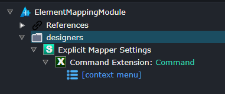
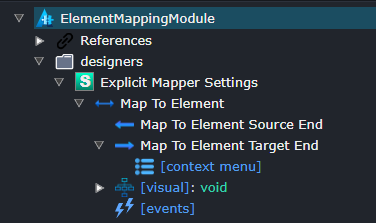
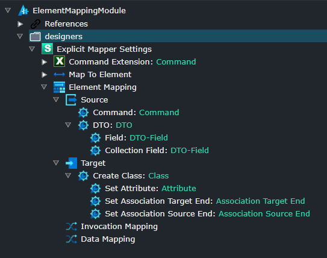
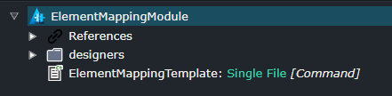
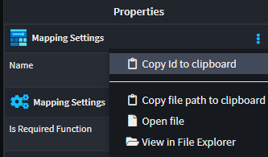

# Tutorial: Advanced Mapping

## Overview

This tutorial will guide you through the process of setting up an advanced mapping between a CQRS Command and a Domain Entity Class using Intent Architect. This allows for the automatic generation of code that maps the properties from a command (or DTO) to the associated properties or fields of a domain entity. 

## Create a New Module Builder Application

- Open Intent Architect and create a new Module Builder application named `ElementMappingModule`.
- Ensure you include the necessary components: `Module Builder C#`, `Domain` and `Services`.
- Once the `ElementMappingModule` is created, right-click on the newly created application and select `Manage Modules`.
- Search for `cqrs`.
- Install the  `Intent.Modelers.Services.CQRS` module. Expand the `Options` section on the right hand side and check `Install metadata only`.

## Setup designer settings



- In the `Module Builder`, create a `Designer Settings` named `Explicit Mapper Settings`.
- Within this folder, create a `Designer Settings` item and name it `Command Extension`.
- Set the `Extended Designers` property to reference the `Services` designer.
- Add an `Element Extension` with the name `Command Extension` and target the `Command` type from the CQRS module.

## Define the Mapping Associations



- Create a new `Association Type` named `Map to Element`.
- Set the `Source End` to `Command`.
  - Set the Display Text Function to

    ```javascript
    return `mapped by : ${typeReference.getType().getParent().getName()}.${typeReference.display}`;
    ```

  - Set the Name Accessibility to `Hidden`.
- Set the `Target End` to `Class`.
  - Set the Display Text Function to

    ```javascript
    const returnType = typeReference.getType()?.typeReference?.display ?? "void";
    return `[map] ${getName()}: ${`${typeReference.getType()?.getName()}(...): ${returnType}` ?? "<not set>"}`;
    ```

  - Set the Name Accessibility to `Optional`.
- Right click on `Map to Element` and select `Add Visual Settings`, ensure the Type is `void`.
- Set its properties:
  - Line Type `Curved`.
  - Line Dash Array `return "3, 7";`.
- Right click on the `[visual]` and add a `Source` visual.
- Set its properties on Point Settings:
  - Path

    ```js
    return `a 4,4 0 1,0 4,4 
        a 4,4 0 1,0 -4,4`;
    ```

  - Line Width `return 3;`.
- Right click on the `[visual]` and add a `Destination` visual.
- Set its properties on Point Settings:
  - Path

    ```js
    return `l 4 8 l -8 0 l 4 -8 Z`;
    ```

## Define the Element Mapping



Create a new `Mapping Settings` in the `Explicit Mapper Settings` Designer Settings and name it `Element Mapping`.

Create the following `Mappable Element Settings` inside the `Source` element (with its own Target Type) by right clicking on `Source` and selecting `Add Mappable Element`:

- Command (`Command`)
- DTO (`DTO`)
  - Field (`DTO-Field`)
  - Collection Field (`DTO-Field`)

Set the properties for the following source elements:

- Command
  - Represents `Data`.
  - Is Mappable Function `return true;`.
  - Allow Multiple Mappings `checked`.
  - Can Be Modified `checked`.
  - Use Child Mappings From `DTO: DTO`.
- DTO
  - Represents `Data`.
  - Is Mappable Function `return false;`.
  - Allow Multiple Mappings `checked`.
  - Can Be Modified `checked`.
  - Create Name Function

    ```js
    return element.getParent('Command').getName() + element.getName() + 'Dto';
    ```

- Field
  - Represents `Data`.
  - Filter Function

    ```js
    return !element.typeReference.getIsCollection();
    ```

  - Is Mappable Function `return true;`.
  - Allow Multiple Mappings `checked`.
  - Traversable Mode `Traverse Specific Types`.
  - Traversable Types `DTO: DTO`.
  - Can Be Modified `checked`.
- Collection Field
  - Represents `Data`.
  - Filter Function

      ```js
      return element.typeReference.getIsCollection();
      ```

  - Is Mappable Function `return true;`.
  - Allow Multiple Mappings `checked`.
  - Traversable Types `DTO: DTO`.
  - Can Be Modified `checked`.

Create the following `Mappable Element Settings` inside the `Target` element (with its own Target Type) by right clicking on `Target` and selecting `Add Mappable Element`:

- Create Class (`Class`)
  - Set Attribute (`Attribute`)
  - Set Association Target End (`Association Target End`)
  - Set Association Source End (`Association Source End`)

Set the properties for the following target elements:

- Create Class
  - Represents `Invokable`.
  - Is Mappable Function `return true;`.
  - Allow Multiple Mappings `checked`.
- Set Attribute
  - Represents `Data`.
  - Is Mappable Function `return true;`.
  - Allow Multiple Mappings `checked`.
- Set Association Target End
  - Represents `Data`.
  - Is Mappable Function `return true;`.
  - Allow Multiple Mappings `checked`.
  - Traversable Mode `Traverse Specific Types`.
  - Traversable Types `Create Class: Class`.
  - Use Child Mappings From `Create Class: Class`.
- Set Association Source End
  - Represents `Data`.
  - Is Required Function `return false;`.
  - Is Mappable Function `return true;`.
  - Allow Multiple Mappings `checked`.
  - Traversable Mode `Traverse Specific Types`.
  - Traversable Types `Create Class: Class`.
  - Use Child Mappings From `Create Class: Class`.

Add the following Mapping Types to the `Element Mapping` by right clicking and selecting `Add Mapping Type` and set their properties accordingly:

- Invocation Mapping
  - Source Types `Command: Command`.
  - Target Types `Create Class: Class`.
  - Represents `Invokable`.
- Data Mapping
  - Source Types `Field: DTO-Field`, `Collection Field: DTO-Field`.
  - Target Types `Set Attribute: Attribute`, `Set Association Target End: Association Target End`.
  - Represents `Data`.

## Create Template for Mapping code



Create a new template in the `ElementMappingModule` for mapping commands to domain entities by right clicking on the `ElementMappingModule` package and selecting `New C# Template`.

Ensure the following properties are set:

- Name `ElementMappingTemplate`.
- Type `Single File`.
- Templating Method `C# File Builder`.
- Designer `Services`.
- Model Type `Command`.

## Implement ElementMappingTemplate

Run the Software Factory and open the solution in Visual Studio.

Open the `ElementMappingTemplatePartial` class. Implement the constructor like this:

```cs
public ElementMappingTemplate(IOutputTarget outputTarget, IList<CommandModel> model) : base(TemplateId, outputTarget, model)
{
    CSharpFile = new CSharpFile(this.GetNamespace(), this.GetFolderPath())
        .AddClass($"ElementMapping", @class =>
        {
            @class.Static();
            foreach (var commandModel in model)
            {
                var commandTypeName = GetTypeName("Application.Command", commandModel);
                foreach (var target in commandModel.MapToElementTargets())
                {
                    var entityTypeName = GetTypeName("Domain.Entity", target.Association.TargetEnd.Element);
                    var entityName = target.Association.TargetEnd.Element.Name;
                    @class.AddMethod(entityTypeName, $"MapTo{entityName.ToPascalCase()}", method =>
                    {
                        method.Static();
                        method.AddParameter(commandTypeName, "source", param => param.WithThisModifier());
                        
                        var manager = new CSharpClassMappingManager(this);
                        
                        manager.SetFromReplacement(commandModel, "source");
                        
                        var resultStatement = new CSharpAssignmentStatement(
                            "var result",
                            manager.GenerateCreationStatement(target.Mappings.First())).WithSemicolon();
                        method.AddStatement(resultStatement);
                        method.AddStatement("return result;");
                    });
                }
            }
        });
}
```

Create a new class `ElementMappingTypeResolver` and implement it as follows:

```cs
public class ElementMappingTypeResolver : IMappingTypeResolver
{
    private readonly ICSharpFileBuilderTemplate _template;

    public ElementMappingTypeResolver(ICSharpFileBuilderTemplate template)
    {
        _template = template;
    }

    public ICSharpMapping ResolveMappings(MappingModel mappingModel)
    {
        if (mappingModel.MappingTypeId != "ENTER ID HERE")
        {
            return null;
        }
        
        var model = mappingModel.Model;

        if (model.SpecializationType is "Class" || model.TypeReference?.Element?.SpecializationType == "Class")
        {
            return new ObjectInitializationMapping(mappingModel, _template);
        }
        
        if (model.SpecializationType == "Association Target End" && model.TypeReference?.IsCollection == true)
        {
            return new SelectToListMapping(mappingModel, _template);
        }

        return null;
    }
}
```

In Intent Architect, go to your `Element Mapping` elemen, left click on it and locate the 3 dots on the right hand side. Click on it and select `Copy Id to clipboard`.



Go back to the `ElementMappingTypeResolver` and locate the `ENTER ID HERE` string. Replace it with the Id you copied in Intent Architect.

```cs 
if (mappingModel.MappingTypeId != "eba4de6c-8b26-4a4e-ab7d-48e327495227")
{
    return null;
}
```

In the `ElementMappingTemplatePartial` constructor, you need to add this resolver like this:

```cs
var manager = new CSharpClassMappingManager(this);
manager.AddMappingResolver(new ElementMappingTypeResolver(this));
```

## Build and install the Module

Compile the ElementMappingModule project in Visual Studio.

Note the location of the created module in the `Build` log.

`Successfully created package C:\Code\MyModules\Intent.Modules\ElementMappingModule.1.0.0.imod`

Create a Clean Architecture application in Intent Architect for testing this newly created module. Call it `TestApp`.

To set it up to install the custom module in the `TestApp`, follow the `Install the Module` instructions [here](xref:module-building.tutorial-create-a-template.install-and-run-the-module#install-the-module).

