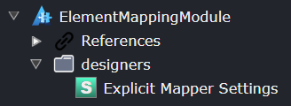

# Tutorial: Advanced Mapping

## Overview

This tutorial will guide you through setting up advanced mapping between a CQRS Command and a Domain Entity Class using Intent Architect. This allows for automatic code generation that maps properties from a command (or DTO) to associated properties or fields of a domain entity.


## Create a New Module Builder Application

- Open Intent Architect and create a new Module Builder application named `ElementMappingModule`.
- Ensure you include the necessary components: `Module Builder C#`, `Domain`, and `Services`.
- Once the `ElementMappingModule` is created, right-click on the new application and select `Manage Modules`.
- Search for `cqrs`.
- Install the `Intent.Modelers.Services.CQRS` module. Expand the `Options` section on the right-hand side and check `Install metadata only`.

## Setup Designer Settings

With designer settings, you can introduce new elements such as extensions, associations, and mapping configurations to the designers. This enhances the visual modeling capabilities of Intent Architect, making it easier to create more sophisticated and detailed models that are tailored to the application's needs.



- In the `Module Builder`, create a `Designer Settings` named `Explicit Mapper Settings`.
- Within this folder, create a `Designer Settings` item named `Command Extension`.
- Set the `Extended Designers` property to reference the `Services` designer.
- Add an `Element Extension` with the name `Command Extension` and target the `Command` type from the CQRS module.

## Define the Mapping Associations

Defining mapping associations allows users to establish explicit relationships between commands and domain classes. This facilitates the automatic generation of mapping code based on these defined relationships.


- Create a new `Association Type` named `Map to Element`.
- Set the `Source End` to `Command`.
  - The next steps involve setting `Display Text Functions` that control the text that gets displayed when referencing the Source or Target end of the association. The functions are written in JavaScript.
  - Set the Display Text Function to:

    ```javascript
    return `mapped by : ${typeReference.getType().getParent().getName()}.${typeReference.display}`;
    ```

  - Set the Name Accessibility to `Hidden`.
- Set the `Target End` to `Class`.
  - Set the Display Text Function to:

    ```javascript
    const returnType = typeReference.getType()?.typeReference?.display ?? "void";
    return `[map] ${getName()}: ${`${typeReference.getType()?.getName()}(...): ${returnType}` ?? "<not set>"}`;
    ```

  - Set the Name Accessibility to `Optional`.
- Right-click on `Map to Element` and select `Add Visual Settings`, ensure the Type is `void`.
- Set its properties:
  - Line Type `Curved`.
  - Line Dash Array `return "3, 7";`.
- Right-click on the `[visual]` and add a `Source` visual.
- The next steps involve `Point Settings` which are [SVG Paths](https://developer.mozilla.org/en-US/docs/Web/SVG/Tutorial/Paths) used to draw an image resembling an arrow-line that represents the element mapping.
- Set its properties on Point Settings:
  - Path:

    ```js
    return `a 4,4 0 1,0 4,4 a 4,4 0 1,0 -4,4`;
    ```

  - Line Width `return 3;`.
  - This will draw the solid circle on the Source end.
- Right-click on the `[visual]` and add a `Destination` visual.
- Set its properties on Point Settings:
  - Path:

    ```js
    return `l 4 8 l -8 0 l 4 -8 Z`;
    ```

  - This will draw the triangle pointer on the Target end.

## Define the Element Mapping

Element mappings specify how different elements within the source (like DTOs and Commands) should map to the target (like Domain Classes and Associations). This allows for the detailed configuration of how data should be transferred and transformed between different parts of the application.


The `Source` elements within the settings (such as Command, DTO with nested Fields) indicate the elements from which you can map. On the other hand, the `Target` elements (such as Class, Attribute, and Associations) indicate where you can map to. This setup ensures there's a clear and traversable path for data or actions between various parts of your model.

Create a new `Mapping Settings` in the `Explicit Mapper Settings` Designer Settings and name it `Element Mapping`.

Create the following `Mappable Element Settings` inside the `Source` element (with its own Target Type) by right-clicking on `Source` and selecting `Add Mappable Element`:

- **Command** (`Command`)
- **DTO** (`DTO`)
  - **Field** (`DTO-Field`)
  - **Collection Field** (`DTO-Field`)

The next steps will be addressing the following property types:

- **Represents**: . This will be further addressed in the [Invocation Mapping](#invocation-mapping) and [Data Mapping](#data-mapping).
- **Is Mappable Function**: If it returns `true` the element is allowed to be mapped from/to. This is useful in cases where elements may be greyed out since they are read-only for instance on the target end.
- **Allow Multiple Mappings**: Allow for element to be mapped from/to multiple times.
- **Can Be Modified**: Should it be permissible to generate and automatically link these fields if they do not already exist at the other end upon a double-click action (as an example)?
- **Traversable Mode**: This mode enables elements that link to other types of elements to be expanded, making their child elements accessible for mapping. By choosing this mode, you can specify which types of elements are permitted to enter the traversal. For instance, consider a Class `Order` that contains a collection of `OrderLines` as an association; using this mode, you can navigate through the collection to map to its constituent elements.
- **Use Child Mappings From**: Rather than replicating mappings for child elements along with their associated property values, you have the option to "borrow" the child-element structure from another element type. For instance, Command could adopt the child mappings from DTO, given their structural similarity despite serving different purposes.

Set the properties for the following source elements:

- **Command**
  - Represents `Data`.
  - Is Mappable Function `return true;`.
  - Allow Multiple Mappings `checked`.
  - Can Be Modified `checked`.
  - Use Child Mappings From `DTO: DTO`.
- **DTO**
  - Represents `Data`.
  - Is Mappable Function `return false;`.
  - Allow Multiple Mappings `checked`.
  - Can Be Modified `checked`.
  - Create Name Function:

    ```js
    return element.getParent('Command').getName() + element.getName() + 'Dto';
    ```

- **Field**
  - Represents `Data`.
  - Filter Function:

    ```js
    return !element.typeReference.getIsCollection();
    ```

  - Is Mappable Function `return true;`.
  - Allow Multiple Mappings `checked`.
  - Traversable Mode `Traverse Specific Types`.
  - Traversable Types `DTO: DTO`.
  - Can Be Modified `checked`.
- **Collection Field**
  - Represents `Data`.
  - Filter Function:

    ```js
    return element.typeReference.getIsCollection();
    ```

  - Is Mappable Function `return true;`.
  - Allow Multiple Mappings `checked`.
  - Traversable Types `DTO: DTO`.
  - Can Be Modified `checked`.

Create the following `Mappable Element Settings` inside the `Target` (or Destination) element (with its own Target Type) by right-clicking on `Target` and selecting `Add Mappable Element`:

- **Create Class** (`Class`)
  - **Set Attribute** (`Attribute`)
  - **Set Association Target End** (`Association Target End`)
  - **Set Association Source End** (`Association Source End`)

Set the properties for the following target elements:

- **Create Class**
  - Represents `Invokable`.
  - Is Mappable Function `return true;`.
  - Allow Multiple Mappings `checked`.
- **Set Attribute**
  - Represents `Data`.
  - Is Mappable Function `return true;`.
  - Allow Multiple Mappings `checked`.
- **Set Association Target End**
  - Represents `Data`.
  - Is Mappable Function `return true;`.
  - Allow Multiple Mappings `checked`.
  - Traversable Mode `Traverse Specific Types`.
  - Traversable Types `Create Class: Class`.
  - Use Child Mappings From `Create Class: Class`.
- **Set Association Source End**
  - Represents `Data`.
  - Is Required Function `return false;`.
  - Is Mappable Function `return true;`.
  - Allow Multiple Mappings `checked`.
  - Traversable Mode `Traverse Specific Types`.
  - Traversable Types `Create Class: Class`.
  - Use Child Mappings From `Create Class: Class`.

Add the following Mapping Types to the `Element Mapping` by right-clicking and selecting `Add Mapping Type` and set their properties accordingly:

### Invocation Mapping

- Source Types `Command: Command`.
- Target Types `Create Class: Class`.
- Represents `Invokable`.

Example of an Invocation mapping:


This mapping method facilitates the creation of an instance or execution of an operation on a target Entity. This can be done by directly calling the Entity's constructor, either explicitly or implicitly, or by solely executing the Entity's operation. To illustrate, a `CreateOrderCommand` could correspond to the constructor of an `Order` class, initializing necessary fields directly. This approach guarantees a consistent and foreseeable setup of the target entity.

### Data Mapping

- Source Types `Field: DTO-Field`, `Collection Field: DTO-Field`.
- Target Types `Set Attribute: Attribute`, `Set Association Target End: Association Target End`.
- Represents `Data`.

Example of a Data mapping:


This type of mapping is intended for direct assignment of values from fields in the source object to attributes or relationships in the target object. It handles both s
ingle-value fields and collections. By defining these mappings, fields from a command or DTO can be accurately transferred and mapped to corresponding properties of a domain entity, ensuring
 data integrity and consistency. For example, the `RefNo` and `CreatedDate` attributes of an `Order` entity can be directly mapped from fields in a command or DTO, ensuring each attribute is correctly populated.

## Create Context Menus

To provide a way for users to create these Element Mappings between Commands and Domain Classes and to map the data flow between them, context menus will be added to enable the user to perform those functions.

To create the `Map To Element` association and perform the `Element Mapping` mapping, we need to set up their context menu options.

On the `Command Extension`, ensure that the `[context menu]` element exists by right-clicking on it and selecting `Add Menu Options`.

On the `[context menu]` element, right-click and select `Add Association Creation`. Name it `Add element mapping` and set the type to `Map To Element`.

Next, go to the `Map To Element` association and locate the `Map To Element Target End` destination end. Ensure it too has the `[context menu]` created by selecting `Add Menu Options` when right-clicking on the element.

On the `[context menu]`, right-click and select `Add Mapping Option` and name it `Map to Element` with the type being `Element Mapping`.


## Create Template for Mapping Code

Creating a template for mapping code involves defining a custom template that generate the necessary code to perform the mappings. This step ensures that the mappings defined in the designer are translated into executable code.


Create a new template in the `ElementMappingModule` for mapping commands to domain entities by right-clicking on the `ElementMappingModule` package and selecting `New C# Template`.

Ensure the following properties are set:

- Name `ElementMappingTemplate`.
- Type `Single File`.
- Templating Method `C# File Builder`.
- Designer `Services`.
- Model Type `Command`.

## Implement ElementMappingTemplate

The implementation of the `ElementMappingTemplate` and `ElementMappingTypeResolver` provides the logic for how the mappings should be executed and ensures that the correct methods and logic are generated based on the defined mappings.

Run the Software Factory and open the solution in Visual Studio.

Open the `ElementMappingTemplatePartial` class. Implement the constructor like this:

```csharp
public ElementMappingTemplate(IOutputTarget outputTarget, IList<CommandModel> model) : base(TemplateId, outputTarget, model)
{
    CSharpFile = new CSharpFile(this.GetNamespace(), this.GetFolderPath())
        .AddClass($"ElementMapping", @class =>
        {
            @class.Static();
            foreach (var commandModel in model)
            {
                var commandTypeName = GetTypeName("Application.Command", commandModel);
                foreach (var target in commandModel.MapToElementTargets())
                {
                    var entityTypeName = GetTypeName("Domain.Entity", target.Association.TargetEnd.Element);
                    var entityName = target.Association.TargetEnd.Element.Name;
                    @class.AddMethod(entityTypeName, $"MapTo{entityName.ToPascalCase()}", method =>
                    {
                        method.Static();
                        method.AddParameter(commandTypeName, "source", param => param.WithThisModifier());

                        var manager = new CSharpClassMappingManager(this);

                        manager.SetFromReplacement(commandModel, "source");

                        var resultStatement = new CSharpAssignmentStatement(
                            "var result",
                            manager.GenerateCreationStatement(target.Mappings.First())).WithSemicolon();
                        method.AddStatement(resultStatement);
                        method.AddStatement("return result;");
                    });
                }
            }
        });
}
```

Create a new class `ElementMappingTypeResolver` and implement it as follows:

```csharp
public class ElementMappingTypeResolver : IMappingTypeResolver
{
    private readonly ICSharpFileBuilderTemplate _template;

    public ElementMappingTypeResolver(ICSharpFileBuilderTemplate template)
    {
        _template = template;
    }

    public ICSharpMapping ResolveMappings(MappingModel mappingModel)
    {
        if (mappingModel.MappingTypeId != "ENTER ID HERE")
        {
            return null;
        }

        var model = mappingModel.Model;

        if (model.SpecializationType is "Class" || model.TypeReference?.Element?.SpecializationType == "Class")
        {
            return new ObjectInitializationMapping(mappingModel, _template);
        }

        if (model.SpecializationType == "Association Target End" && model.TypeReference?.IsCollection == true)
        {
            return new SelectToListMapping(mappingModel, _template);
        }

        return null;
    }
}
```

In Intent Architect, go to your `Element Mapping` element, left-click on it and locate the 3 dots on the right-hand side. Click on it and select `Copy Id to clipboard`.


Go back to the `ElementMappingTypeResolver` and locate the `ENTER ID HERE` string. Replace it with the Id you copied in Intent Architect.

```csharp
if (mappingModel.MappingTypeId != "eba4de6c-8b26-4a4e-ab7d-48e327495227")
{
    return null;
}
```

In the `ElementMappingTemplatePartial` constructor, add this resolver like this:

```csharp
var manager = new CSharpClassMappingManager(this);
manager.AddMappingResolver(new ElementMappingTypeResolver(this));
```

## Build and Install the Module

Once the custom module is set up and implemented, we'll cover the process of installing the module into your application. This step makes the new mapping capabilities available for use in the application.

Compile the `ElementMappingModule` project in Visual Studio.

Note the location of the created module in the `Build` log:

`Successfully created package C:\Code\MyModules\Intent.Modules\ElementMappingModule.1.0.0.imod`

Create a Clean Architecture application in Intent Architect for testing this newly created module. Call it `TestApp`.

To set it up to install the custom module in the `TestApp`, follow the `Install the Module` instructions here: [Install and Run the Module](xref:module-building.tutorial-create-a-template.install-and-run-the-module#install-the-module).

## Testing the Module

Testing the module involves creating domain models and commands within the application and applying the mappings to ensure that the generated code correctly maps between commands and domain entities, confirming the intended functionality.

Navigate to the Domain Designer for `TestApp`. Create two Classes defined like this:

- **Order**
  - `RefNo` as `string`
  - `CreatedDate` as `datetime`
- **OrderLine**
  - `Description` as `string`
  - `Amount` as `decimal`
  - `Quantity` as `int`

Create an association from `Order` to `OrderLine` as a `1 -> *` relationship.


Next, navigate to the Services Designer and create a Command called `CreateOrderCommand`. Provide it with a `RefNo` as `string` and `CreatedDate` as `datetime` fields. Last, right-click on the Command and select `Add element mapping`. Skip the name for the association by pressing tab to jump right into the type dropdown and select `Order`.


Right-click on the `[map] : Order(...): void` element and select `Map To Element`. This presents an advanced mapping screen where you can map the two Mapping Types: `Invocation Mapping` and `Data Mapping`.

- Double-click on the `Order` class on the right-hand side to set up the `Invocation Mapping` represented as a dotted purple line.
- Double-click on the `RefNo` and `CreatedDate` fields on the right-hand side to set up the `Data Mappings` represented as solid blue lines.
- Double-click on the `OrderLines` field twice to set up the `Data Mappings` represented as solid blue lines.
- Click DONE.


Run the Software Factory and open the `ElementMapping` class located in the Application project. It should look like this:

```csharp
namespace TestApp.Application
{
    public static class ElementMapping
    {
        public static Order MapToOrder(this CreateOrderCommand source)
        {
            var result = new Order
            {
                RefNo = source.RefNo,
                CreatedDate = source.CreatedDate,
                OrderLines = source.OrderLines
                    .Select(ol => new OrderLine
                    {
                        Id = ol.Id,
                        Description = ol.Description,
                        Amount = ol.Amount,
                        Quantity = ol.Quantity,
                        OrderId = ol.OrderId
                    })
                    .ToList()
            };
            return result;
        }
    }
}
```

This allows you to write the following code inside the `CreateOrderCommandHandler` class:

```csharp
public async Task Handle(CreateOrderCommand request, CancellationToken cancellationToken)
{
    var order = request.MapToOrder();
}
```
