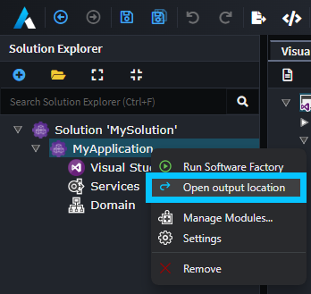

# Create a Module and Template

In this step of the tutorial, we will create a new Module Builder Application in Intent Architect, use the Designer to add a template to it, run the Software Factory against this Application to generate a .NET Core C# solution, and then finally build in our IDE to generate the Module.

## Create a new application

On the home screen, click `Create a new module`.

Fill in a `Name` (such as `MyModules`), review/change the `Location` as desired and click `NEXT`.

Ensure the following components are selected:

- `Module Builder Core`
- `Module Builder - C#`
- `Visual Studio Integration`

Click `CREATE`.

An `Application Installation` dialogue will pop up showing the progress of downloading and installing Modules and Metadata for the Application, once it's finished it will disappear allowing you to start building your own Module.

[!Video-Loop videos/create-a-new-module.mp4]

## Open and rename the package

Click on `Module Builder` on the left of the screen to enter the designer.

Click on the `MyModules` package, right-click and select `Rename`.

> [!NOTE]
> The name of the package is what the name of your module will be. This rename step is optional but demonstrates the process of how to accomplish this if required.

Enter a name for the `Package` (such as `MyModules.Entities`) and press `ENTER`. It will prompt you whether you want to change the underlying files. Click on `YES`. Finally, click on `Save`.

[!Video-Loop videos/open-and-rename-the-package.mp4]

## Create a template

Right-click the Package and click the `New C# Template` option:

Name it `EntityBase` and for its type select `Single File`.

[!Video-Loop videos/create-the-template.mp4]

## Run the software factory

We are now ready to run the software factory. Press the play button near the top right of the screen and the execution will start.

> [!NOTE]
> If your changes are unsaved, you will be asked if you want to save them before proceeding.

Once the Software Factory has executed the templates, it pauses to allow you to review the proposed changes (called staging). You can click an entry and it will open in a diff tool. If you are satisfied with the proposed changes you can press the `APPLY CHANGES` button to continue.

As the Software Factory Execution is running, it will present expandable items that allow you to drill deeper into the current activity currently being performed by the Software Factory.

[!Video-Loop videos/run-the-software-factory.mp4]

When the Software Factory Execution is complete, you can choose to close it (the button with the cross) or minimize it (the button with the underscore). For this tutorial, we recommend you minimize it to make use of Intent Architect's continuous processing feature that runs in the background (which will be demonstrated later in the tutorial).

[!Video-Loop videos/minimize-the-software-factory.mp4]

## Edit the template in Visual Studio

During the Software Factory Execution, Intent Architect generated a Visual Studio solution along with the `EntityBase` template which was added in the [create a template](#create-a-template) step above.

Navigate to the folder where the `.sln` solution file (and associated files) has been placed and open it with Visual Studio.

> [!TIP]
> Intent Architect can open the folder where the generated content was placed by you using the Application's context menu and clicking `Open output location`:
>
> 

Go to the `MyModules` Project and expand the `Templates` folder and then the `EntityBase` folder.

Open the `EntityBaseTemplatePartial.cs` file and it should look as follows:

```csharp

...

namespace MyModules.Templates.EntityBase
{
    [IntentManaged(Mode.Fully, Body = Mode.Merge)]
    public partial class EntityBaseTemplate : CSharpTemplateBase<object>, ICSharpFileBuilderTemplate
    {
        public const string TemplateId = "MyModules.Entities.EntityBase";

        [IntentManaged(Mode.Fully, Body = Mode.Ignore)]
        public EntityBaseTemplate(IOutputTarget outputTarget, object model = null) : base(TemplateId, outputTarget, model)
        {
            CSharpFile = new CSharpFile(this.GetNamespace(), this.GetFolderPath())
                .AddClass($"EntityBase", @class =>
                {
                    @class.AddConstructor(ctor =>
                    {
                        ctor.AddParameter("string", "exampleParam", param =>
                        {
                            param.IntroduceReadonlyField();
                        });
                    });
                });
        }
        ...
    }
}
```

> [!NOTE]
> This is a C# File Builder template, this templating paradigm uses a builder pattern to construct your C# file. The methods on the builder are intuitive and semantically aligned with concept's you would find in a C# code file, for example methods, constructors, fields, properties etc.

Reading through the builder code you can get a sense for what it is constructing:

- Add a class named `EntityBase`.
- within that class ->
  - Add a constructor.
  - for that constructor ->
    - Add a parameter of type `string`, named 'exampleParam.
    - Add a read only field to the class, for storing this parameter.

And as you can imagine this builder will end up producing a C# file as follows:

```csharp
...

    public class EntityBase
    {
        private readonly string _exampleParam;

        public EntityBase(string exampleParam)
        {
            _exampleParam = exampleParam;
        }
    }

```

Let's change this sample implementation to something more relevant for a `EntityBase` class. For the purpose of this tutorial let's assume you would like to add some standard auditing properties to the base class. Go ahead and modify the code as follows:

[!code-csharp[](code/entity-base-completed.cs?highlight=14,17-20)]

As you can intuition, the template will now output a file like this:

[!code-csharp[](code/entity-based-change-visualize.cs?highlight=1,7-10)]

> [!NOTE]
> The actual output may look a little different to this, due to things like [Code Management](xref:application-development.code-management.about-code-management).

Save your changes and build the project.

Once the build has been completed you will notice that the `Build` log includes the following line:
`Successfully created package C:\Code\MyModules\Intent.Modules\MyModules.Entities.1.0.0.imod`

This was output by the Intent Packager and lets you know where it has placed the built Module.

## Summary

You have successfully created an Intent Architect Module.

## Next Steps

### [Install and run the module](xref:module-building.tutorial-create-a-template.install-and-run-the-module)

Create a test Application to install and run our Module.
