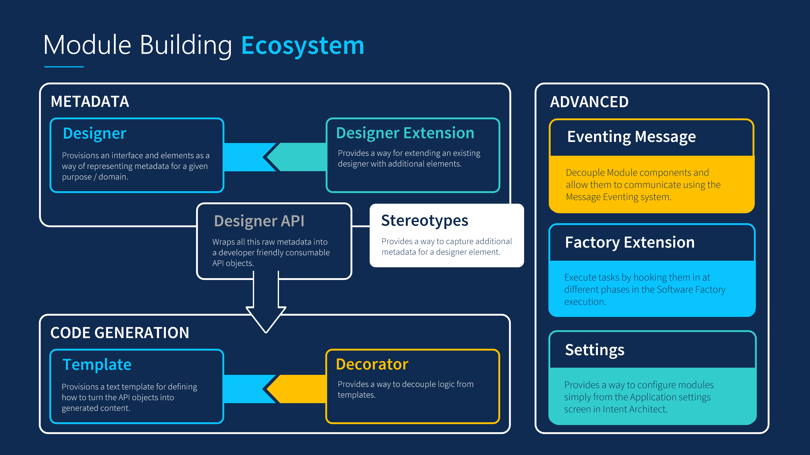

# About Module Building

As stated in [the Module article](xref:modules.about-modules), Modules are the _building blocks_ and artifacts of pattern reuse in Intent Architect.

In order to build Modules, it will be required of you to know what they comprise of. Each component which a Module is composed of fulfils different functions and also can impact and interact with other Modules in certain ways.

## Ecosystem

Here is the overview of what you can expect to find inside a Module in Intent Architect. Components inside Modules can be categorized as follows:

## Metadata

Before any form of code can be generated, there needs to be a structure of information (model) that can describe what an Application should behave and look like on a conceptual level (metadata).

### Designer

[Designers](xref:designers.about-designers) provide the interface that allow users to model what an Application should look and behave like while the designer itself also provides the structure for the model. The model can resemble a Tree-view or a Diagram of sorts. Each Designer exists to address a distinct aspect of the Application being developed. Examples are: modelling API services or what the underlying Database structure should look like, yet these Designers can also borrow information from one another so as to enrich the picture of what the Application looks like overall. Designers are themselves composed of Elements which are the building blocks for capturing user metadata.

### Designer Extension

Existing Designers can be open for [extension](xref:designers.about-designer-extensions) which allows Module developers to add new Elements to a Designer from a different Module. This retains the idea of reuse and can provide users of Designers with a richer experience and with more ways to model what an Application. This should not be confused with Stereotypes.

### Stereotypes

[Stereotypes](xref:stereotypes.about-stereotypes) offer additional ways to capture metadata from a user but not in the same way as Elements from Designers. They can only be applied on top of Elements (and/or their fields and associations) and offer a way to capture extra information about a given Designer Element.

### Designer API

Not only do users of Intent Architect have an interface with which to model what the metadata should look like, Module developers will also get an easy to use generated API to query the modelled metadata for Template development. Example: .

## Code Generation

Components associated with Code Generation will rely on the Designer API to supply it with metadata. This will then through some process transform the metadata into content that will be written to output files.

### Template

Using a [Text Template](xref:templates.about-templates-csharp) containing control logic, metadata can be consistently transformed based on the format of the Text Template and the output will become the content of a text file. These file types can range from XML to programming languages source code as long as the output type is text based.

### Decorator

Some Text Templates can be open for extension by exposing hook-in points for [Decorators](xref:templates.about-decorators) to supply additional content. Decorators offer a way to decouple certain logic from Text Templates. Decorators can also be installed through Modules that are separate from the Modules containing the Text Templates.

## Advanced

Components and infrastructural concerns additional to Metadata and Code Generation.

### Eventing Message

Components can achieve a level of decoupling using the Publish / Subscriber pattern with Eventing Messages.

### Factory Extension

One can introduce [Extensions](xref:software-factory.how-to-create-a-factory-extension) which will execute tasks at certain phases of the Software Factory Execution process. This can include:

- Loading Metadata from outside Intent Architect.
- Alter the output produced from Text Templates.
- Execute external processes which developers might have needed to execute manually after a Software Factory Execution.
