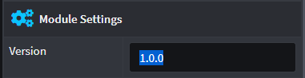

# How to distribute local (or internal) Modules

Working within an organization or small team and developing your own Modules using Intent Architect means that there will be a need to distribute newly created Modules (or even updates to existing ones) to the rest of the organization / team.

Intent Architect makes this simple as you can make use of any of the well known methods of file distribution such as:

* Network file sharing (i.e. Windows Sharing)
* Cloud storage drives (i.e. Dropbox, One Drive, Google Drive, etc.)
* Git repositories

Each option has its pros and cons so you will have to weigh which is better for your organization / team.

## Why Intent Architect isn't using Package Managers

Although Intent Architect's `imod` files have been inspired from [Nuget](https://www.nuget.org/)'s `nupkg` file format, we have decided to provide our own set of tools to build Modules. Modules should not be confused with packages even though it acts as a kind of package. This allows us to offer other features in the future which might have been constrained if we were to use existing Package Managers.

## How to distribute Modules

Once a Module has been built and placed inside the `Inent.Modules` folder (where your Module project for Intent Architect is located) it can then be copied/published to one of the Distribution Methods (mentioned above) to distribute it to the rest of the organization / team.

Ensure that in the Intent Architect project (which is supposed to use this Module), your [Asset Repositories](xref:user-interface.how-to-manage-repositories) are configured to point to this Distribution Method's local path.

## Versioning Concerns

Treat your Modules like they are immutable. Once they have been published to the rest of the team, make sure it has a unique version number assigned. This can be achieved inside the Module Builder when you click on the main Package.

