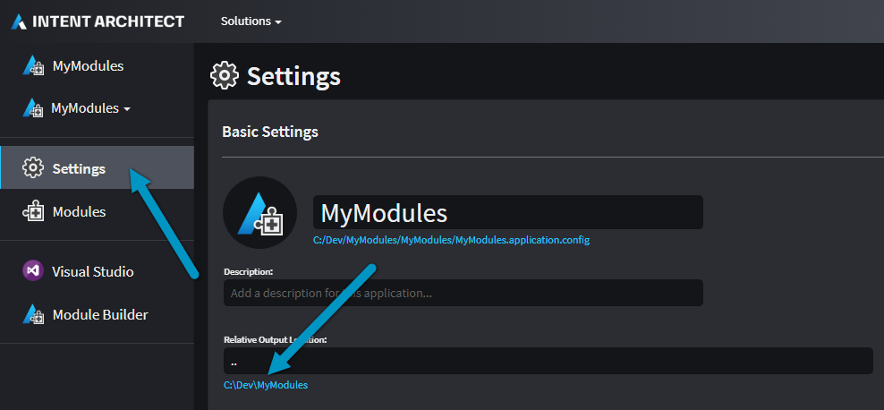

# How to distribute your modules to others

Modules built using Intent Architect can be distributed to other team members using any file system based custom repositories. An HTTPS based module repository is only supported for `https://intentarchitect.com/` which contains official Intent Architect Modules.

## Overview of distributing modules to others

* Decide on a common file system accessible location which everyone within your team has read access to.
* Each Intent Architect user in your team adds this common location to their repositories under their user settings.
* Modules already used by others should be treated as immutable, so if you've made changes within your module, then be sure to increment its version.
* Build the module to get the `.imod` artifact.
* Copy the `.imod` to the common file system accessible location.

## Decide on repository location

### Network based file sharing option

If all members are connected via a local network (or via VPN for remote working), one can make use of network file sharing hosting solutions. Usually all operating systems can access a Windows hosted network file location that resembles `\\server\intent-modules` as an example.

This is a simple way to distribute modules so long as everyone has at least readonly access (except for the publisher who needs write access) to that server location.

### Cloud based file sharing option

If your team is geographically distributed (but can still be leveraged for members on a local network too), then we recommend internet based file sharing with automatic synchronization to users machines, for example, Google Drive, Dropbox, OneDrive (SharePoint with OneDrive), etc.

One of the benefits of this approach is that you have an offline cache available during disruptions and your cloud storage provider also makes backups on your behalf.

## Configure Intent Architect to look at this location

This [article](xref:user-interface.how-to-manage-repositories) explains how to setup your known Intent Architect module repositories where it will look when installing or updating modules.

## Module versioning concerns

Distributing modules to other members of the team introduces some complexity if the version number is always kept the same (i.e. usually 1.0.0), one of them requiring that developers always know when to re-install that given module before usage. A better way would be to treat each module (that will be distributed to the team) as immutable, don't make any changes to it on the same version number.

There are good versioning schemes that you can leverage (such as [semantic versioning](https://semver.org/)) but essentially you could also just increment the last version component each time you publish a change to your module. This will ensure that team members get notified by Intent Architect if there is a new version available; however if your code base is in source control and a given Intent Architect application is already using the latest version, then switching between older and newer branches will not affect the output of Software Factory Executions, since each branch will point to the correct version of that module.

## Copying your `.imod` file

To locate the `Intent.Modules` folder for your Module, open up Settings tab inside your Intent Architect module application and click on the link under `Relative Output Location`.

When File Explorer opens up, locate the `Intent.Modules` folder. Copy the relevant `.imod` file to your file sharing location.
