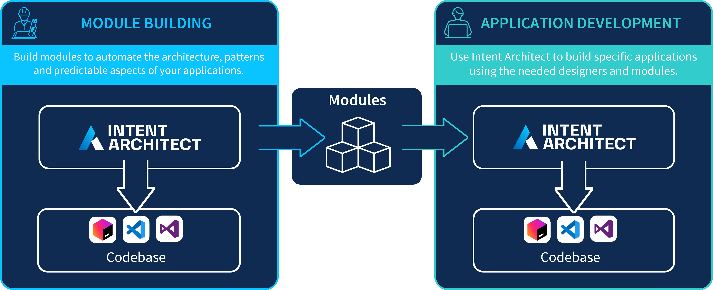
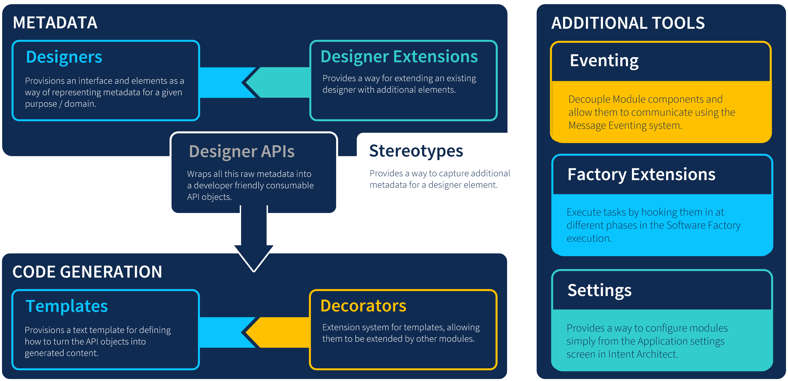

# Overview

## The Two Development Roles

In the same way that traditional software development teams have members who fulfil different roles (such as developing infrastructure, architecture, backends, front-end applications, API integration and consumer services, etc.) Intent Architect is no different in that developers who design and implement Applications may be different to the developers who supply the [Modules](xref:modules.about-modules) that support the ability for the Application developers to function (more efficiently) and deliver value.

> [!NOTE]
> Not all software development teams may have the need to develop and maintain their own Modules, since Intent Architect offers a suite of Modules out of the box to development teams. However, Intent Architect offers power and flexibility for those who do.

### Module Building

This can be likened in general to developers who create their own library packages for Nuget, NPM, Yarn, PIP, etc. It allows for an installable package to supply code that can plug in to the existing code-base to provide additional functionality to help achieve the goal of delivering business value.

Developers who build Modules in Intent Architect are providing different value in that their focus is on finding ways to automate architecture, patterns and any other predictable aspects of software development and provide installable Module packages to the development teams who need them.

This can form part of the same software development development-cycle of the team who is developing applications using Intent Architect, or it can even be an entirely different team operating on a separate development-cycle.

### Application Development

These are the consumers of the said Module packages who install and benefit from the automation features that it provides. This can include new forms of code being generated which saves a lot of time and effort for development teams or it can be that new and/or enhanced designers are provided which offer richer designing experiences and can potentially offer opportunities for other parts of the code-base to be automated that previously had to be maintained by hand.

## Module Building Ecosystem

### Ecosystem

The module building ecosystem comprises of one or more of the following aspects:

### Metadata

Metadata is the term used to describe all information that can be captured with Intent Architect designers. The Software Factory during its execution makes metadata available to modules which then use it to determine what code to generate.

#### Designers

[Designers](xref:designers.about-designers) are the visual modellers in an Intent Architect application which allow users to capture and compose metadata. Designers are highly configurable so that they can be tailored to capture information in a way that is intuitive and natural for the particular project or application.

#### Designer Extensions

Intent Architect supports extending designers. [Designer extensions](xref:designers.about-designer-extensions) allow adding additional element types and behaviour to an existing designer, providing the following powerful benefits:

- No need to copy an entire existing designer when you want to make a single small addition to it.
- Multiple designer extensions extending a single designer can be installed at the same time and they all continue working as expected.
- One can generally upgrade the module with the base designer to take advantage of new designer features with the designer extensions not needing to be updated to continue working.

#### Stereotypes

[Stereotypes](xref:stereotypes.about-stereotypes) allow "decoration" of elements and are analogous to decoration features in programming languages, such as [`C# Attributes`](https://docs.microsoft.com/dotnet/csharp/programming-guide/concepts/attributes/) or [`Java Annotations`](https://en.wikipedia.org/wiki/Java_annotation). Common use of Stereotypes is specifying technology or business domain specific metadata for Elements in the Intent Architect designer, such as a Class having a business requirement of being audited, or a Service Operation's HTTP method.

>[!NOTE]
>In comparison to designers and designer extensions, stereotypes allow adding additional "fields" or values to a particular element, while designers and designer extensions are for defining additional element types and element behaviours (such as context menu options, where they can be used, etc).

#### Designer APIs

Not only do users of Intent Architect have an interface with which to model what the metadata should look like, Module developers will also get an easy to use generated API to query the modelled metadata for Template development, [see for example](xref:stereotypes.how-to-use-stereotypes#query-stereotypes-from-templates).

### Code Generation

Code generation is the process of running the Software Factory which provides metadata from the designers to installed modules which use it to generate output (normally code).

#### Templates

[Templates](xref:templates.about-templates-csharp) are responsible for generating the actual content of output files, the Software Factory runs each template for each installed module in turn to ultimately generate the output of all the different files. The vast majority of module building is the authoring of templates.

#### Decorators

[Decorators](xref:templates.about-decorators) are a mechanism which can be used by Templates in order to inject content at certain _hook points_ within a Template. Templates expose a Decorator contract which can be implemented by Decorators in different modules. In this way Templates can be extended by modules on which they have no dependency and might have been created by completely different authors or even companies.

### Advanced

Less commonly used module building features for advanced use cases or requirements.

#### Eventing Messages

A fully decoupled mechanism for modules to interact with each other through use of messages and the event dispatcher within the Software Factory, commonly used for fulfilling architectural infrastructural concerns.

For example a template may need a registration to be performed with a system's dependency injection framework, without the template being aware of what dependency injection framework will ultimately be used. The template would simply publish a message saying what it needs, then multiple different modules (for example, AutoFac or Ninject modules) would be configured to listen to these messages and fulfil them making it so that regardless of which module is installed, everything still works.

#### Factory Extensions

[Factory Extensions](xref:software-factory.how-to-create-a-factory-extension) are used to hook into and extend any of the pre-defined phases of the the Software Factory process, use cases where this is useful include:

- Loading Metadata from outside Intent Architect.
- Alter the output produced from Templates.
- Execute external processes which developers might have needed to execute manually after a Software Factory Execution.
