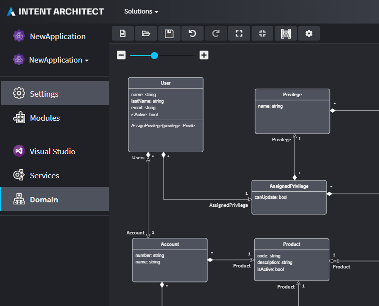

# Designers

Designers in Intent Architect allow you describe your [application's](xref:references.applications) design as visual models and hierarchical concepts. For example, Designers could be used to describe: the entities in a domain, the services that make up the applications API, events that are published and subscribed, etc.

Designers are added to the [Application](xref:references.applications) when a [Module](xref:references.modules) that has designer configuration is installed. You can therefore choose which Designers you would like to use in your Application.

> [!NOTE]
> Designers can be created and configured by using the [Intent Module Builder](xref:references.modules.module-builder). Existing Designers can also be extended with new concepts and configuration.

_An example from our from a sample application showing a Domain model inside of the Domain Designer._

Designers serve as a **blueprint** of your system. They can be used to describe any aspect of your Application. Typically, they are used to capture the following:

- **Codebase Structure** - Visual Studio Projects in .NET, Folder Structures in other languages, etc.
- **Entities** - Entities and their relationships to one another, Domain Driven Design (DDD) concepts (Aggregate Roots, Entities and Value Objects), etc.
- **Database Schemas** - Tables, Documents, Foreign keys, Indices, etc.
- **Services** - RESTful web services, SOAP services, security settings, transactional settings, etc.
- **Client Proxies** - Web client proxies, Synchronous Query Proxies, etc.
- **Eventing** - Messages, Topics, Queues, Subscriptions, etc. Often used to support a Microservices architectures.
- **Workflows** - Workflow Diagrams, Process Diagrams, etc.
- **Front-End Structure** - Components, Routing, Modules, View Models, Views, etc.

## Creating your own Designer

Customized Designers can be created using the Intent Module Builder. For examples on how Designers can be configured, open the `Intent.Modules.isln` in the [Intent.Modules](https://github.com/IntentSoftware/Intent.Modules) open-source repository on GitHub. See the following Modules:

- `Intent.Modelers.Services`
- `Intent.Modelers.Services.CQRS`
- `Intent.Modelers.Domain`

## See also

- 
