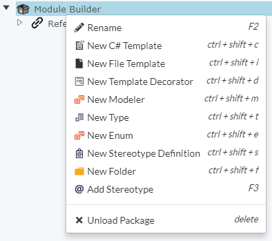

# Module Builder

The Module Builder is one of the powerful features of Intent Architect which allows a developer to craft their own code-generation module. This will allow a developer to generate custom defined code at the click of a button once that module is installed (while its being Intent Architect Managed). Think of the power!

>[!NOTE]
>The scope of this article is to explain the concepts found in the Module Builder. If you wish to find out more about Modules or Templates themselves, please navigate to the relevant section on the panel to the left.

## Breakdown

_Module Builder Components_

For the purposes of this document, we will only stick to the following components below. For information on the rest of the components outlined in the image above, please visit the [Intent Architect Concepts](intent_architect_concepts.md) page.

### File Template
Creates a Template class that will allow you to generate a text file for any type of text content (including any programming language).

### C# Template
Since Intent Architect supports intelligent weaving in C# files, it will create a template that will set this up for you. It is recommended to use this type of template for all C# classes as the [weaving](xref:RoslynWeaver) systems allow user-managed code to co-exist with Intent-managed code within the same file.

### Template Decorator
Creates a decorator that you can use to add content to an existing template by hooking into its extensibility points.

### Modeler

### Type

