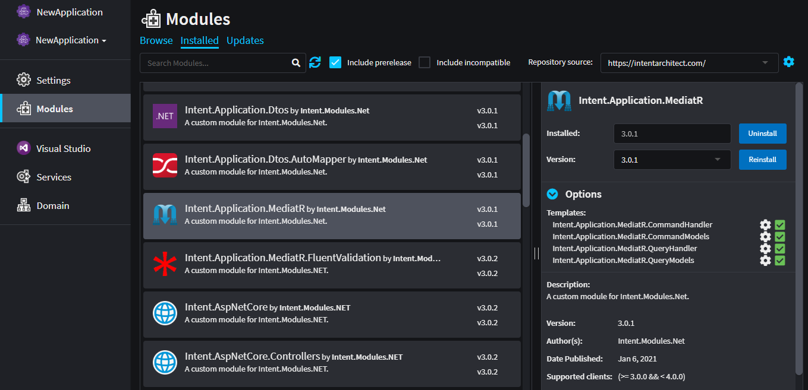

# Modules

## What is a Module

Modules are the _building blocks_ and artifacts of pattern reuse in Intent Architect.

Typically, the purpose of a Module is to generate and manage a set of code files in a codebase, usually around a particular architectural pattern. This could for example be the entities in a domain, simple bootstrapping files, ORM mappings, controllers in an Api, etc.

Modules have similarities with package systems such as Nuget, NPM, and Maven. However, where the primary objective of these system is to make code-reuse easier, the primary objective of Modules is _pattern-reuse_. 

Modules have versions and dependencies, and don't directly introduce any runtime dependencies. They can, however, be configured to introduce package dependencies if the designer of the Module so chooses.

An example showing the list of Installed Modules in a sample application. The `Intent.Application.MediatR` module has been selected, with its details displayed in the pane on the right._

> [!NOTE]
> When you select an installed Module, Intent Architect gives a view into the internals of that module (i.e. the Templates, Decorators, and Factory Extensions it is made up of).

<!-- ## Anatomy of a Template

TODO

### Template

TODO

### Template Partial

TODO

### Template Registration

TODO

## See also

-  -->
