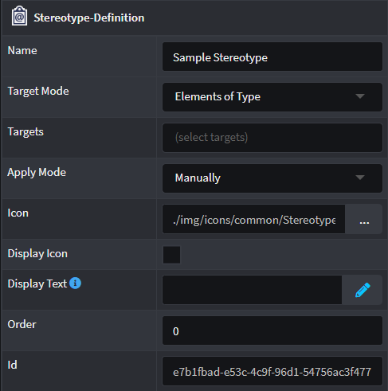
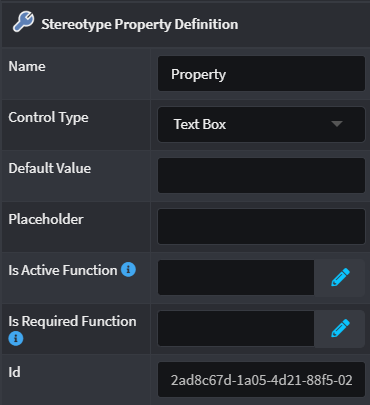

# Stereotype Definitions

Stereotypes can only be created and applied in Intent Architect Designers if their `Stereotype Definitions` are accessible. These Definitions need to be created first and can often be found when a [Module](xref:references.modules) is installed in your Application. They offer a blueprint that Intent Architect can recognize when trying to apply them.

|Property|Value|Description|
|--|--|--|
|Target Mode|Elements of Type|Only allows the Stereotype to be applied on Elements found in the `Target` property|
| |Elements that reference|Only allows the Stereotype to be applied on Elements' attributes/fields or associations that reference the Elements found in the `Target` property|
| |All elements|No constraint on where the Stereotype can be applied|
|Target|Elements found in Designer|Select the Element types that are applicable to the Stereotype Definition in question|
|Apply mode|Manually|The user has to explicitly apply a Stereotype on a `Target` Element|
| |On element created|When a `Target` Element is created, the Stereotype is automatically applied but it can be removed|
| |Always|The Stereotype exists permanently on any `Target` Element and cannot be removed (as long as the Stereotype Definition exists)|
|Icon|Formatted Text|Specify an Icon for this Stereotype using Font Awesome, a boxed character or a Base-64 encoded image|
|Display Icon|Check box|Allows the Designer to display the visual icon where available|
|Display Text|Function|Using the Javascript language, write a formatted text string that will be used by the Designer to add a Display Text where available. Example: `` return `[${properties["Router Link"].value}]` ``|
|Order|Number|Each Stereotype can be ordered according to this numerical value (in ascending order) in the Properties panel located on the right hand side in Intent Architect within a designer|

## Stereotype Properties

Stereotype Definitions can also hold Properties of their own which can be used to capture additional information from the Developer for the Element that it is decorating with additional metadata.

|Property|Value|Nested Value|Description|
|--|--|--|--|
|Name|Text|N/A|Specify a developer friendly name for this Property|
|Control Type|Text Box|N/A|Allows the Property to capture a single line of free text that represents a string|
| |Number|N/A|Allows only the capture of a Numerical value for this Property|
| |Checkbox|N/A|Presents a checkbox to capture a boolean value for the Property|
| |Text Area|N/A|Allows the Property to capture multiple-lines of free text that represents a string|
| |Select/Multi-select|Options|Provides an additional `Options` field where the Developer can specify explicit options which can be selected for that Stereotype Property|
| | |Lookup element|Provides an additional `Lookup types` field where the Developer can select Element types in order to make the Property a dropdown control that features instances of those Element types|
| | |Lookup Children|Provides additional `Root Type Function` and `Lookup types` fields where a Developer can determine which Element type's "child elements" can be selected. Use the `Lookup types` to select the Child-Element to be selected and specify the function to evaluate how to determine the Parent-Element in the `Root Type Function` field. An example would be selecting Enum Literals|
| |Javascript Function|N/A|Exposes the Property as a Javascript type field where the Developer can use the built in Javascript editor to define a script which can be leveraged by other Stereotype Properties or Designer elements|
| |Icon|N/A|Exposes the Property as a standard Icon selector which acts in the same manner as the `Icon` property found on the Stereotype Definition itself|
|Default Value|Multi-type value|N/A|Specify a default value in for this Property depending on the Control Type specified|
|Placeholder|Text|N/A|Specify a description for this Property's input field which a user of the Stereotype can see which describes what is expected|
|Is Active Function|Javascript|N/A|Write a script that returns `true`/`false` in order to determine if the Property will be visible/hidden or not. By default this will be Active.|
|Is Required Function|Javascript|N/A|Write a script that returns `true`/`false` in order to determine if the a value is required for this Property which is validated by Intent Architect. By default this will not be required.|

## See also

* 