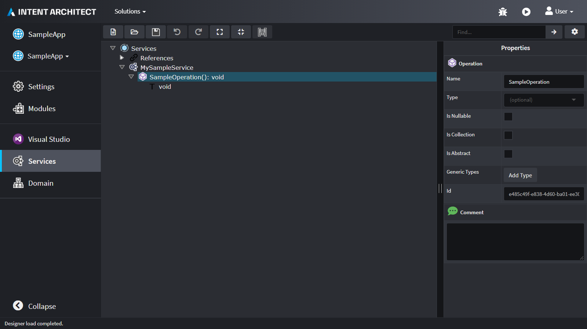
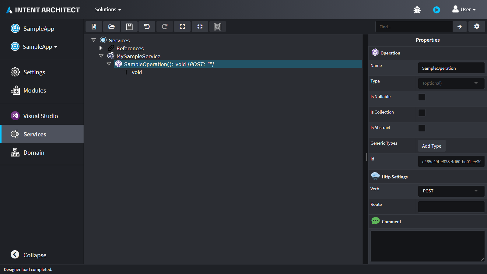
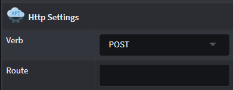

# Stereotypes

Intent Architect's Designers enables modelling of [Stereotypes](https://en.wikipedia.org/wiki/Stereotype_(UML)) which can be used to extend the vocabulary of Designer Elements.

Stereotypes allow "decoration" of elements and are analogous to decoration features in programming languages, such as [`C# Attributes`](https://docs.microsoft.com/dotnet/csharp/programming-guide/concepts/attributes/) or [`Java Annotations`](https://en.wikipedia.org/wiki/Java_annotation). Common use of Stereotypes is specifying technology or business domain specific metadata for Elements in the Intent Architect designer, such as a Class having a business requirement of being audited, or a Service Operation's HTTP method.

## A practical example

For example, Intent Architect's standard Services Designer only allows modelling generic Services and generic Operations on them.

After installing the `Intent.Metadata.WebApi` [module](xref:references.modules), an `Http Settings` Stereotype is automatically applied on all Operations and allows specifying via which HTTP Verbs should be accessible.

The Stereotype can be located on the Properties pane located to the right of the Designer:

Stereotypes not only offer a form of "tagging" on Elements found in Intent Architect Designers, but they also allow one to capture additional information using properties. These properties can hold different data types, allowing for a richer way of specifying more information on the Element at hand.

## Making your own

Stereotypes can be defined by the use of Stereotype Definitions, refer to this [article](xref:references.stereotypes.stereotype-definitions) for further details.

## See also

* 