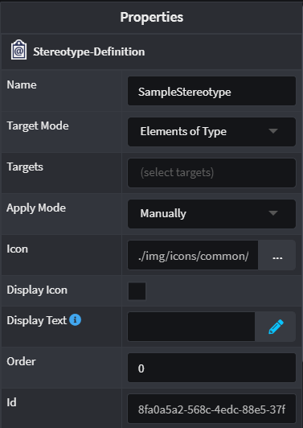

# Stereotypes

Intent Architect's Designers enables modelling of a sub-set of [UML](https://en.wikipedia.org/wiki/Unified_Modeling_Language), in particular [Stereotypes](https://en.wikipedia.org/wiki/Stereotype_(UML)). They can be used to extend the vocabulary of elements on the diagram. This typically takes the form of extending the metadata of any Element in any Intent Architect Designer.

This article will focus on more in-depth characteristics and definitions of Stereotypes. To learn how to apply them, refer to [this article](xref:how-to-guides.use-stereotypes).

## Stereotype Definitions

Stereotypes can only be created and applied in Intent Architect Designers if their Stereotype Definitions are accessible. These Definitions need to be created first and can often be found when a [Module](xref:references.modules) is installed in your Application. They offer a blueprint that Intent Architect can recognize when trying to apply them.

|Property|Value|Description|
|--|--|--|
|Target Mode|Elements of Type|Only allows the Stereotype to be applied on Elements found in the `Target` property|
| |Elements that reference|Only allows the Stereotype to be applied on Elements' attributes/fields or associations that reference the Elements found in the `Target` property|
| |All elements|No constraint on where the Stereotype can be applied|
|Target|Elements found in Designer|Select the Element types that are applicable to the Stereotype Definition in question|
|Apply mode|Manually|The user has to explicitly apply a Stereotype on a `Target` Element|
| |On element created|When a `Target` Element is created, the Stereotype is automatically applied but it can be removed|
| |Always|The Stereotype exists permanently on any `Target` Element and cannot be removed (as long as the Stereotype Definition exists)|
|Icon|Formatted Text|Specify an Icon for this Stereotype using Font Awesome, a boxed character or a Base-64 encoded image|
|Display Icon|Check box|Allows the Designer to display the visual icon where available|
|Display Text|Function|Using the Javascript language, write a formatted text string that will be used by the Designer to add a Display Text where available. Example: `return (properties["Source"].value == "Default") ? "" : ``[${properties["Source"].value}]``;`|
|Order|Number|Orders Stereotypes according to this numerical value in the Properties panel located on the right hand side in Intent Architect|
