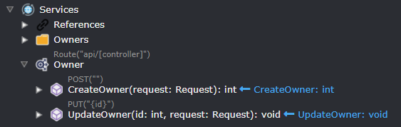
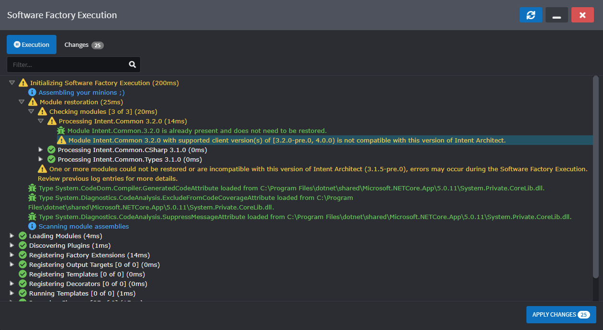
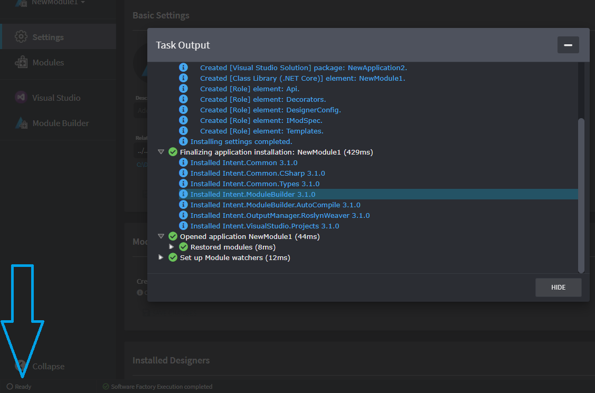
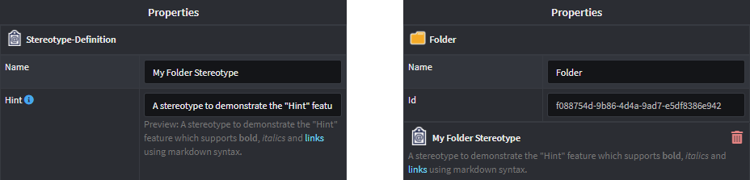
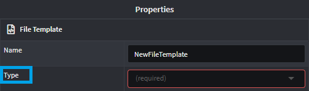
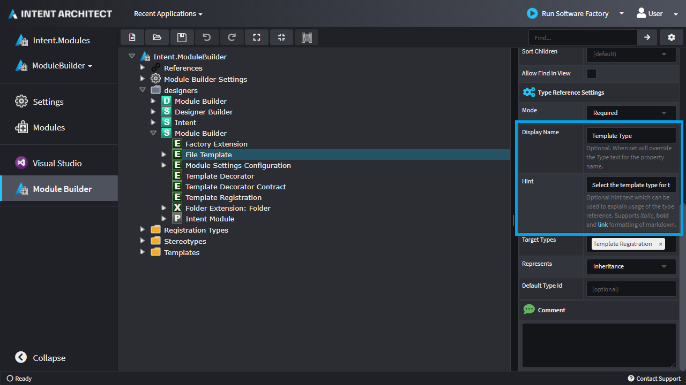
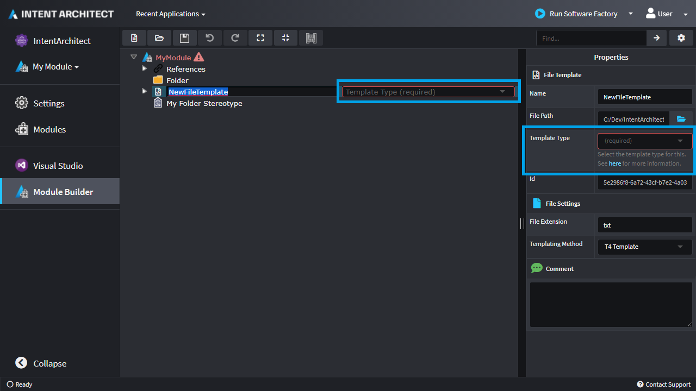

# Release notes: Intent Architect version 3.1

## Version 3.1.9

### New features added in 3.1.9

- Improved shortcuts for Software Factory Execution:
  - F5 will launch and start the execution.
  - If launched, F5 will restart execution.
  - On stage, Enter will apply changes.
  - Escape will minimize the modal.
- Enhanced JavaScript API for Designer Macros to support generics and associations.
- Associations in diagrams are rendered behind the elements. When selected, selection will high-light over elements.
- Macro API now allows creation of associations.
- Macro API now allows specifying of generic type parameters.

### Issues fixed in 3.1.9

- User settings -> Application location browse button always disabled.
- Fixed minor bugs in JavaScript API
- Diagrams unable to select default `New element location` from parent hierarchy.

## Version 3.1.8

### New features added in 3.1.8

- When ignoring/un-ignoring files in the Software Factory Execution changes dialogue, the preference is now saved immediately whereas before it was saved only on acceptance of changes.
- When creating an application or solution, there is now an option to create/update `.gitignore` files to ignore [relevant files](xref:application-development.applications-and-solutions.scm-ignore-files).
- Extended JavaScript API for Designer Macros.
- SDK now exposes visual metadata for diagrams.
- Expand/Collapse node functions extended to when more than one tree node is selected. Shortcuts (left arrow & right arrow) apply as before.
- Stereotypes can now be visualized as annotations:

- Additional triggers for scripts (e.g. on-name-changed and on-mapped for elements).

### Issues fixed in 3.1.8

- The space bar key would not work to toggle checkboxes on the mapping screen.

## Version 3.1.7

### Issues fixed in 3.1.7

- On Windows the diff tool for comparing staged changes would fail to launch if a user's `HOMEDRIVE` environment variable was set to an offline network drive.

## Version 3.1.6

### New features added in 3.1.6

- [Automatically re-run code weavers when file system change detected](#automatically-re-run-code-weavers-when-file-system-change-detected).
- [Warn during Software Factory Execution if installed modules are incompatible](#warn-during-software-factory-execution-if-installed-modules-are-incompatible).
- Additional mapping configuration support in Intent.ModuleBuilder
  - Ability to specify name, symbol and styling for mapping configurations on elements.
  - Support for multiple mapping configurations
- Restart option added to Software Factory Executions that are minimized in the tray.

### Issues fixed in 3.1.6

- Contact Support appeared to be loading forever if you were offline, it will now instead show a non-distracting warning icon and try re-connect itself automatically when you're back online.
- Software Factory Execution will only flash if changes are staged while the execution is minimized.

### Automatically re-run code weavers when file system change detected

During the "Staging Changes" phase of the Software Factory Execution, Intent Architect will now watch existing files on your disk drive for changes. When a change is detected it then re-runs the "Preparing Changes" phase for just that one file allowing instant previewing of code weaver changes.

For example, when looking at a file's diff during "Staging Changes" you realize you actually want to mark a section of code as being ignored, you can make the change in the diff tool, press save and instantly see the effect:

[!Video-Loop videos/3.1.0/rerun-transformers-automatically.mp4]

### Warn during Software Factory Execution if installed modules are incompatible

A warning will now show during Software Factory Execution when an installed module is marked as incompatible with the version of Intent Architect that is running:

## Version 3.1.5

### New features added in 3.1.5

- Significant speed up of the "Running Templates" phase of the Software Factory Execution, particularly for applications with many template instances. For the speed benefits to properly take effect you are also required to update the following modules (if installed):
  - `Intent.Common.CSharp`, to version `3.1.5` or better.
  - `Intent.Common`, to version `3.1.5` or better.

### Issues fixed in 3.1.5

- File renames were not properly recognized during Software Factory Execution.

## Version 3.1.4

### Issues fixed in 3.1.4

- Sometimes the agent would crash completely during Software Factory Execution.
- If a file that Intent Architect is managing was manually deleted, then a null reference exception would occur during Software Factory Execution.

## Version 3.1.3

### Issues fixed in 3.1.3

- Sometimes during Software Factory Execution a `Collection was modified after the enumerator was instantiated` exception would occur during the `Committing Changes` phase.

## Version 3.1.2

### New features added in 3.1.2

- Significant speed up of the "Preparing Changes" phase of Software Factory Execution for templates which have been previously run on the same computer and whose output and the existing file content are unchanged. The Software Factory will skip running Output Transformers when all the following are true since the previous Software Factory Execution:
  - The module for the Output Transformer has not been re-installed or upgraded.
  - The Template Output hash is the same.
  - The existing file on your disk drive has the same hash.

  This significantly speeds up the Software Factory Execution time when you have a lot of files and there are very few changes since the previous execution. For the Software Factory to compare the current Software Execution to the previous one, at the end of each execution a `.intent/output.cache` is written/updated. This file is placed in an `.intent` folder as folders of this name should be ignored in your Source Code Management, this also means that the first run of the Software Factory on a particular computer will be slower, but subsequent runs will have the `output.cache` pre-populated and thus be faster.

## Version 3.1.1

### Issues fixed in 3.1.1

- For accounts which already had Professional licenses and had not re-logged in some time, this fixes "no permission" errors from showing until you log out and then back in again.

## Version 3.1.0

### New features added in 3.1.0

- [Overhauled the Software Factory Execution functionality](#software-factory-execution-functionality-overhaul) so that it supports a host of great new features including, but not limited to:
  - Can now be minimized and run in the background.
  - You can now run multiple Software Factory Executions for different Applications at the same time.
  - If a change to a Module on your file system is detected, or designer is saved, the Software Factory will automatically re-run itself.
- [Automatic re-installation of rebuilt Modules](#automatic-re-installation-of-rebuilt-modules).
- [Specify application wide configuration for a Module](#specify-application-wide-configuration-for-a-module).
- [Overhauled the Application Installer window](#overhauled-the-application-installer-window).
- [Keyboard shortcut for the "Define Mapping" screen](#keyboard-shortcut-for-the-define-mapping-screen).
- [Keep mapped member types in sync](#keep-mapped-member-types-in-sync).
- ["Contact Support" option now available to live chat with Intent Architect staff](#contact-support).
- [JavaScript macros](#javascript-macros).
- [Intent Architect now runs on .NET 5.0](#intent-architect-now-runs-on-net-50).
- ["Hints" can now be added to Stereotype Definitions and their Properties](#hints-can-now-be-added-to-stereotype-definitions-and-their-properties).
- [The display name of Type Reference selection fields can now be customized through the Module Builder](#the-display-name-of-type-reference-selection-fields-can-now-be-customized-through-the-module-builder).

### Issues fixed in 3.1.0

- Some "Browse" dialogues would open at an expected path.
- Keyboard shortcuts wouldn't work when used from the visual designer.
- When removing a mapping from a type, errors regarding unmapped paths would still show on the element.

### Software Factory Execution functionality overhaul

The Software Factory execution functionality has been overhauled.

#### Minimize the window

The window can now be minimized:

You can see its status at a glance in the status bar area, click on it to re-open it or right-click on it for additional options:

#### Running multiple instances of the Software Factory at the same time

While a Software Factory Execution window is minimized, you can start additional instances:

#### Automatically re-run Software Factory when module updated

Intent Architect looks at your configured module repositories, watches all those paths for file system changes and will automatically restart the Software Factory when a change to a module is detected:

[!Video-Loop videos/3.1.0/sf-auto-restart.mp4]

### Automatic re-installation of rebuilt Modules

Intent Architect looks at your configured module repositories, watches all those paths for file system changes and will automatically re-install a module of the same version if a change to it is detected.

### Specify application wide configuration for a Module

When a Module is installed which specifies application wide configuration settings, these settings will be visible under the "Settings" section of an application:

Any template within the module is then able to use this setting to control its behaviour.

### Overhauled the Application Installer window

The application installer window now provides detailed and structured information when creating a new application. It can also be minimized to and restored from the feedback bar in the bottom left corner of the UI.

### Keyboard shortcut for the "Define Mapping" screen

The "Define Mapping" dialogue now has keyboard shortcuts for common actions such as selecting tree nodes.

### Keep mapped member types in sync

For a mapped property, there is now an option selected by default for the type reference to be kept in sync. For example, if you change an attribute in the domain from a `string` to an `int`, a field mapped from that attribute will have its type updated also with no intervention required.

### Contact Support

There is now a "Contact Support" option available to be able to live chat with Intent Architect support from directly from within the application.

### JavaScript macros

Intent Architect now supports JavaScript macros for automating certain kinds of tasks. We will be releasing more documentation on this soon.

### Intent Architect now runs on .NET 5.0

By having upgraded Intent Architect to .NET 5.0 it is now possible to create and use modules compiled for any .NET target compatible with the .NET 5.0 runtime.

### "Hints" can now be added to Stereotype Definitions and their Properties

You can now add a "Hint" to Stereotype Definitions and their Properties. These "Hints" can be used to better explain the intended purpose of Stereotype's or properties for users applying them to elements. A subset of markdown is also supported in these hints, namely \*\*bold\*\*, \_italics\_ and \[hyperlinks](https://intentarchitect.com/).

### The display name of Type Reference selection fields can now be customized through the Module Builder

Prior to this feature, when an element could reference another element, the label for this field was hard-coded as "Type".

It's now possible to customize this label and provide hint text (which works the same as [hints for stereotypes](#hints-can-now-be-added-to-stereotype-definitions-and-their-properties)) for it. In the module builder set the "Display Name" and "Hint" property values:

Then when using the designer it will show the label customization and hint:

