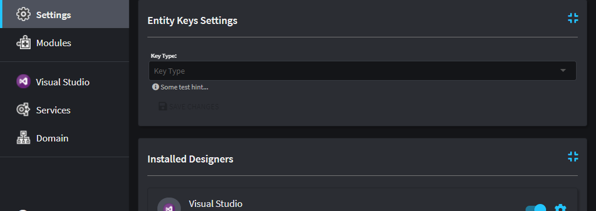
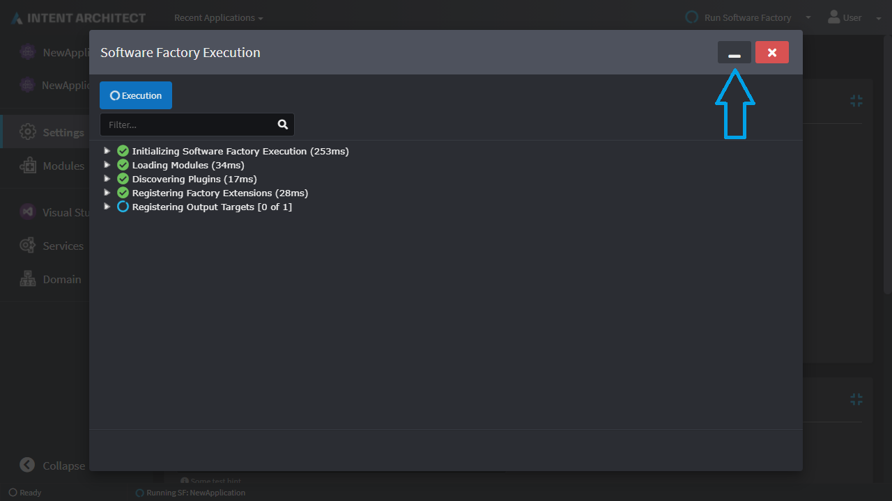
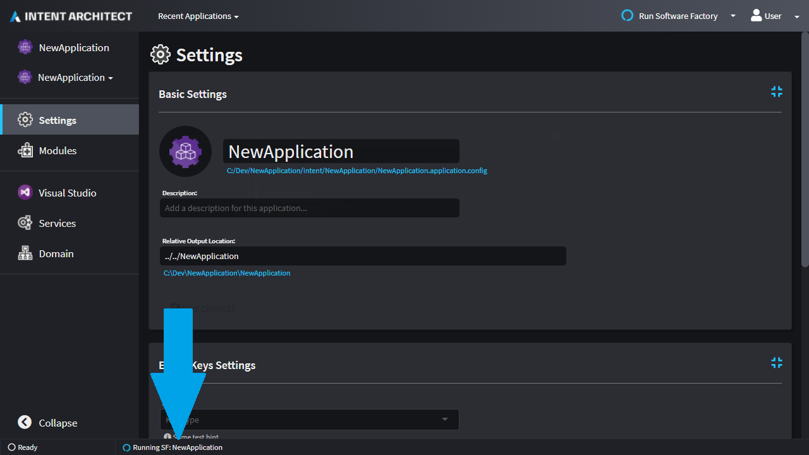
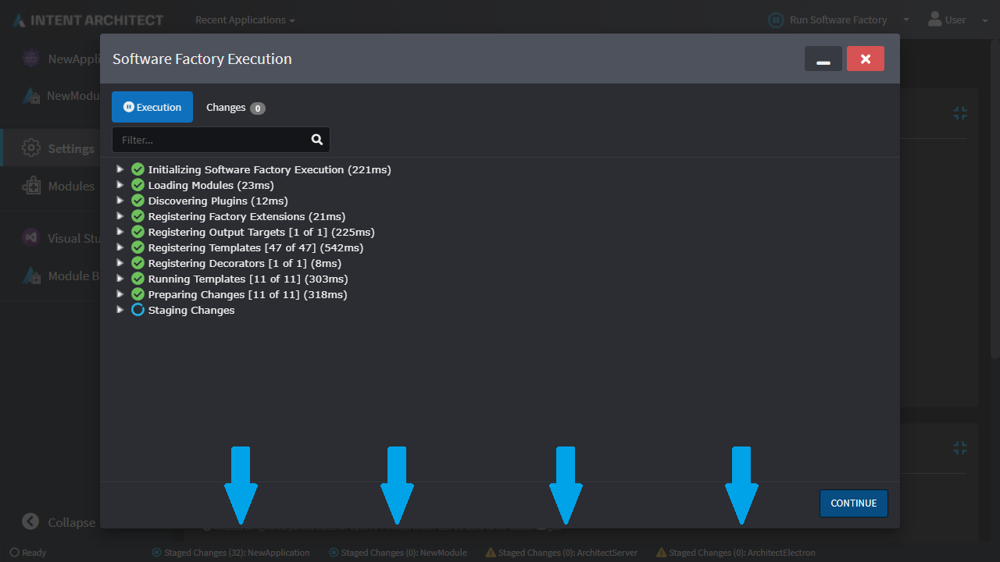

# Release notes: Intent Architect version 3.1

## Version 3.1.0

### New features added in 3.1.0

- Overhauled the Software Factory Execution functionality so that it supports a host of great new features including, but not limited to:
  - Can now be minimized and run in the background.
  - You can now run multiple Software Factory Executions for different Applications at the same time.
  - If a change to a Module on your file system is detected, or designer is saved, the Software Factory will automatically re-run itself.
- Specify application wide configuration for a Module.
- Overhauled the Application Installer window.
- Added keyboard shortcuts to the "Define Mapping" screen.
- Keep types of mapped members in sync with the type of the source member.
- "Contact Support" option now available to live chat with Intent Architect staff.
- JavaScript macros.
- Automatic re-installation of Modules when a rebuild of them is detected by a background file system watcher.
- Intent Architect now runs on .NET 5.0 and also supports modules compiled for any .NET version compatible with being run by .NET 5.0.
- "Hints" can now be added to Stereotype Definitions and their Properties.
- The display name of Type Reference selection fields can now be customized through the Module Builder.

### Issues fixed in 3.1.0

- Some "Browse" dialogues would open at an expected path.
- Keyboard shortcuts wouldn't work when used from the visual designer.
- When removing a mapping from a type, errors regarding unmapped paths would still show on the element.

### Specify application wide configuration for a Module

When a Module is installed which specifies application wide configuration settings, these settings will be visible under the "Settings" section of an application:

Any template within the module is then able to use this setting to control its behaviour.

### Software Factory Execution functionality overhaul

The Software Factory execution functionality has been overhauled.

#### Minimize the window

The window can now be minimized:

You can see its status at a glance in the status bar area, click on it to re-open it or right-click on it for additional options:

#### Running multiple instances of the Software Factory at the same time

While a Software Factory Execution window is minimized, you can start additional instances:

Intent Architect looks at your configured module repositories, watches all those paths for file system changes and will automatically restart the Software Factory when a change to a module is detected:

<video style="max-width: 100%" muted="true" loop="true" autoplay="true" src="videos/3.1.0/sf-auto-restart.mp4"></video>

