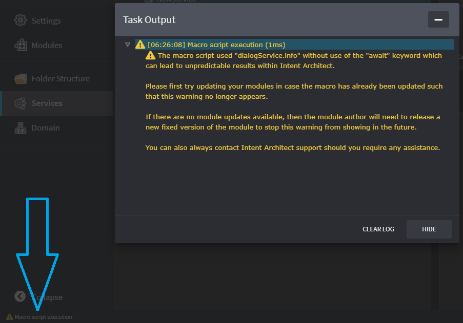

# Release notes: Intent Architect version 3.2

## Version 3.2.7

### Issues fixed in 3.2.7

- Fixed: Script context menu options captured in the Module Builder for packages would not actually appear on the package context menu when the designer was loaded.

## Version 3.2.6

### Issues fixed in 3.2.6

- Fixed: Imported metadata (for application templates or modules) would place all content in the root element regardless of whether or not the content should have been in sub-elements.

## Version 3.2.5

### Issues fixed in 3.2.5

- Fixed: When installing a module, folders for template outputs would always get created in the root instead of being nested within projects or other folders.

## Version 3.2.4

### New features added in 3.2.4

- A `Copy Id to Clipboard` context-menu option has been added to application tiles in the solution view.
- The Designer Settings screen now also shows the Designer's Id.

### Issues fixed in 3.2.4

- Fixed: In rare scenarios Code Weavers would incorrectly disregard all existing file content.
- Fixed: (Windows) Paths in various places would show with forward-slashes instead of platform appropriate back-slashes.

## Version 3.2.3

### Issues fixed in 3.2.3

- Fixed: It was not possible to load association metadata for template registration through `IMetadataManager`.
- Fixed: In some scenarios the module metadata installer wouldn't detect that elements of the same name already existed and end up creating a duplicate.
- Fixed: The Software Factory Metadata Loader will now traverse module dependencies of package dependencies for Stereotype Definitions. This should make it no longer necessary to add direct references to module metadata to prevent certain Software Factory errors from occurring.

## Version 3.2.2

### New features added in 3.2.2

- Clicking on the "update available" icon on the `Modules` entry in the left navigation pane will now navigate directly to the `Updates` tab.
- In the application `Settings` view, each module's settings section will now show the module's icon instead of a generic cog icon. *(Please note that modules installed prior to 3.2.2 will still show the default cog icon until re-installed.)*
- [Macro editor/execution improvements](#macro-editorexecution-improvements)

### Issues fixed in 3.2.2

- Fixed: Filtering of solutions and applications on the home screen no longer matches on character strings within base64 encoded images.
- Fixed: Styling issue on the home screen where recent application pills would sometimes span multiple line.
- Fixed: The module screen would sometimes still show updates being available for a module even after being upgraded to the latest version.
- Fixed: Placement of the question mark for nullable collections in the designer type rendering, before it would display as (for example) `string?[*]`, but it will now display as `string[*]?` instead.
- Fixed: Letter descenders were getting cut off in the left navigation pane.

### Macro editor/execution improvements

- Intellisense (Ctrl/⌘ + Space) now works on arrays:

- The `await` keyword now works with and must be used for asynchronous operations (such as dialogues). When the `await` keyword is not used the error dialog may not show and undo/redo will not correctly group all actions performed by the macro as a single operation. Intellisense method descriptions will say when use of `await` is required and a warning shows at the bottom left of the window which can be clicked on:

- If an error occurs during execution of the macro, the error dialog now shows a stack trace with line numbers:

## Version 3.2.1

### New features added in 3.2.1

- [Metadata export](#export-functionality) now also exports mapping details of elements.

### Issues fixed in 3.2.1

- Fixed: Making an association relationship that is not a collection is still pluralizing the relationship name.
- Fixed: Error occurs when calling `element.typeReference.getType()` function in a JavaScript macros on elements without the type set.
- Fixed: No error showing when type cannot be found for the type reference on elements.

## Version 3.2.0

### New features added in 3.2.0

- [Solution-wide Modules manager](#solution-wide-modules-manager).
- [Configuration of visual elements to use JavaScript functions](#configuration-of-visual-elements-to-use-javascript-functions).
- [Support for visually rendering elements and associations more than once in diagrams](#visually-rendering-elements-and-associations-more-than-once-in-diagrams).
- [Consolidated Z-Index of visual elements and associations in diagrams](#consolidated-z-index-of-visual-elements-and-associations). Added controls to "Bring to Front" and "Send to Back" for associations.
- In designers: new shortcut `CTRL + ENTER` creates a new element of the same type for rapid creation of models. This is available in both diagrams and tree-views.
- [Added timestamp to output log entries and a clear-log button for clearing log history](#task-output-log-enhancements).
- Up, Down and Left arrows work the same way in diagrams as they do in the tree-view.
- [Indicator on Modules manager when there are module updates that are available](#module-updates-available-indicator).
- Added support for "On Type Changed" events for JavaScript execution.
- Exposing the execution log of previous Software Factory executions to aid with correct renaming of files by Intent Architect.
- [Export functionality](#export-functionality).

### Issues fixed in 3.2.0

- Fixed: auto-focus on dropdown for Mapping and Lookup Type modals.
- Fixed: Relative paths specified on creating empty applications being ignored.
- Fixed: Module reinstallation watchers watching files instead of the Asset Repository folder.
- Fixed: Ordering of Application Templates not being respected across the aggregated Asset Repositories when creating new applications.
- Fixed: Changes to Properties in designers not being applied when clicking into different contexts.
- Fixed: Ellipsis showing when navigation sidebar is minimized.
- Fixed: Changes to elements still being applied when the user presses ESC in the designer tree-views.
- Fixed: Keyboard shortcuts (e.g. up and down arrows) not working when more than one Software Factory in execution.
- Fixed: JavaScript API not loading for JavaScript based configurations and scripts used when building Modules.
- Fixed: Updating all modules ignoring cache and re-downloading Modules unnecessarily.
- Fixed: Selection of elements between diagrams and the tree-view are not synchronized.
- Fixed: Element Extensions not enabling the Type Reference configuration if the Type Reference was disabled in the base Element.
- Fixed: JavaScript functions not working when starting with `switch` or `let`.
- Fixed: Width of buttons in button groups have inconsistent width in the Properties pane.
- Fixed: Copy / Paste and drag-copy not working when elements have mappings.
- Fixed: Software Factory not auto-focusing on "Continue" button when there are no changes.
- Fixed: Rename (F2) not working for Associations.
- Fixed: Ordering of Associations not being persisted and respected when loading metadata.
- Fixed: Resizing of Properties pane not working when tree-view has elements with display that exceeds the available visual real-estate.
- Fixed: Modules Manager not refreshing lists after an install / update / uninstall.

### Solution-wide Modules Manager

The Solution-wide Modules Manager provides a means to upgrade modules across multiple applications in a convenient and unified way. A link to this feature has been added in the left-hand navigation bar, below the Settings, when in the context of an Intent Architect solution.

### Consolidated z-index of visual elements and associations

Where previously associations would always be displayed behind elements in diagrams, the z-index of both have been consolidated into a single system. This means that associations can be either behind or in front of elements, and vice versa. The user is able to control the z-index of all elements by using the "Bring to Front" or "Send to Back" options in their context menu.

For example, the diagram below illustrates an association that is both behind one element and in front of another:

### Configuration of visual elements to use JavaScript functions

Visual settings for elements and associations can now be configured using JavaScript functions and therefore based on metadata available in their context. For example, we can now specify that the colour of an element's visual `[draw-path]` can be based whether a specific stereotype has been applied to that element. Note the Fill Color setting in the following screenshot.

### Visually rendering elements and associations more than once in diagrams

Elements may now be visualized multiple times within the same diagram. For example, an association may be visualized as both a path in the diagram as well as an additional child element. The diagram below illustrates this with an association between an aggregate root and a domain event being visually shown in two places.

### Task Output Log enhancements

To make it easier to track when events happened in Intent Architect, a timestamp has been added to the Task Output Log. A `Clear Log` button has been added to allow the user to clear the log's history.

### Module updates available indicator

When opening an application in Intent Architect, a background request is kicked off to determine whether there are any Module updates available for the application. If updates are available, a subtle indicator will appear next to the `Modules` navigation item in the left-hand navigation bar. If the user then clicks on `Modules`, the indicator will disappear.

### Export functionality

An *Export* button is now available in the designer view. Clicking this will export metadata as XML and copy it to your clipboard. This exported data can be used for automatic installation of metadata by Application Templates and Modules.

