# Release notes: Intent Architect version 3.3

## Version 3.3.2
_Released 2022/05/01_

### Issues fixed in 3.3.2

- Fixed: Styling issue with statistics in light mode
- Fixed: Module settings not being displayed in some circumstances.

## Version 3.3.1
_Released 2022/04/28_

### Issues fixed in 3.3.1

- Fixed: Script API throwing errors when accessing parent elements on deleted elements.
- Fixed: Setting a stereotype value to its existing value still triggering an on-changed event.
- Fixed: Diagram Loaded logic getting called in certain edge cases where packages have not all finished loading.

## Version 3.3.0
_Released 2022/04/26_

### New features added in 3.3.0

- [Repository management enhancements](#repository-management-enhancements).
- [Software Factory Execution: Quickly navigate to errors or warnings](#software-factory-execution-quickly-navigate-to-errors-or-warnings).
- [Software Factory Execution: Code management statistics](#software-factory-execution-code-management-statistics).
- [Designer ad-hoc script execution](#designer-ad-hoc-script-execution)
- [Metadata File Naming Conventions](#metadata-file-naming-conventions).
- [Extensive Shortcut System Upgrade](#extensive-shortcut-system-upgrade).
- [Additional Application Template options](#additional-application-template-options).
- [Additional Event Hooks for Scripts](#additional-event-hooks-for-scripts).
- [Role-based Template Resolution](#role-based-template-resolution)
- Intent Architect upgraded to internally run using .NET 6. This allows the Software Factory to now support modules which are compiled to target any framework supported by .NET 6.
- Elements now allow specifying a custom validation function. This allows Designer authors to specify additional validation rules for their element types which make elements in the tree view highlight in red when any validation fails.
- Elements and Associations created from shortcuts pressed in the diagram context will automatically be added to the diagram.
- When a module is re-installed, unassigned `Template Output` elements will now be removed and re-added to Designers. This means that if a template did not initially have a Role in the Template Builder and one was applied later, on re-install of the module, the `Template Output` will be "moved" to the correct place.
- Module Settings are now available in scripts. For example, a script could access some setting in the following way: `let yourField = application.getSettings("Your Settings").getField("Your Field").value;`. This provides a mechanism for configuring scripts to behave differently based on settings for a particular application.
- Module Settings from one module can be extended by another. This prevents fragmentation of a cohesive set of options.
- Metadata key-value pairs to all elements and associations. These can be accessed by scripts on the element and associations API and via the SDK. These can be very useful for tracking information between scripts or setting hidden values that Templates may use.
- When creating a new application from within a solution, Intent Architect will now select the last used application template.
- Stereotype Definitions now have a setting to specify whether they can be added more than once (`Allow Multiple Applies`).

### Issues fixed in 3.3.0

- Fixed: It was not possible to select multiple mapped members with the same name in the mapping dialogue.
- Fixed: `ApplicationEvent` was not triggering handlers subscribed to them by event type and would only work by `EventIdentifier`. Both methods of subscribing now work.
- Fixed: Intent Architect would automatically upgrade modules to the "highest available version" of when a specific version could not be restored which could result in incompatible modules being installed. Intent will now just show an error that the module could not be restored.
- Fixed: When editing Stereotype property definitions, changes in text inputs wouldn't "apply" until focus was moved off the text input which could cause "pending" changes to not be included when using Ctrl+S to save the Designer.
- Fixed: Diagram context menu not showing options from Designer Extensions
- Fixed: Diagram context menu shortcuts not working.
- Fixed: Editing mapping paths on elements automatically removes a trailing period character if not typed quickly enough (due to the debounce).
- Fixed: Mapping errors not explicit or clear.
- Fixed: `Ctrl + S` not saving in designers after an element has been dragged.
- Fixed: Created associations would jump to the top of the class when the user clicks on an attribute within the target class.
- Fixed: Rename being reverted when clicking on the background of a diagram.
- Fixed: Attach Debugger dialog popping up multiple times in certain circumstances.

### Repository management enhancements

The `Asset Repository` dialogue available when pressing the "cog" icon from the Modules screens has been updated.

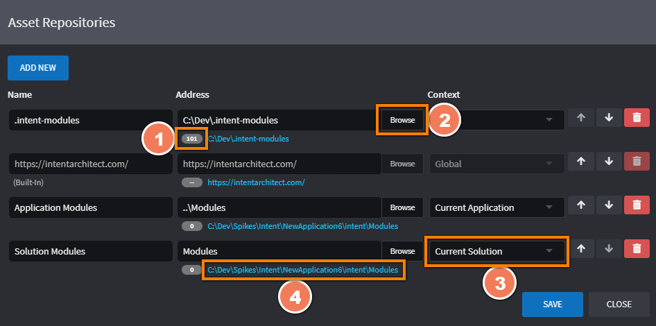

1. The number of modules in the repository (file system based repositories only).
2. Launches your operating system's file browser which you can use to select the path.
3. Can be used to specify if the repository is:
   - Global: Saved to the user's computer and available to all Solutions and Applications.
   - Current Solution: Saved in the same folder as the Intent Architect Solution and is available to the Solution and any Applications within it.
   - Current Application: Saved in the same folder as the current Intent Architect Application and is only available to the Application.

   When changed, it will automatically update the `Address` to/from being fully qualified or update its relative location accordingly.
4. The link can be clicked on to open the location in your operating system's file browser.

### Software Factory Execution: Quickly navigate to errors or warnings

The Software Factory Execution now allows you to quickly navigate between errors and warnings by clicking on the relevant buttons:

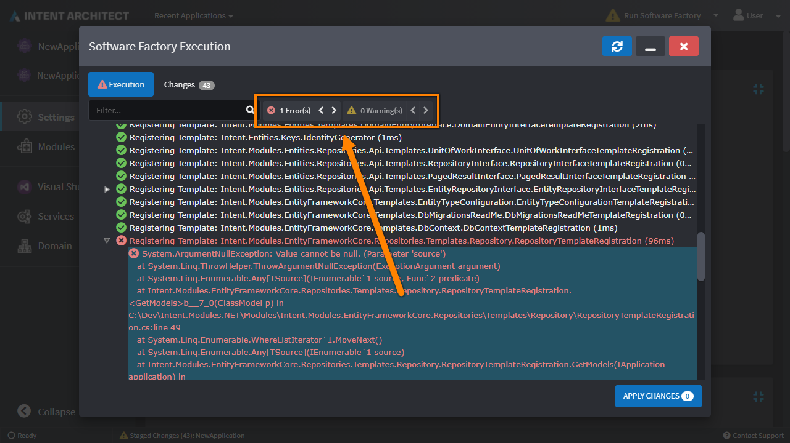

### Software Factory Execution: Code management statistics

The Software Factory Execution Changes dialogue now shows statistics on the number of lines and files being managed and affected by the current execution:

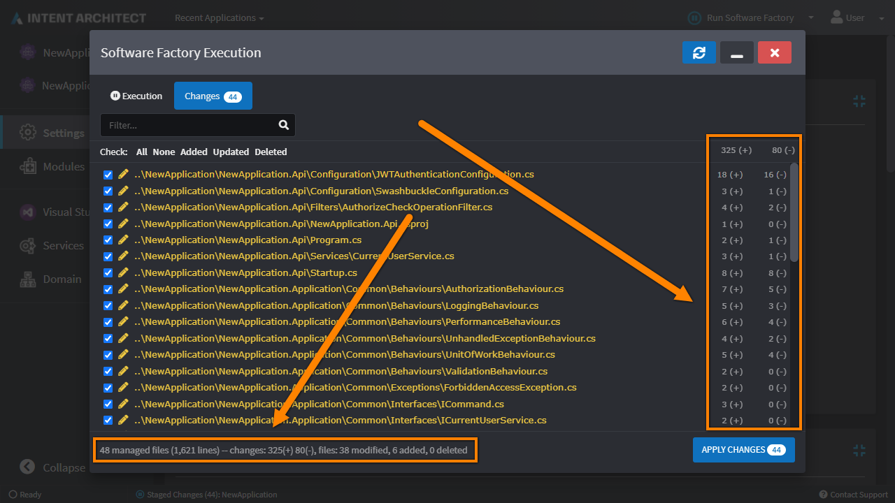

### Designer ad-hoc script execution

You can now perform ad-hoc script executions in all Designers using the `Open Execute script dialog` button on the toolbar.

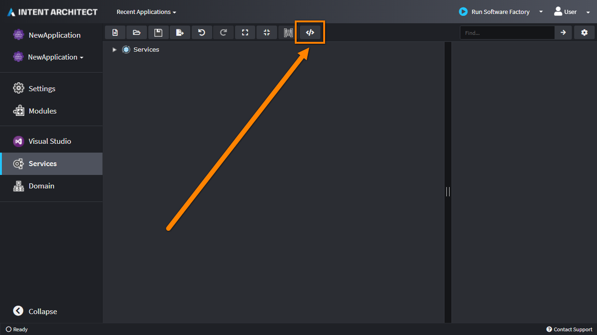

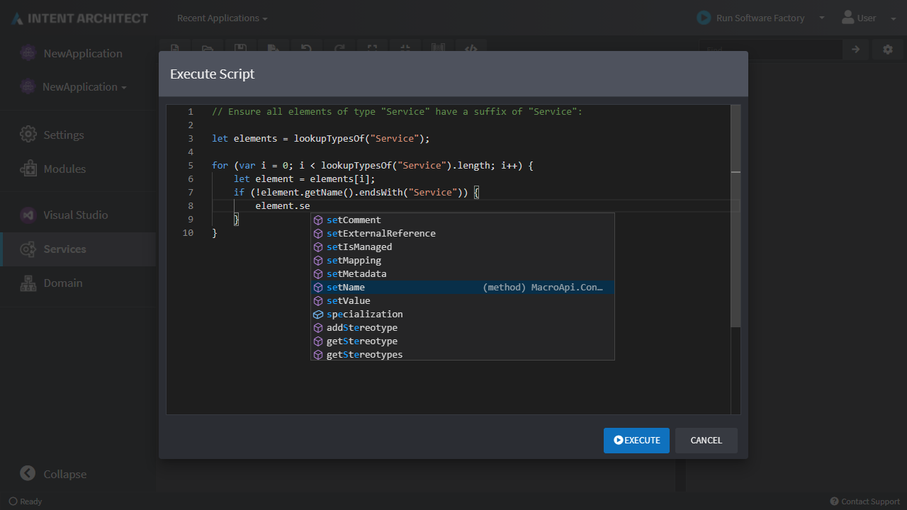

### Metadata File Naming Conventions

You can now select how metadata should be saved for an applications. Where previously, metadata files were saved as `${id}.xml` (e.g. `1391e9e0-b257-443a-bfe2-bbaea44aa0b8.xml`), using the setting as show below, the same metadata will be saved as `${name}__{unique-characters}.xml` (e.g. `User__hjw1hjyr.xml`). This has the advantage of making the files more human readable and easier to manage in version control.

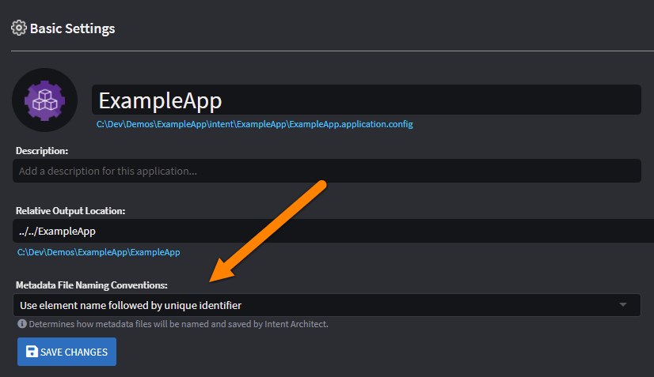

### Extensive Shortcut System Upgrade

In line with our vision to eventually be able to interact entirely with Intent Architect solely through the keyboard, this version offers a substantial upgrade to the shortcuts system in the designers. It's also now possible to  view the shortcuts in any particular context by pressing `ctrl + .` to launch the `Keyboard Shortcuts` dialog, as shown below. The available shortcuts will change as the focus and context changes.

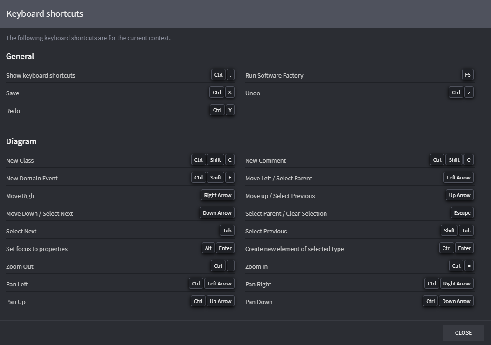
This dialog is also available in the dropdown menu for the user at the top right-hand of the screen.

New keyboard shortcuts are also available from the Apply Stereotype dialog and Mapping dialog.

### Additional Application template options

- It is now possible to specify between "Multiple" or "Single Only" selection of components within a component group. When the "Single Only" option is selected, then when selecting a checkbox within a component group, any other selected checkbox within the same component group will be automatically deselected.

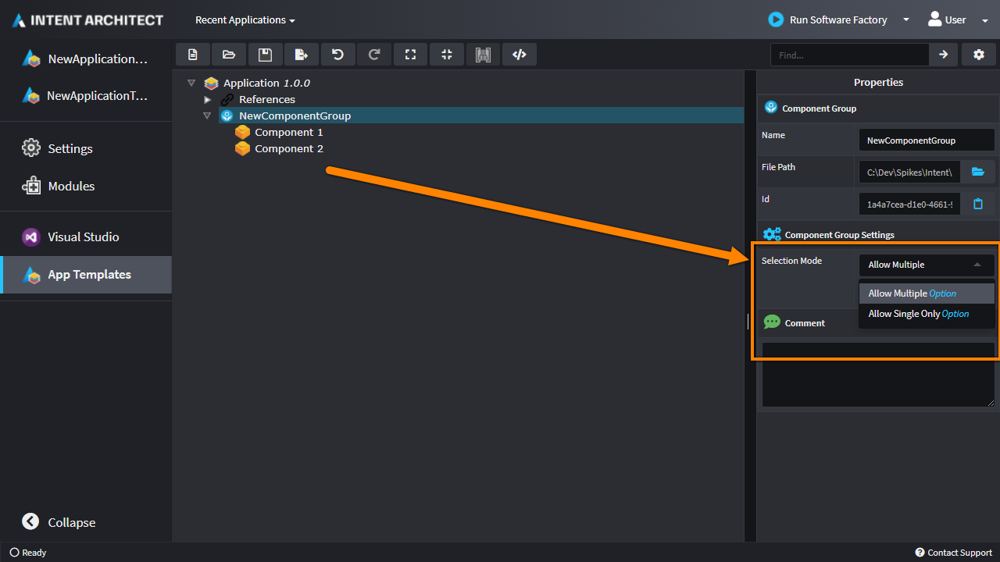

- It is now possible to specify dependencies between components. When selecting the checkbox of a component which has dependencies, all the dependencies checkboxes are also automatically selected. When deselecting a checkbox, any other components which are dependent on it are also automatically deselected.

- It is now possible to make a component "Is Required". When a component "Is Required", then it cannot be deselected.

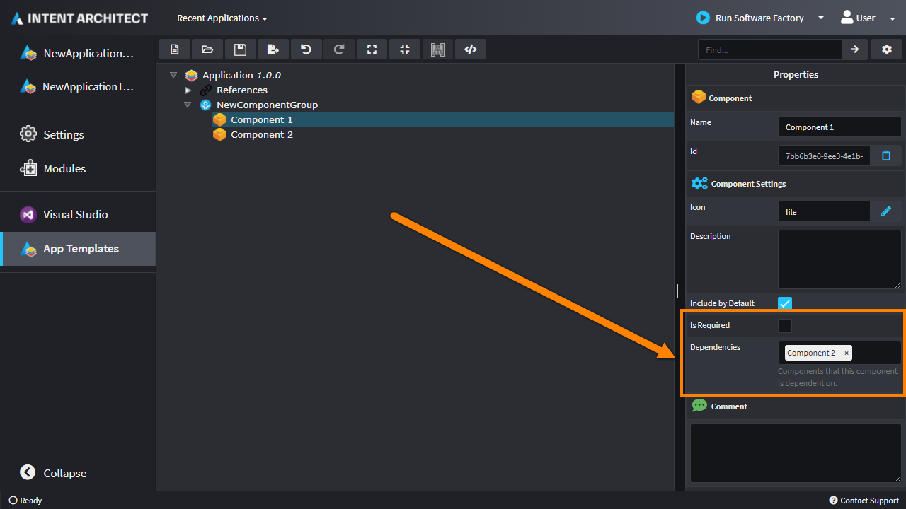

- It is now possible to specify settings for an application template which can be used to set different values during [metadata installation](xref:modules.metadata-installation).

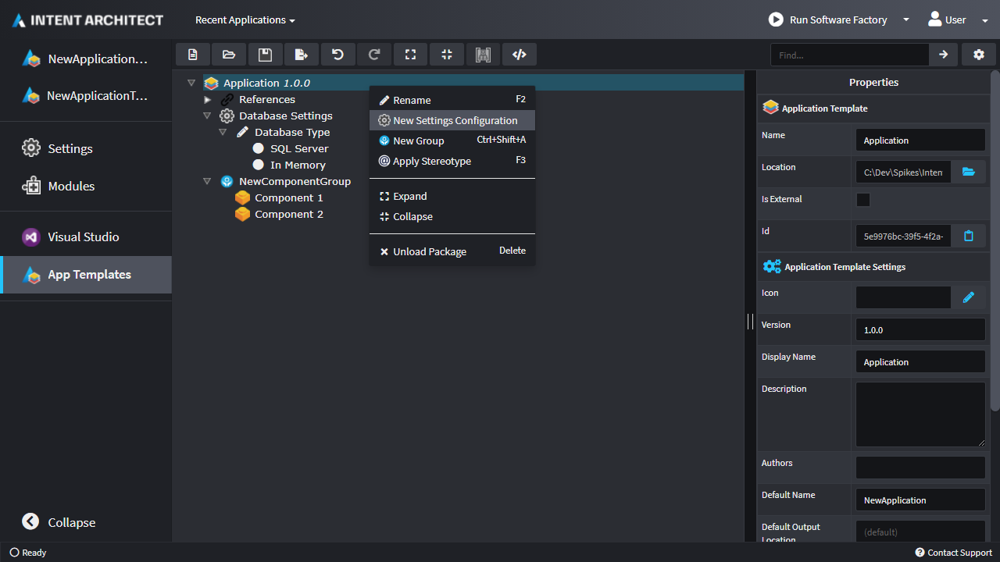

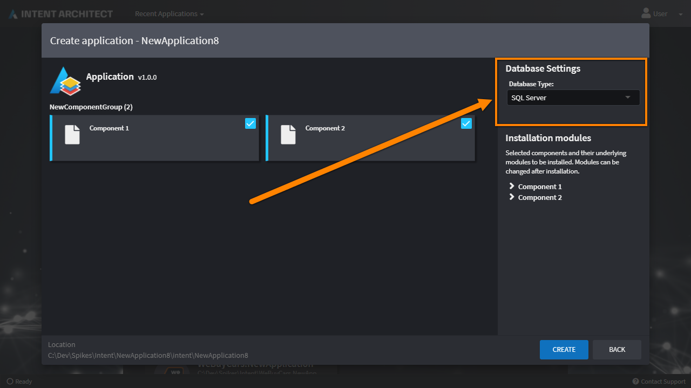

### Additional Event Hooks for Scripts

These event hooks allow scripts to be executed whenever a particular change is detected on an Element / Association. Note that some script (e.g. `On Changed`) must be idempotent so as not to cause an infinite execution loop.

The following event hooks are now available:
 - `On Loaded` - executed once when the diagram is loaded.
 - `On Created` - executed on a newly created Element / Associations.
 - `On Changed` - executed whenever a change related to the Element / Association occurs. It is important that this script is idempotent.
 - `On Name Changed` - executed whenever the Element's / Association's name is changed. It is important that this script is idempotent.
 - `On Type Changed` - executed whenever the Element's / Association's type reference is changed. It is important that this script is idempotent.
 - `On Deleted` - executed when am Element / Associations is deleted.

 Below illustrates how the new Intent.Metadata.RDBMS module is taking advantage of these event hooks to allow Intent Architect to create and maintain PKs and FKs automatically:

 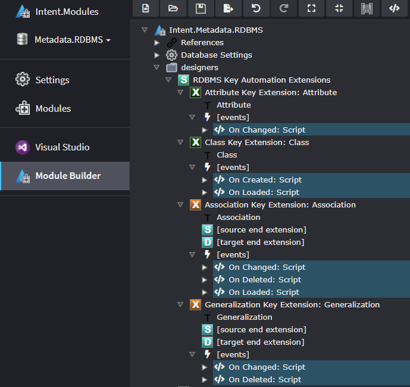

 ### Role-based Template Resolution

 Up until this release, Modules would resolve other templates based on their identifier using the [`GetTypeName(...)`](xref:templates.how-to-get-type-names) system (e.g. `GetTypeName("<template-id>")`). This would couple modules together making it very difficult to swap out / replace a single module. Typically, if a developer would like to swap out a particular Module from the stack, they would have to fork all other modules too.

 Now in Intent Architect 3.3, Modules can resolve templates in an additional way - by their roles. This is done in exactly the same way as resolving by identifier (e.g. `GetTypeName("<template-role>")` for a single template, `GetTypeName("<template-role">", "<model-id>")` for a template per model).  This allows modules to be _decoupled_ from each other but still be able to operate interdependently.

 Under the hood, Intent Architect will fist attempt to resolve the template by assuming the first parameter is the identifier. If no template is found it will then attempt to resolve it based on its role.

 [Roles](xref:templates.how-to-auto-assign-template-outputs) are defined in the Module Builder designer, under the properties of a template. It is worth noting that a template can fulfill more than one role. This can be indicated by separating each role by a comma (`,`), semicolon (`;`) or pipe (`|`) delimiter (e.g. a template with a role of `Domain.Entity; Domain.EntityInterface` can be discovered by either the `Domain.Entity` or `Domain.EntityInterface` role.).