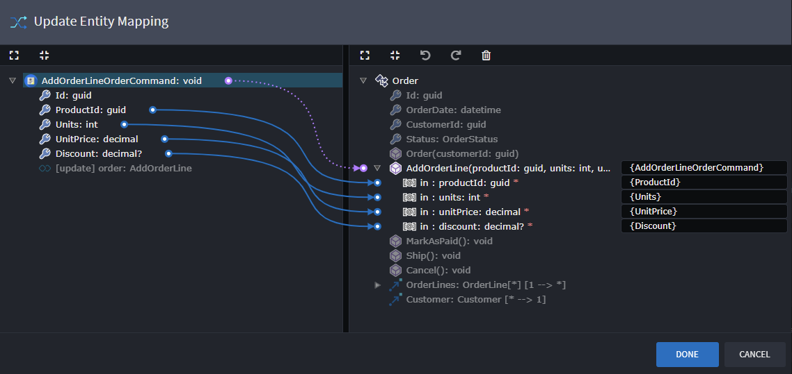
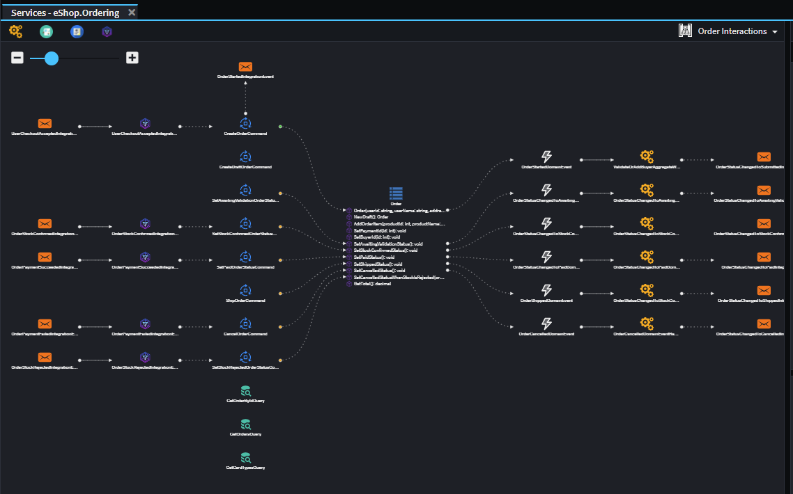
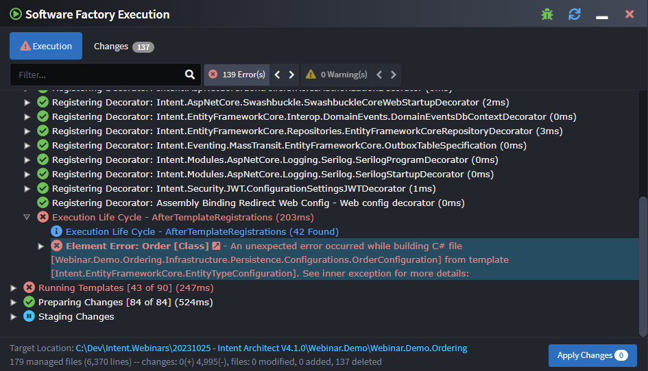

# Release notes: Intent Architect version 4.1

## Version 4.1.5

### Improvements in 4.1.5

- Renaming of applications allows user to synchronize underlying files and references throughout the solution.

### Issues fixed in 4.1.5

- Fixed: Clicking save in a designer not working in certain rare circumstances.
- Fixed: Renaming of packages leading to errors where that package was referenced by other packages.
- Fixed: Application home screen and tabs hanging on loading.
- Fixed: Task Console not loading in time for Module restoration events.
- Fixed: Basic Mappings loading incorrectly when mapping to an element in a package that hasn't been saved in 4.1.x and doesn't have an application Id specified.
- Fixed: Associations in Services diagrams being incorrectly selected on creation.

## Version 4.1.4

### Issues fixed in 4.1.4

- Fixed: Service proxies fail to map to services when creating a Service Proxies Package from scratch

## Version 4.1.3

### Improvements in 4.1.3

- Designer jumps to loaded package after loading a package reference into the designer.

### Issues fixed in 4.1.3

- Fixed: Software Factory Executions failing when unable to access a Stereotype Property when the Stereotype Definition isn't available in a Package Reference. This is fixed in conjuction with the `Intent.Common 3.5.1` module, which requires this version of Intent Architect.
- Fixed: errors lingering on elements without being refreshed in certain circumstances.
- Fixed: Element annotation text is cut off at the bottom.
- Fixed: Packages not loading when its application identifier can't be found. Now will warn if that is the case, and allow the package to load.

## Version 4.1.2

### Improvements in 4.1.2

- Advanced Mapping support for Drag and Drop onto background to trigger auto-mapping of selected elements.
- Basic Mapping now loads options from its package and package references.
- Loading performance of both Advanced and Basic Mapping dialogs noticeably improved.
- Implemented Package Reference caching to improve Designer loading time performance.
- Improved responsiveness of element renaming.

### Issues fixed in 4.1.2

- Fixed: Services designer hangs after saving in the Domain Designer.
- Fixed: `Auto-sync Type` on mapped elements (Basic Mapping) prevents user from changing the type reference in any way.
- Fixed: Error refreshing not working in certain scenarios.
- Fixed: Tree View forgetting which elements were expened after reloading from an underlying metadata change.

## Version 4.1.1

### Improvements in 4.1.1

- Improved designer performance through the caching paradigm of "JavaScript function" based configurations.

### Issues fixed in 4.1.1

- Fixed: Advanced mappings failing to be added in certain circumstances.
- Fixed: Changes to the type-references of elements involved in advanced mappings causes incorrectly validation errors.

## Version 4.1.0

Intent Architect V4.1 is promising to be a pivotal release for the platform, with a set of incredibly versatile and powerful new features and capabilities. The Intent Architect team is very  proud to finally make this release available to our community after the many months of effort. We are looking forward to getting your feedback.

### Watch the webinar

To watch the webinar, `middle-click` on the image above or use the following link: [What's new in V4.1](https://intentarchitect.com/#/redirect/?category=resources&subCategory=webinar-introduction-to-intent-architect-v4.1)

Please share your feedback on this version (and the webinar) by filling in this 1 min survey: [Share your feedback](https://intentarchitect.com/#/redirect/?category=resources&subCategory=Webinar-Feedback-Survey)

### Backward Compatibility

This release of Intent Architect is fully backward compatible with V4.0.x. It does simultaneously come with functionality that is not available in V4.0.x that, if used, would require other team members working on that application to upgrade to V4.1.x or higher.

The installation of this version will replace V4.0.x. If you need to downgrade back to V4.0.x, simply re-download the installer from our website [downloads page](https://intentarchitect.com/#/downloads) and install.

### Highlights in 4.1.0

#### Advanced Mapping System

The new Advanced Mapping System in Intent Architect is the flagship new feature of V4.1. This feature offers powerful and versatile new capabilities to the platform's designing systems, which serve to further increase the percentage of predictable and repetitive code that developers can now automate.

Above: Example mapping between a Command and an Entity constructor.

#### Enhanced Diagram Capabilities

In our continuous effort to support explicit "living" blueprints of our community's software systems, several new features have been added to the diagram capabilities in V4.1. In conjunction with the new Advanced Mapping System, these features allow developers to accurately visualize the flow of data through their system in a way that was previously not possible. These new features and improvements are listed below.

- New diagram toolbar, which includes:
  - Buttons for creating new roots element types on the diagram.
  - A dropdown to quickly switch between diagrams within the designer.
- Diagrams can now visualize elements from referenced packages.
- Curved Association lines, which help make connecting elements together simpler, more efficient, and neat.
- Anchor points on visual elements which associations "snap to". This improvement is limited to curved association lines at the moment.
- Auto-resizing of element visuals to fit / hide content. This option is available on all root elements in the diagrams.
- Drag & drop functionality includes all child elements when holding down `ctrl`. This can be very useful to quickly visualize associated elements, and all types in folders or packages.

#### Error Management Enhancements

As part of V4.1, the Intent Architect team has re-architected the way that errors work within the designers. This brings better robustness, predictability as well as performance improvements. As part of this initiative, `Intent.Exceptions.ElementException` errors produced by modules during the Software Factory Execution are able to provide a link to the metadata element that backs the failing logic. Users can click this link which will navigate them to the element in it's owning designer.

In addition, clicking on error symbols within the designer tree-views (or pressing the `return` shortcut key) will also jump to location where the error could be fixed, if an obvious location exists.

#### Apple Silicon support

macOS releases are now published as "universal" packages which will run code natively for both Intel and Apple Silicon based Macs.

### Removed dependency on `git` executable for Software Factory statistics

During Software Factory execution, statistics of how many lines are managed and have been added or removed by the Software Factory are calculated and are visible on the "Changes" view.

Previously this was achieved using the Git executable, however, if Git was not available in a computer's path during Software Factory execution this would cause warnings and prevent statistics from being calculated. Furthermore, as calculating diffs for many files considerably increased the Software Factory execution time, it would be skipped if there were more than 50 files requiring changes.

In the latest version of Intent Architect, an in process diff algorithm is now used which removes the need for Git to be available and it also makes the diff calculations practically instant allowing statistics to always be calculated regardless of the number of changes.

#### Other quality-of-life enhancements

- Navigating through the 'Go to Definition' context menu options (`F12` shortcut), will open the relevant designer and select they type.
- Internals of reference packages can now be explored from within the designer.
- Diagrams will delay loading while a module restoration is in progress. Afterward, it will automatically load. This enhancement prevents errors caused by loading designers before the required modules have been restored.
- Associations now only require their type-reference to be specified if the name is configured to be Hidden.
- Designer add a context menu to Properties for each element to access the underlying file or copy the element's Id (>= `4.1.0-beta.4`).
- Tree-view selection highlighting indicates focus (>= `4.1.0-beta.5`).
- Noticeable performance enhancements to designer loading and mapping dialog loading. Improved the UI responsiveness too. (>= `4.1.0-beta.7`).
- And a whole list of bug fixes :)
