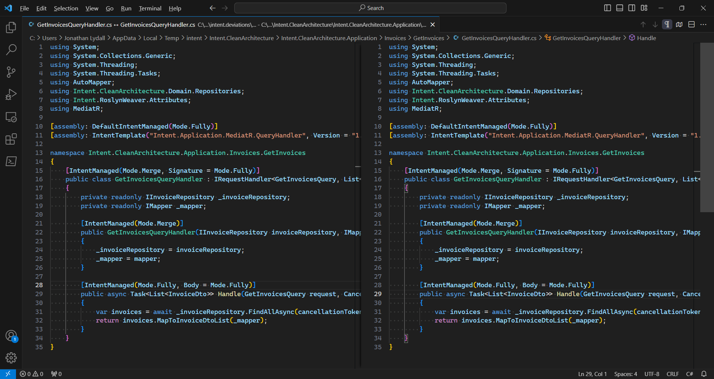
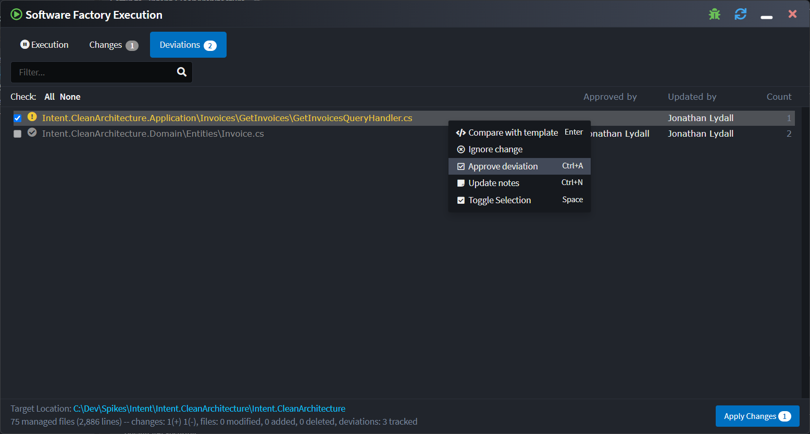
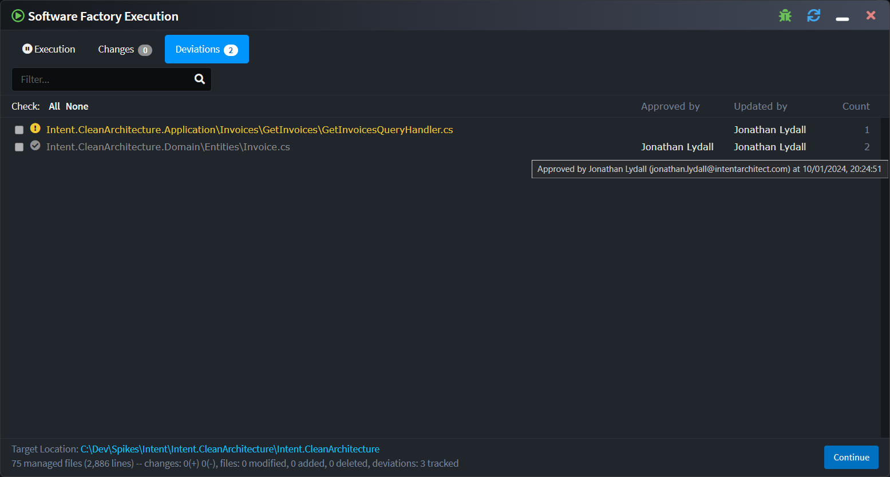
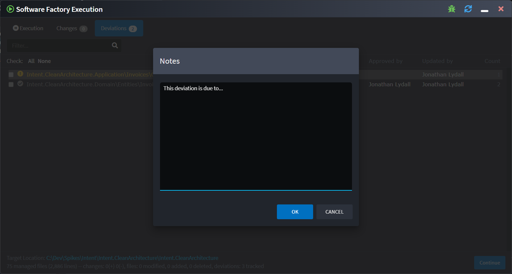
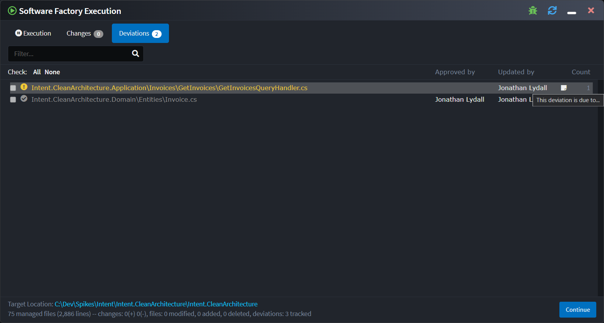

# Release notes: Intent Architect version 4.2

## Version 4.2.0

### Highlights in 4.2.0

#### C# code management instruction deviation tracking

The Software Factory now tracks code management instruction deviations, any found are visible on the new _Deviations_ tab:

Double-clicking a deviation will open a diff comparing the unmerged template output (left) with the current file (right):

Editing and saving the file in the right pane will trigger re-running the code merging for that particular file, for example to remove instruction deviations:

Deviations can be approved by right-clicking it and selecting "Approve deviation":

Approving a deviation records the person who performed the deviation and when they did so:

If the particular deviation(s) for the file changes, the approval is automatically revoked, approvals can also be manually revoked using the context menu.

Also available through the context menu is the ability to update "Notes" on the deviation:

Finally, the [Software Factory CLI tool](xref:tools.software-factory-cli)'s `ensure-no-outstanding-changes` command now has a `--check-deviations` option that when applied will cause the tool to also "break the build" when any unapproved deviations are detected.

#### Edits to staged changes will now be applied

When looking at a diff a staged file change, it is now possible to edit and save the right-pane. When any edit is saved, the Software Factory will re-apply code merging and save the updated staged changes when the pending Software Factory changes are applied with the "Apply" button.

### Improvements in 4.2.0

- [C# code management instruction deviation tracking](#c-code-management-instruction-deviation-tracking)
- Intent Architect will now give the option to save any unsaved Designer changes when trying to close it or return to the home screen from a Solution.
- Intent Architect upgraded to internally run using .NET 8. This allows the Software Factory to now support modules which are compiled to target any framework supported by .NET 8.
- The module installation and upgrade system will now only check the dependency graph for modules or dependencies of modules being installed, whereas before it would also check the dependency graph of all already installed modules.
- On create Application screens you can now click anywhere on a component "tile" to check/uncheck it whereas before you would have have to click on the checkbox itself.

### Issues fixed in 4.2.0

- Tab order would be reversed when re-opening a solution which had open tabs when it was closed.
