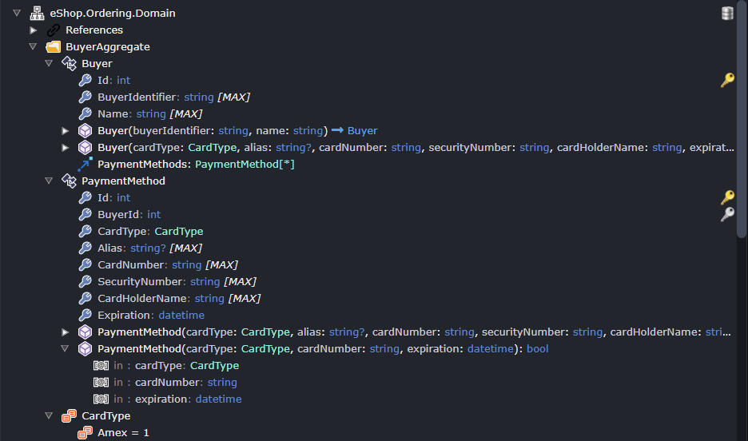

# Release notes: Intent Architect version 4.2

## Version 4.2.4

### Improvements in 4.2.4

- Improvement: Installation of multiple modules is now significantly faster, this is especially noticeable when creating new applications.
- Improvement: Application templates can now specify minimum versions of module dependencies and interoperabilities making it possible for new applications to have all modules at the latest version.

### Issues fixed in 4.2.4

- Fixed: Windows: The installer was not DPI aware and would look blurry if Windows scaling was set to anything other than 100%.
- Fixed: Metadata installation would occur for module updates (it should only occur for module installations) when triggered by the "Update" button on the "Updates" tab.

## Version 4.2.3

### Improvements in 4.2.3

- Improvement: Hints on the application settings screen will now render "minimal markdown" (Bold, italics, inline code and URLs) for hints.

### Issues fixed in 4.2.3

- Fixed: Icons on the Settings screen had incorrect vertical alignment with headings.
- Fixed: If the casing of module's identifier had changed between versions, an error would sometimes occur when trying to reinstall or update the module.

## Version 4.2.2

### Issues fixed in 4.2.2

- Fixed: The Software Factory CLI would update files in the `.intent` folder which could break CI builds if they were configured in a particular way.

## Version 4.2.1

### Issues fixed in 4.2.1

- Fixed: An exception would occur in the Software Factory CLI when using "legacy" command line arguments, i.e. if not explicitly using the newer `ensure-no-outstanding-changes` command. It's advised to upgrade any scripts you have to rather use the [`ensure-no-outstanding-changes` command](xref:tools.software-factory-cli#ensure-no-outstanding-changes-command).

## Version 4.2.0

Intent Architect V4.2.0 comes with several highly anticipated features, many of which are direct requests from yourselves, the users. This release also comes with several "groundwork" features that we've added to support future enhancements and capabilities. Please share your thoughts and feedback on this release with our team.

> [!NOTE]
> Version 4.2.0 is backward compatible with 4.1.x of Intent Architect. However, upgrading to the latest modules that require 4.2.0 may cause issues if the solution is then opened again in 4.1.x or earlier. We therefore recommend that teams officially upgrade their modules once all members are using 4.2.0.

### Highlights in 4.2.0

#### C# code management instruction deviation tracking

It can be useful to know which files may not be following the architecture which your installed Modules normally generates. Intent Architect can now track these "Deviations" and shows them on a new screen during [Software Factory execution](xref:application-development.software-factory.about-software-factory-execution#the-deviations-screen):

> [!NOTE]
> At this time deviation tracking is only supported for C# files and requires the `Intent.OutputManager.RoslynWeaver` module, at version `4.6.0` or later, to be installed.


Selecting the "Compare with Template" context menu option, or simply double-clicking a deviation, will open a diff comparing the unmerged template output (left) with the current file (right):


It is possible to immediately remove deviations by updating content in the right pane and saving it which will trigger a "re-merging" of the file by the Software Factory.

Otherwise, deviations can be approved and have notes added to them, for more information refer to the [](xref:application-development.software-factory.about-software-factory-execution#the-deviations-screen) article.

#### Edits to staged changes will now be applied

When looking at a diff of a staged file change, it is now possible to edit and save the right-pane. When any edit is saved, the Software Factory will re-apply code merging and save the updated staged changes when the pending Software Factory changes are applied with the "Apply" button.

#### Syntax Highlighting and `Ctrl + Click` Navigation

As part of our strategy to continuously enhance the designers into highly efficient and productive modeling systems, we've enabled syntax highlighting of the display text for each element in the tree-view designers. Users can navigate to types directly by using the `Ctrl + Click` shortcut.

> [!NOTE]
> This feature has base implementations build into 4.2.0, but will require the latest designer modules (e.g. `Intent.Modelers.Domain` version `3.7.0`, and `Intent.Modelers.Services` version `3.6.0`) to be fully utilized.


_Example syntax highlighting in dark mode._

For those users who are interested in the configurability of the syntax highlighting as part of Module Building, the `Display Text Function` of [Element Settings](xref:module-building.designers.designer-modelling#the-element-settings-element) now also allows the return of an object array with the display parts and their configuration. It's also worth noting that there is a default mode which will highlight type-references in cases where the `Display Text Function` has not been set.

```javascript
const result = [
        { text: `${ name }${ genericTypes }`, cssClass: "muted" },
        { text: ': ', cssClass: "annotation" },
        { text: typeReference.display, cssClass: "typeref", targetId: typeReference.typeId }; // navigate to type-reference through Ctrl + Click
    ];
return result;
```

_An example `Display Text Function` implementation._

The currently available `cssClass` options are `keyword`, `typeref`, `muted` and `annotation`. Users can also simply set a `color` field if they wish to customize the color completely.

#### Triggerable Module Tasks

The Module Tasks feature aims to lay the groundwork for a whole avenue of powerful new features and capabilities in the platform. Simply put, Module Tasks are discoverable execution points that can be created inside of the .NET DLL of a Module. These executables can then be triggered via JavaScript in the [Designer Scripting](xref:module-building.designers.designer-scripting).

To give a simple example, the following class can be added anywhere inside of an installed Module:

```csharp
public class ExampleModuleTask : IModuleTask
{
    public string TaskTypeId { get; } = "Example Task Id";

    public string TaskTypeName { get; } = "Example Task Name";

    public int Order { get; } = 0;

    public string Execute(params string[] args)
    {
        foreach (var arg in args)
        {
            Logging.Log.Info("ARG: " + arg);
        }

        return JsonSerializer.Serialize(new[] { "Response Example 1", "Response Example 2" });
    }
}
```

This Module Task can then be triggered via a JS Designer Script (e.g. from a context menu option):

```javascript
const result = await executeModuleTask("Example Task Id", "Example Arg 1", "Example Arg 2");
console.warn(result);
```

When called, this will lead to the following output in the Task Output Console:


_The script causes the_ Module Task Agent _to initialize and then execute the `Example Task Id` Module Task inside the module, returning our response from above and logging it to the console as a warning._

Where can this be used? Module Tasks allow developers to plug additional functionality into the platform and leverage the full power of .NET in doing so. This versatile option promises to enable developers to extend designers in a way that was previously impossible. Example Module Tasks that are being planned by the Intent Architect team range from Domain imports from databases, Service imports from Open API documents, and integration with AI services.

#### Configurable Dynamic Forms for [Designer Scripting](xref:module-building.designers.designer-scripting)

When executing Designer Scripts it's often a requirement to prompt the user to provide some additional information, which can then be used to determine the precise behaviour of the script in execution. The Dynamic Forms feature, now available in 4.2.0, offers this functionality in a simple, configurable format.

As a simple example, the following script can be executed from any manual or automatic trigger within the designer:

```javascript
let result = await dialogService.openForm({
    title: "Example Form",
    fields: [{
        id: "text",
        label: "Text",
        fieldType:"text",
        placeholder: "Enter your text",
        hint: "This is an example hint for this text"
    },
    {
        id: "checkbox",
        label: "Checkbox",
        fieldType:"checkbox",
        value: "true", // sets the default
        hint: "This is an example hint for this checkbox"
    },
    {
        id: "select",
        label: "Select Option",
        fieldType:"select",
        selectOptions: [{ id: "1", description: "Test 1" }, { id: "2", description: "Test 2" }],
        value: "1",
        hint: "This is an example hint for this selection"
    }]
});

console.warn(result);
```

The result is a form in a dialog, which would appear as follows:


If the user then clicks `Done`, the output console will log the result as a warning:


#### Contextual Popovers in Designer Diagrams

Creating an information rich diagram that is also not overwhelming requires that some information be hidden but easily visible if needed. This is the rationale behind the Contextual Popovers in the designers, which is an "experimental" feature, subject to feedback from users.

In this release we've included the source package that owns the element in the diagram. This allows the user to easily understand the source of the element, especially in cases where metadata is shared between applications. To view this information, the user simply needs to hover over the element with their mouse curser while holding down the `Alt` key.


The other "experimental" aspect of this feature is the inline popover of stereotype settings. This is triggered by clicking on the icon in the diagram, which loads the popover to the right of the stereotype.


### Other Improvements in 4.2.0

- Intent Architect will now give the option to save any unsaved Designer changes when trying to close it or return to the home screen from a Solution.
- Intent Architect has been upgraded to internally run using .NET 8. This allows the Software Factory to now support modules which are compiled to target any framework supported by .NET 8.
- The module installation and upgrade system will now only check the dependency graph for modules or dependencies of modules being installed, whereas before it would also check the dependency graph of all already installed modules. This substantially improves the performance and robustness of the module installation process.
- On Create Application screens you can now click anywhere on a component "tile" to check/uncheck it whereas before you would have have to click on the checkbox itself.
- Added Cut / Copy / Paste shortcuts to element context menus. The shortcuts `Ctrl + X`, `Ctrl + C` and `Ctrl + V` also apply.
- Added a `Ctrl + H` shortcut to hide elements and associations from within the diagrams.
- Improved error visibility for the Advanced Mapping dialog.
- Allow filtering of [Application Templates](xref:application-templates.overview) when creating a new application to include Prerelease and/or Incompatible Application Templates.
- Stereotypes display their target types inline.
- Minimum Client Verion stored in `.application.config` files and will trigger compatibility warnings on opening a solution. This Minimum Client Version is determined by the lowest supported client versions from the installed modules.
- Collapse button in tree views will now, instead of collapsing the entire tree, incrementally collapse nodes and only hides leaf nodes on each click.

### Issues fixed in 4.2.0

- Fixed: Tab order would be reversed when re-opening a solution which had open tabs when it was closed.
- Fixed: It was not possible to drag-drop package reference elements into diagrams when the diagram itself doesn't have visual settings for that element type.
- Fixed: An error would occur on the home screen when clicking on Create New application too quickly on initial startup of Intent Architect.
- Fixed: Drag-drop reordering of elements was not working in certain circumstances.
- Fixed: Clicking on tree-view caret in quick succession would not expand and collapse nodes as expected.
- Fixed: The Package Reference Manager search filter would also match against file paths, leading to unexpected results.
- Fixed: The application file sync prompt would show even when not renaming the application.
- Fixed: `Ctrl + Enter` shortcut not working for Stereotype Definitions and Stereotype Property Definitions.
- Fixed: Type reference updated by synchronized basic mapping not updating text display.
- Fixed: Basic mapping not able to traverse into external package references (e.g. AspNetCore.Identity.Domain).
- Fixed: Ctrl click to select elements in diagram can lead to accidental duplication of selected items
- Fixed: Association default names sometimes not being set, causing renames in the underlying files and incorrectly indicating dirty changes.
- Fixed: Association names not updating in the diagrams on undo.
- Fixed: Issues with updating Modules where the new version is identifiable but the installed version is not, preventing update failures.
