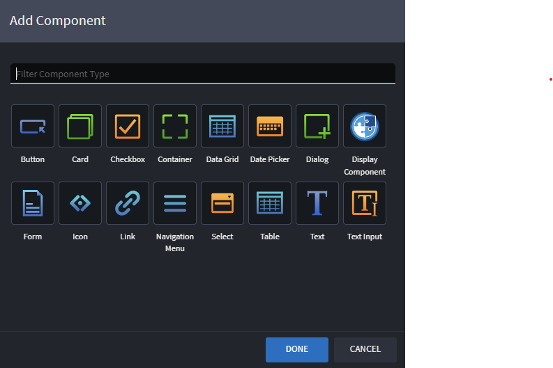
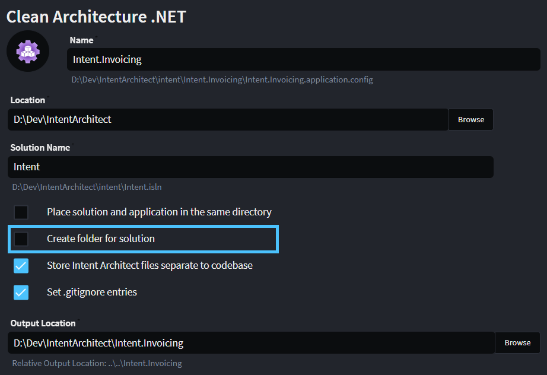

# Release notes: Intent Architect version 4.3

## Version 4.3.4

### Issues fixed in 4.3.4

- Fixed: The value of the "Value" field on associations would not be visible during Software Factory execution and would disappear when reloading the designer.

## Version 4.3.3

### Issues fixed in 4.3.3

- Fixed: Opening of `.isln` files directly from the File Explorer intermittently causes designers to hang.
- Fixed: Renaming Command or Query elements causes error in Advanced Mappings to Domain Classes.
- Fixed: Comments in designers showing ellipsis and no longer wrapping text - introduced in previous release.

## Version 4.3.2

### Improvements in 4.3.2

- Improvement: Syntax highlighting support added to the designer diagrams. This should reduce cognitive load and make the designers easier on the eye.

### Issues fixed in 4.3.2

- Fixed: Unique name validation not taking generic parameters into consideration.
- Fixed: Advanced Mapping errors showing in the models under certain circumstances.
- Fixed: Javascript API function `.getAssociations()` on elements not returning non-navigable associations.
- Fixed: Designer not reliably prompting to reload when changes to the underlying settings are detected.

## Version 4.3.1

### Issues fixed in 4.3.1

- Fixed: Advanced mappings would show errors when encountering a hidden element with same name but with no settings.
- Fixed: Some designer extension scripts could cause designers to hang indefinitely on load.

## Version 4.3.0

Intent Architect v4.3.0 primarily brings features and functionality to support the designing and automating of front-end user interfaces. This is new territory for our team and we're very excited to get your thoughts and feedback. In addition to back-end, our vision is to fully support the design and development of user interfaces in the various modern technologies (e.g. Blazor, Angular, etc.). This release is our first focused step along this journey, and one of many more to come. We'd like to thank all of our users for their support in helping us evolve Intent Architect to this point.

In conjunction with this release, our team has developed a set of UI Modules that focus on automating a Blazor UI using MudBlazor components. As of this writing, these modules are still in `alpha` release stages, but can be used to explore the new capabilities that 4.3.0 has to offer.

### Upgrading from 4.2 to 4.3

If upgrading from Intent Architect 4.2.x you should be able to run your existing Intent Architect applications as is on Intent Architect 4.3.x with no changes or module upgrades being required.

> [!IMPORTANT]
>
> Once any changes made using Intent Architect 4.3.x have been saved, the Intent Architect applications can no longer be opened and used with earlier versions of Intent Architect.

### Want to check out the new front-end capabilities?

As part of this release, our team has also created a set of Modules to support the creation of a Blazor front-end using [MudBlazor](https://mudblazor.com/). If you would like to experience the front-end design capabilities first-hand visit our [MudBlazor sample repository on GitHub](https://github.com/IntentArchitect/Intent.Samples.MudBlazor).

### Highlights in 4.3.0

#### New Advanced Mapping Features

A key aspect of designing UI pages and components is the ability to bind the view to the backing view-model. The advanced mapping system introduced in v4.1.0 provides the perfect foundation for this capability. However, several new features and enhancements were needed to support this better.

##### Static Mappable Child Elements

This feature gives the ability to configure "static" mappable elements that will appear as children of actual elements. In other words, these mappable elements don't exist outside of the Advanced Mapping dialog, but play a crucial role in capturing all of the different bindings that are required by various UI components.

_The screenshot above illustrates this with several examples such as the `On Click` mappable elements on the `Save` and `Cancel` buttons._

##### Scripting Options on Mappable Elements

A key paradigm in designing front-end components with Intent Architect in v4.3.0 is that the view-model metadata can be used to project out view components, and vice versa. To enable this, the Advanced Mapping system exposes a JavaScript API that can be used to automate these projections.

_An example of two scripting options available for the `Model: PageResult<CustomerDto>?` property. These scripts are configured in the relevant Modules._

##### Other enhancements

- Access to underlying elements' creation and scripting context-menu options, allowing the user to add elements and associations on the fly directly inside of the Advanced Mapping dialog.
- Hiding of unusable mapping elements by default (hold down `alt` key to view all elements as well other debug information). This helps de-clutter the Advanced Mapping dialog tree-views.
- `Ctrl + Enter` shortcut working inside of Advanced Mapping dialog.

#### Open code in IDE from metadata

This simple new feature is one which our team is very excited to release. That's because, fundamentally, it connects the design elements of our systems to the underlying code that implements that design. We hope that this will increase developer efficiency by making it easier to access the relevant code, as well as help new developers understand how Intent Architect is connected to the codebase.

On all top-level metadata elements, there now exists an option to `Open in IDE` which, if hovered over, will show the list of files connected to that element. By clicking on any of the files, Intent Architect will open the file in your IDE (e.g. Visual Studio). If you click directly on the `Open in IDE` options, Intent Architect will open all associated files.

For more information refer to  article.

#### Tiles control type in Dynamic Forms

Front-end views are made up of many different types of UI components, often including custom components. To facilitate an easy way to visually find the appropriate UI component, a `Tiles` control type has been added to the Dynamic Forms feature. This feature allows Module Builders to configure any array of options to be displayed as tiles with icons for the user to select. It supports filtering and the `tab` and `enter` keyboard shortcuts.

#### Unique Name Validations and Auto-Naming

This feature ensures that names of adjacent elements are unique (where configured to be in the Designer Settings) by showing errors on adjacent elements that share the same name. In addition to this, Intent Architect will also append an auto-incrementing number to elements that are created or pasted that would otherwise end up with the same name as an existing adjacent element.

#### Traits System

This feature is "under the hood" of Intent Architect and perhaps interesting to developers that are configuring Designers through the Module Building ecosystem. Elements and Associations can now be configured to implement Traits, which can be used to generically configure the constraints of other Elements and Associations.

A simple example of how this is being used is with the new front-end features. All the different Element types that represent standard UI components (e.g. Text Input, Button, Form, Table, etc.) implement the same Trait (`[Component]`) which can be accepted as children under the `Component View` Element type. This is key to the extensibility of the systems, and ensures that Designer configuration stays simple and manageable.

#### Task Output Console

Various improvements have been made the Task Output Console:

- The Task Output Console can now be shown and hidden using the tilde (`~`) / back quote (`` ` ``) key (often below `Esc` on keyboards).
- Messages can now be filtered by text and source:

  

  "Source" refers to the designer tab from which the message originated:

  - **(all sources)** - No filtering by source occurs, all messages will be show.
  - **(no source)** - Only messages which do not originate from a particular designer tab will be shown.
  - **\<tab name\>** - When a designer tab is selected here (e.g. "Domain - MudBlazor.ExampleApp from above), then only messages originating from that tab will be shown.

#### Software Factory CLI - `apply-pending-changes` command

The Software Factory CLI now has a new option `apply-pending-changes`, which will run Software Factories and apply pending changes from the command line.

### Module Building Enhancements and Features

These are features that are available for configuration in the Module Building ecosystem that can help simplify the configuration process or be used to improve the developer experience when using that Module.

- Added `On Applied`, `On Changed` and `On Removed` scripting hook points to Stereotypes.
- Added support for a `Validate Function` to Stereotypes which will be run by the relevant Element / Association during its validation checks.
- Added a `Decimal` stereotype control type, which allows the input of decimal numbers.
- Added `toSentenceCase(word: string): string` and `toTitleCase(word: string): string` functions to all Designer Scripting JavaScript execution contexts.
- Dynamic Form supports `minWidth`, `maxWidth` and `height` configurations.
- Icons that are using FontAwesome can now also indicate color by adding the color after a `|` character to the source string (e.g. `long-arrow-right|orange`, `cogs|#2222aa`, etc.)
- `Is Active Function` and `Is Required Function` scripts now available in Module Settings.
- Support for reusing JS scripts through dependencies, and to load scripts from file, in the designers.

### Other Improvements in 4.3.0

- Setting type references to generic types automatically focuses on editing the generic arguments.
- Added better handling of unreachable HTTP(S) module server(s) when searching/restoring/installing/updating Modules and Application Templates. Previously, any request would take 60 seconds to timeout which could result in very slow restorations if a single custom HTTP(S) module repository was inaccessible for any reason. Now the timeout is just 3 seconds and if a failure occurs it will be instantly presumed to still be offline for at least 30 seconds making checks against other servers faster.
- Searchable dropdowns now prioritize equal and startsWith filter matches in the list ordering.
- Designers will now display warnings, in addition to errors, in the toolbar and on-click navigates to elements that have the warnings.
- Package Reference now exclude module packages by default. This should help simplify the process of adding package references.
- For Solutions with many applications, Intent Architect can now better handle running many Software Factories at once without any getting stuck.
- The help icon now shows a menu with options to request help or open our Docs website:
- Advanced Mapping validation performance improved substantially, while simultaneously increasing the max traversal depth from 4 to 10.

  

- Converted font-awesome icon selector to use tiles, instead of a list.
- Warnings are now shown on Advanced Mappings that have unmapped required fields.
- When creating a solution, creating a folder for the solution is now optional:

  

- There is now a "Browse" button on the Application Settings screen for selecting its _Relative Output Location_:

  

### Issues fixed in 4.3.0

- Fixed: Sometimes when minimizing the Software Factory Execution window, Windows would jump to a different open application.
- Fixed: Undo/redo when creating and altering associations would not work correctly in certain circumstances.
- Fixed: Different package types could not be reordered within the designers.
- Fixed: Drag and drop of mapped elements in the Advanced Mapping dialog would lead to mapping errors in many scenarios.
- Fixed: HTML flicker on editing of elements.
- Fixed: Unexpected errors on elements with Advanced Mappings after altering connected elements.
- Fixed: For Solutions with many applications, running many Software Factories at the same time would sometimes result in some of them getting stuck.
- Fixed: Pressing ALT-F4 on modal windows would cause Intent Architect to get into an unrecoverable broken state of showing errors.
- Fixed: Proportionally-sized modal dialogs now maintain a consistent aspect ratio across various screen sizes, including ultra-wide displays, ensuring proper visibility and layout regardless of screen dimensions.
