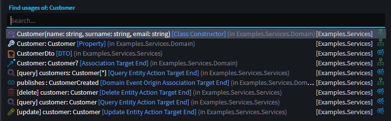

# Release notes: Intent Architect version 4.4

## Version 4.4.0

Intent Architect v4.4.0 primarily brings features and functionality to improve product usability and feature discoverability. Some examples of this would include new Help system, and a new suggestion system. This version is fully backwards compatible.

### Highlights in 4.4.0

#### Help Topics, in product

Intent Architect now includes built-in `Help`. Pressing `F1` within the context of a designer opens the `Help` dialog. The dialog provides help topics that can be further filtered using the search bar.

The `Help` dialog is context-aware. For example:

- Pressing F1 in a designer displays help topics specific to that designer.
- Selecting an `Element` such as a domain `Class` or CQRS `Command` filters help topics relevant to the selected element.

#### Suggestions

`Suggestion`s are a new feature intended to give context-specific assistance to modelers. When hovering your mouse over an `Element` that has suggestions, you will see a Light Bulb icon, indicating that suggestions are available.

Suggestions aim to assist with the following:

- Quickly model common scenarios, for example:
  - Publishing an `Integration Event` from a CQRS Command.
  - Subscribing to an `Integration Event`.
  - Publishing a `Domain Event` from a domain behavior.
- Add related Elements/Associations for existing Diagram Elements.
- Discover modeling options.

#### Search Everywhere

The Search Everywhere dialog allows you to quickly find aspects of your design using a unified, incremental search box that also supports abbreviation matching.  
The search is performed across applications, and the search results provide full context to make it easy to identify the desired result.

You can access the Search Everywhere dialog using its shortcut (Ctrl+T).

### Find Usages

The `Find Usages` (Shift+F12) feature has been vastly improved, leveraging the new `Search Everywhere` feature.

Find usages will present you with a list of all references to the modeled element, including across applications.

Example use cases for this feature:

- Who is subscribing to this Integration Event?
- What would be affected if I change this domain attribute?

### Filtered searching

When searching in the `Solution Explorer` and `designer tree-view`, these trees now filter to only show matching search results.

### Solution folders

You can now group applications together by adding folders to the solution explorer. This is particularly useful if you have:

- Many Microservices.
- Logically similar applications you'd like to group together.

